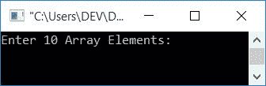
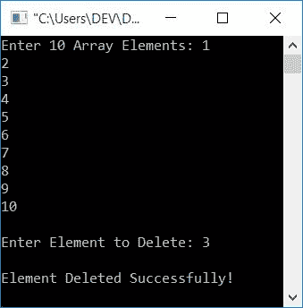
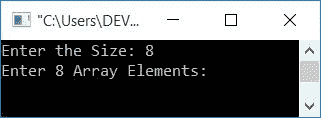
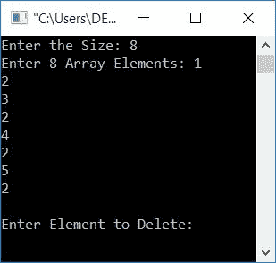
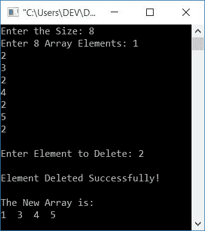
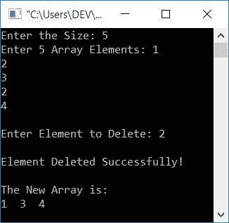
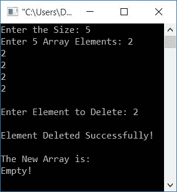
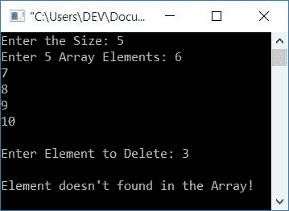

# C++ 程序：从数组中删除元素

> 原文：<https://codescracker.com/cpp/program/cpp-program-delete-element-from-array.htm>

在本文中，您将学习如何在 C++ 中从数组中删除元素，并获得这样做的代码。该程序通过以下方式创建:

*   从数组中删除元素
*   删除一个元素并打印一个新数组。用户也可以指定数组的大小。
*   使用用户定义的函数

## 在 C++ 中，从数组中删除元素。

在 C++ 编程中，要从数组中删除一个元素，你必须要求用户首先输入数组的 10 个元素。然后要求必须删除的元素。现在搜索该编号或元素，如果找到就删除它。否则，打印一条消息，如“未找到元素”

问题是，“用 C++ 写一个程序，从数组中删除一个元素。”以下是这个问题的答案:

```
#include<iostream>
using namespace std;
int main()
{
    int arr[10], tot=10, i, elem, j, found=0;
    cout<<"Enter 10 Array Elements: ";
    for(i=0; i<tot; i++)
        cin>>arr[i];
    cout<<"\nEnter Element to Delete: ";
    cin>>elem;
    for(i=0; i<tot; i++)
    {
        if(arr[i]==elem)
        {
            for(j=i; j<(tot-1); j++)
                arr[j] = arr[j+1];
            found++;
            i--;
            tot--;
        }
    }
    if(found==0)
        cout<<"\nElement doesn't found in the Array!";
    else
        cout<<"\nElement Deleted Successfully!";
    cout<<endl;
    return 0;
}
```

这个程序是在 Code::Blocks IDE 下构建和运行的。下面是它的运行示例:



现在提供任意 10 个数字，比如 1、2、3、4、5、6、7、8、9 和 10，作为 10 个数组元素。为数组 arr[]输入 10 个元素后，输入必须从列表中删除的数字或元素，比如 3。以下是示例运行的最终快照:



**注意**:如果发现输入的元素(必须删除的)重复出现(不止一次)，那么该元素将从所有 位置删除。也就是说，重复的元素也会被删除。

当用户输入 10 个数组元素 1、2、3、4、5、6、7、8、9、10 时，它以如下方式存储在 arr[]数组中:

*   arr[0]=1
*   arr[1]=2
*   arr[2]=3
*   arr[3]=4
*   arr[4]=5
*   arr[5]=6
*   arr[6]=7
*   arr[7]=8
*   arr[8]=9
*   arr[9]=10

输入的元素，比如 3，必须删除，存储在 elem 中。现在，上面程序的模拟运行(在 for 循环中)是这样的:

*   初始值，发现=0，总计=10
*   在 for 循环的第一次求值时，0 被初始化为 I 。( for 循环的)初始化首先发生，并且只发生一次。现在我=0
*   条件 i
*   而使用 if，条件 arr[i]==elem 或 arr[0]==3 或 1==3 求值为假；因此，程序流不会进入 if 的主体，而是进入 for 循环的更新部分，并增加 I 的值。现在 i=1
*   同样，条件 i
*   并且再次，条件 arr[i]==elem 或 arr[1]==elem 或 2==3 评估为假；因此，程序流再次增加 I。现在 i=2
*   因为 for 循环的条件第三次评估为 true，所以程序流此时再次进入循环。
*   但是此时,“if”的条件评估为真，因为索引号 2 处的元素是 3，它等于存储在 elem 中的值(必须删除的元素)。
*   换句话说，条件 arr[i]==elem、arr[2]==3 或 3==3 的计算结果为 true。
*   因此，程序流进入 if 体，并执行它的所有语句。
*   也就是说，使用 for 这个(当前或第二个)索引的元素都向后移动一个索引。
    *   也就是说，首先，i (2)的值被初始化为 j，所以 j=2
    *   并且条件 j
    *   现在 j 的值增加了。所以 j=3
    *   同样，条件 j
    *   重复该过程，直到条件 j
    *   当条件评估为 false 时，循环的第二次评估将暂时终止。
    *   并且 found 的值增加。它的值在程序开始时被初始化为 0，在对两个循环求值后，检查它是否包含它的值(0)。如果它的值为 0，程序流将永远不会进入 If 块。这意味着数组中没有元素与作为要删除的元素输入的元素匹配。如果它的值不为 0，那么该元素将被匹配并从数组中删除。
    *   不要忘记将 I 的值减 1，从我们在 if 块中来到这里的索引开始，与已经转移到先前删除元素的索引的新元素进行比较。
    *   tot 的值会减少，因为删除了一个元素，所以数组的大小会比之前小 1。
*   现在，I 的值增加了，外部 for 循环的条件再次得到评估。
*   这个过程一直持续到外部 for 循环的条件评估为假。
*   这样，元素(以及重复的元素)就从数组中删除了。
*   循环执行完成后，只需检查 found 的值并相应地打印消息。

**注意**:在上面的程序中，如果在数组中的任意一个索引处发现一个元素，比如说 2，那么从这里开始，所有的元素都向后移动一个 索引。也就是说，第三个索引中的元素移动到第二个，第四个索引中的元素移动到第三个，依此类推。

### 删除一个元素并打印一个新数组

与前一个相比，这个程序有两个额外的特点。这两个额外的功能是:

*   允许用户指定数组的大小。
*   删除元素后打印新数组。

问题是:用 C++ 写一个删除元素并打印新数组的程序。这个问题的答案如下:

```
#include<iostream>
using namespace std;
int main()
{
    int arr[100], tot, i, elem, j, found=0;
    cout<<"Enter the Size: ";
    cin>>tot;
    cout<<"Enter "<<tot<<" Array Elements: ";
    for(i=0; i<tot; i++)
        cin>>arr[i];
    cout<<"\nEnter Element to Delete: ";
    cin>>elem;
    for(i=0; i<tot; i++)
    {
        if(arr[i]==elem)
        {
            for(j=i; j<(tot-1); j++)
                arr[j] = arr[j+1];
            found=1;
            i--;
            tot--;
        }
    }
    if(found==0)
        cout<<"\nElement doesn't found in the Array!";
    else
    {
        cout<<"\nElement Deleted Successfully!";
        cout<<"\n\nThe New Array is:\n";
        for(i=0; i<tot; i++)
            cout<<arr[i]<<"  ";
    }
    cout<<endl;
    return 0;
}
```

这是用户输入的运行示例。

*   大小为 8
*   1，2，3，4，2，5，2 作为 8 个数组元素
*   2 作为要删除的元素

首先，输入尺寸 8，然后按回车键。以下是您将看到的输出:



输入所有 8 个数组元素，即 1、2、3、4、2、5 和 2，然后按 Enter 键。以下是您将看到的输出:



现在，最后输入 2 作为要移除或删除的元素，并按 enter 键从列表中删除 2，并打印新数组，如下图所示:



### 使用函数从数组中删除元素

这个程序是在 C++ 中从数组中删除元素的完整版本。它根据输入产生输出。在运行时，它还处理无效的用户输入。这个程序使用用户定义的函数 delElem()。

delElem()函数有三个参数。第一个参数是 array，第二个是 size，第三个是必须删除的元素。想了解更多 C++ 中的[函数，可以参考其单独教程。](/cpp/cpp-functions.htm)

```
#include<iostream>
using namespace std;
int delElem(int [], int, int);
int main()
{
    int arr[100], tot, i, elem, chk;
    cout<<"Enter the Size: ";
    cin>>tot;
    if(tot>0)
    {
        cout<<"Enter "<<tot<<" Array Elements: ";
        for(i=0; i<tot; i++)
            cin>>arr[i];
        cout<<"\nEnter Element to Delete: ";
        cin>>elem;
        chk = delElem(arr, tot, elem);
        if(chk==101)
            cout<<"\nElement doesn't found in the Array!";
        else if(chk==102)
        {
            cout<<"\nElement Deleted Successfully!";
            cout<<"\n\nThe New Array is:\n";
            cout<<"Empty!";
        }
        else
        {
            cout<<"\nElement Deleted Successfully!";
            cout<<"\n\nThe New Array is:\n";
            for(i=0; i<chk; i++)
                cout<<arr[i]<<"  ";
        }
    }
    else
        cout<<"\nInvalid Input!";
    cout<<endl;
    return 0;
}
int delElem(int arr[], int tot, int elem)
{
    int i, j, found=0;
    for(i=0; i<tot; i++)
    {
        if(arr[i]==elem)
        {
            for(j=i; j<(tot-1); j++)
                arr[j] = arr[j+1];
            found++;
            i--;
            tot--;
        }
    }
    if(found==0)
        return 101;
    else if(tot==0)
        return 102;
    else
        return tot;
}
```

下面是用户输入的示例运行:5 作为大小，1，2，3，2，4 作为 5 个数组元素，2 作为要删除的元素:



下面是另一个运行用户输入的示例:5 作为大小，2，2，2，2 作为 5 个数组元素，2 作为要删除的元素:



下面是另一个运行用户输入的示例:5 作为大小，6，7，8，9，10 作为 5 个数组元素，3 作为要删除的元素:



如果用户输入了输入，那么对于上面的程序来说，这不是一个有效的数字。例如，a，-4，0，#等。然后，程序将显示一条错误消息，如“无效输入！”

#### 其他语言的相同程序

*   从数组中删除元素
*   [Java 从数组中删除元素](/java/program/java-program-delete-element-from-array.htm)

[C++ 在线测试](/exam/showtest.php?subid=3)

* * *

* * *