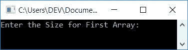
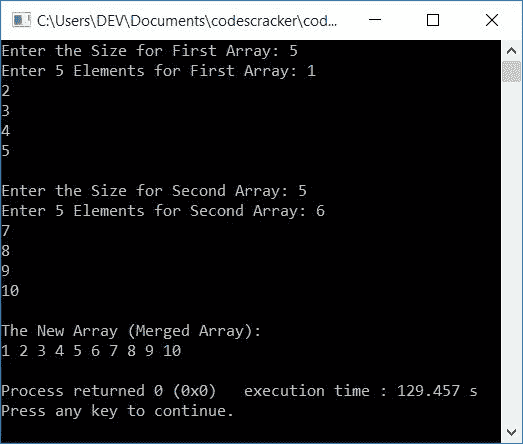
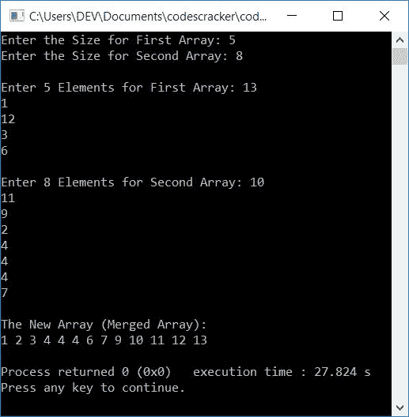
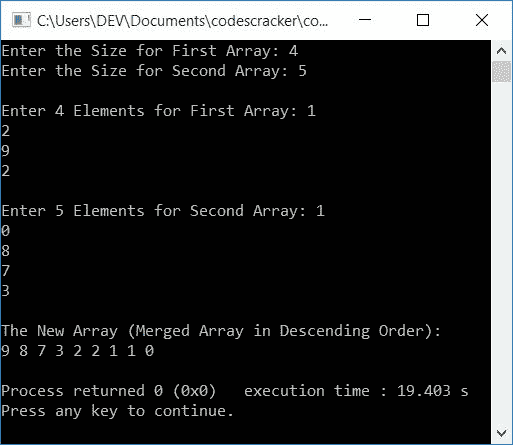

# C++ 程序：合并两个数组

> 原文：<https://codescracker.com/cpp/program/cpp-program-merge-two-arrays.htm>

在本文中，您将学习并获得在运行时用 C++ 语言合并用户输入的两个数组的代码。下面是本文中关于合并两个数组的程序列表:

*   按照用户提供的相同顺序合并两个数组
*   按升序合并两个数组
*   按降序合并两个数组

## 在 C++ 中合并两个数组

在 C++ 编程中要合并两个[数组](/cpp/cpp-arrays.htm)，你必须要求用户输入 两个数组的大小和元素。然后将这两个给定的数组合并成第三个数组，如下面给出的程序 所示:

**注意-** 在接收数组元素的时候，我们已经应用了合并操作。也就是说，用户收到的元素 被逐一初始化到第三个数组中。

问题是，**用 C++ 写个程序合并两个数组。**下面是它的回答:

```
#include<iostream>
using namespace std;
int main()
{
    int arrOne[50], arrTwo[50], arrMerge[100];
	int sizeOne, sizeTwo, i, k;
    cout<<"Enter the Size for First Array: ";
    cin>>sizeOne;
    cout<<"Enter "<<sizeOne<<" Elements for First Array: ";
    for(i=0; i<sizeOne; i++)
    {
        cin>>arrOne[i];
        arrMerge[i] = arrOne[i];
    }
    k = i;
    cout<<"\nEnter the Size for Second Array: ";
    cin>>sizeTwo;
    cout<<"Enter "<<sizeTwo<<" Elements for Second Array: ";
    for(i=0; i<sizeTwo; i++)
    {
        cin>>arrTwo[i];
        arrMerge[k] = arrTwo[i];
        k++;
    }
    cout<<"\nThe New Array (Merged Array):\n";
    for(i=0; i<k; i++)
        cout<<arrMerge[i]<<" ";
    cout<<endl;
    return 0;
}
```

这个程序是在 *Code::Blocks* IDE 下构建和运行的。下面是它的运行示例:



现在逐一提供输入。例如，如果用户输入:

*   5 作为第一个数组的大小
*   1，2，3，4，5 作为第一个数组的 5 个元素
*   5 作为第二个数组的大小
*   6，7，8，9，10 作为第二数组的 5 个元素

下面是在提供这些输入并按下`ENTER` 键后，上述程序产生的输出:



您也可以对两个数组进行排序，然后合并。或合并后排序。以下是你可以采用的排序技术:

*   [C++ 冒泡排序](/cpp/program/cpp-program-bubble-sort.htm)
*   [C++ 选择排序](/cpp/program/cpp-program-selection-sort.htm)
*   [C++ 插入排序](/cpp/program/cpp-program-Insertion-sort.htm)

## 按升序合并两个数组

这个程序按照升序合并用户在运行时输入的两个数组。也就是说，这两个数组被合并，然后在输出中打印合并后的数组之前进行排序:

```
#include<iostream>
using namespace std;
int main()
{
    int arrOne[50], arrTwo[50], arrMerge[100];
    int sizeOne, sizeTwo, sizeMerge, i, j, temp;
    cout<<"Enter the Size for First Array: ";
    cin>>sizeOne;
    cout<<"Enter the Size for Second Array: ";
    cin>>sizeTwo;
    cout<<"\nEnter "<<sizeOne<<" Elements for First Array: ";
    for(i=0; i<sizeOne; i++)
        cin>>arrOne[i];
    cout<<"\nEnter "<<sizeTwo<<" Elements for Second Array: ";
    for(i=0; i<sizeTwo; i++)
        cin>>arrTwo[i];
    // merging the two arrays
    for(i=0; i<sizeOne; i++)
    {
        arrMerge[i] = arrOne[i];
    }
    for(j=0; j<sizeTwo; j++)
    {
        arrMerge[i] = arrTwo[j];
        i++;
    }
    sizeMerge = i;
    // sorting the merged array in ascending order
    for(j=0; j<(sizeMerge-1); j++)
    {
        for(i=0; i<(sizeMerge-1); i++)
        {
            if(arrMerge[i]>arrMerge[i+1])
            {
                temp = arrMerge[i];
                arrMerge[i] = arrMerge[i+1];
                arrMerge[i+1] = temp;
            }
        }
    }
    cout<<"\nThe New Array (Merged Array):\n";
    for(i=0; i<sizeMerge; i++)
    {
        if(i==(sizeMerge-1))
            cout<<arrMerge[i];
        else
            cout<<arrMerge[i]<<" ";
    }
    cout<<endl;
    return 0;
}
```

下面是它的运行示例，用户输入如下:

*   5 作为第一个数组的大小
*   8 作为第二个数组的大小
*   13，1，12，3，6 作为第一个数组的 5 个元素
*   10，11，9，2，4，4，7 作为第二数组的 8 个元素

在提供这些输入之后，上面的程序产生了以下输出:



## 按降序合并两个数组

要按降序合并两个数组，请更改以下代码(来自上一个程序):

```
if(arrMerge[i]>arrMerge[i+1])
```

随着

```
if(arrMerge[i]<arrMerge[i+1])
```

**注-** 仅仅是一个**大于**和**小于**的符号问题，整个程序都变了。

其余的事情将是一样的。也就是说，在前面的程序中按升序对合并的数组进行排序的代码已经更改为按降序对相同的数组进行排序。

但是，如果你想得到按降序合并两个数组的完整程序，这里有你需要的源代码:

```
#include<iostream>
using namespace std;
int main()
{
    int arrOne[50], arrTwo[50], arrMerge[100];
    int sizeOne, sizeTwo, sizeMerge, i, j, temp;
    cout<<"Enter the Size for First Array: ";
    cin>>sizeOne;
    cout<<"Enter the Size for Second Array: ";
    cin>>sizeTwo;
    cout<<"\nEnter "<<sizeOne<<" Elements for First Array: ";
    for(i=0; i<sizeOne; i++)
        cin>>arrOne[i];
    cout<<"\nEnter "<<sizeTwo<<" Elements for Second Array: ";
    for(i=0; i<sizeTwo; i++)
        cin>>arrTwo[i];
    // merging the two arrays
    for(i=0; i<sizeOne; i++)
    {
        arrMerge[i] = arrOne[i];
    }
    for(j=0; j<sizeTwo; j++)
    {
        arrMerge[i] = arrTwo[j];
        i++;
    }
    sizeMerge = i;
    // sorting the merged array in descending order
    for(j=0; j<(sizeMerge-1); j++)
    {
        for(i=0; i<(sizeMerge-1); i++)
        {
            if(arrMerge[i]<arrMerge[i+1])
            {
                temp = arrMerge[i];
                arrMerge[i] = arrMerge[i+1];
                arrMerge[i+1] = temp;
            }
        }
    }
    cout<<"\nThe New Array (Merged Array in Descending Order):\n";
    for(i=0; i<sizeMerge; i++)
    {
        if(i==(sizeMerge-1))
            cout<<arrMerge[i];
        else
            cout<<arrMerge[i]<<" ";
    }
    cout<<endl;
    return 0;
}
```

以下是用户输入的运行示例:

*   4 作为第一个数组的大小
*   5 作为第二个数组的大小
*   1，2，9，2 作为第一个数组的 4 个元素
*   1，0，8，7，3 作为第二个数组的 5 个元素

下面给出的快照显示了在提供这些输入后，上述程序产生的示例输出:



#### 其他语言的相同程序

*   [C 合并两个数组](/c/program/c-program-merge-two-arrays.htm)
*   [Java 合并两个数组](/java/program/java-program-merge-two-arrays.htm)

[C++ 在线测试](/exam/showtest.php?subid=3)

* * *

* * *