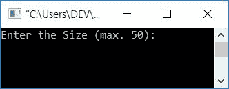
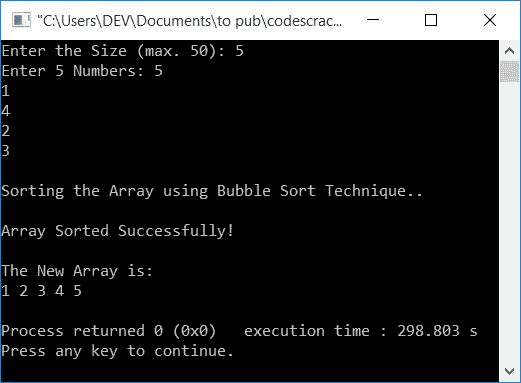
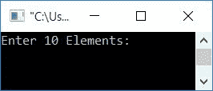
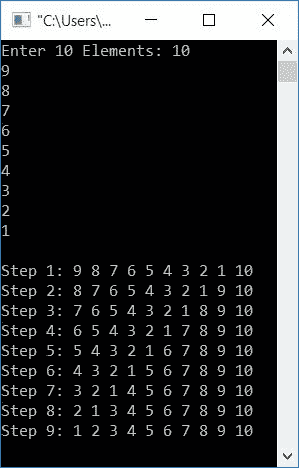
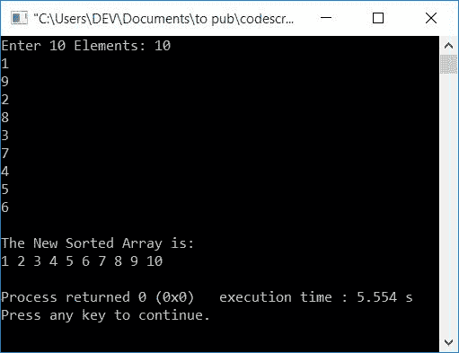

# C++ 程序：冒泡排序

> 原文：<https://codescracker.com/cpp/program/cpp-program-bubble-sort.htm>

在本文中，您将学习并获得在 C++程序中实现冒泡排序技术的代码。也就是说，你将得到如何使用冒泡排序技术对数组进行升序排序的代码。冒泡排序程序通过以下方法创建:

*   简单冒泡排序程序
*   使用冒泡排序算法在每次排序后打印数组
*   使用用户自定义函数的冒泡排序程序

但是在开始这个程序之前，如果你不知道它，你可以按照[冒泡排序](/computer-fundamental/bubble-sort.htm)用例子来理解它的逻辑。这就是 冒泡排序技术在程序中的实际工作方式。

## C++中的冒泡排序

要在 [C++](/cpp/index.htm) 编程中使用冒泡排序对[数组](/cpp/cpp-arrays.htm)进行升序排序，必须要求用户输入数组大小及其元素。现在 开始使用冒泡排序技术对数组元素进行排序，并在屏幕上显示排序后的数组，如下面程序中的 所示。

```
#include<iostream>
using namespace std;
int main()
{
    int n, i, arr[50], j, temp;
    cout<<"Enter the Size (max. 50): ";
    cin>>n;
    cout<<"Enter "<<n<<" Numbers: ";
    for(i=0; i<n; i++)
        cin>>arr[i];
    cout<<"\nSorting the Array using Bubble Sort Technique..\n";
    for(i=0; i<(n-1); i++)
    {
        for(j=0; j<(n-i-1); j++)
        {
            if(arr[j]>arr[j+1])
            {
                temp = arr[j];
                arr[j] = arr[j+1];
                arr[j+1] = temp;
            }
        }
    }
    cout<<"\nArray Sorted Successfully!\n";
    cout<<"\nThe New Array is: \n";
    for(i=0; i<n; i++)
        cout<<arr[i]<<" ";
    cout<<endl;
    return 0;
}
```

这个程序是在 *Code::Blocks* IDE 下构建和运行的。以下是示例运行的初始快照:



现在输入尺寸，比如说 **5** ，然后输入它的元素为 **5，1，4，2，3** 。按下`ENTER`键至 键，列表按升序排序，如下面给出的样品运行的最终快照所示:



如果用户输入数组的大小为 **5** ，其元素为 **5，1，4，2，3** ，那么上述 程序的模拟运行如下:

*   因为尺寸是 **5** 。因此， **n=5**
*   并且所有 5 个元素都被初始化到数组 **arr[]** 中，其方式为 **arr[0]=5** ， **arr[1]= 1**， **arr[2]=4** ， **arr[3]=2** ，以及 **arr[4]=3**
*   现在使用**循环**，初始 **i=0** 并检查条件，是否小于 **n-1**
*   因为条件( **i < (n-1)** 或 **0 < (5-1)** 或 **0 < 4** )评估为真，所以 程序流程进入循环内部
*   在循环内部，对于循环有另一个**，并且有 **j=0** (初始)并且条件 **j<(n-I-1)**或 **j < (5-0-1)** 或 **j < 4** 评估为真。因此程序流 进入该循环**
*   如果块检查**的条件，即 **arr[j] > arr[j+1]** 或 **arr[0] > arr[1]** 或 **5>1**评估为真，则程序流程进入 **if** 块并执行所有的 三条语句**
*   执行完所有三条语句后，索引号为 **j** 的元素与索引号为 j+1 的元素进行交换
*   现在 **arr[0]=1** 和 **arr[1]=5** 以及其余三个元素将处于相同的索引。
*   现在程序流程转到循环的内部**的更新部分，并增加 **j** 的值。 现在 **j=1****
*   再次检查条件，即 **j < (n-i-1)** 或 **1 < (5-0-1)** 或 **1 < 4** 评估为 真，因此程序流程再次进入循环内部并检查**的条件，如果**阻塞
*   如果条件评估为真，则处理三个语句，否则更新 **j** 的值并检查条件
*   用更新的值继续类似的过程，直到循环的外部**的条件评估 为假。**
*   如果循环的**外部**的条件评估为假，则程序流退出循环
*   现在数组 **arr[]** 已经排序，只需打印它

### 每次排序后打印数组

让我们创建另一个程序来消除你对冒泡排序的所有疑虑。这个程序在每次排序后打印数组。每次排序后，深入查看所有数组。

```
#include<iostream>
using namespace std;
int main()
{
    int i, arr[10], j, temp;
    cout<<"Enter 10 Elements: ";
    for(i=0; i<10; i++)
        cin>>arr[i];
    cout<<endl;
    for(i=0; i<9; i++)
    {
        for(j=0; j<(10-i-1); j++)
        {
            if(arr[j]>arr[j+1])
            {
                temp = arr[j];
                arr[j] = arr[j+1];
                arr[j+1] = temp;
            }
        }
        cout<<"Step "<<i+1<<": ";
        for(j=0; j<10; j++)
            cout<<arr[j]<<" ";
        cout<<endl;
    }
    cout<<endl;
    return 0;
}
```

以下是示例运行的初始快照:



现在随机输入 10 个元素，按升序排序。这里我已经输入了 10 个元素，按降序排列，比如说 **10，9，8，7，6，5，4，3，2，1** 。提供所有 10 个元素后，按`ENTER`到 键，输出如下图所示:



**注-** 最后一个数组或最后一步(第 9 步)的数组是排序后的数组。

## C++中使用函数的冒泡排序

这是关于冒泡排序的最后一个程序。这个程序是使用函数 **bubbleSort()** 创建的。函数 接收数组作为参数，并按升序排序。要详细了解函数，那么你可以 参考关于它的单独教程。

```
#include<iostream>
using namespace std;
void bubbleSort(int []);
int main()
{
    int i, arr[10];
    cout<<"Enter 10 Elements: ";
    for(i=0; i<10; i++)
        cin>>arr[i];
    bubbleSort(arr);
    cout<<"\nThe New Sorted Array is: \n";
    for(i=0; i<10; i++)
        cout<<arr[i]<<" ";
    cout<<endl;
    return 0;
}
void bubbleSort(int arr[])
{
    int i, j, temp;
    for(i=0; i<9; i++)
    {
        for(j=0; j<(10-i-1); j++)
        {
            if(arr[j]>arr[j+1])
            {
                temp = arr[j];
                arr[j] = arr[j+1];
                arr[j+1] = temp;
            }
        }
    }
}
```

下面是它的运行示例:



#### 其他语言的相同程序

*   [C 气泡排序](/c/program/c-program-bubble-sort.htm)
*   [Java 冒泡排序](/java/program/java-program-bubble-sort.htm)

[C++在线测试](/exam/showtest.php?subid=3)

* * *

* * *