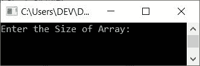
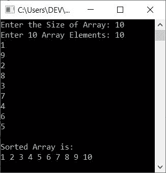
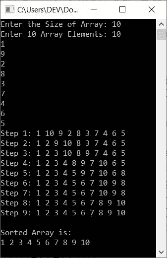
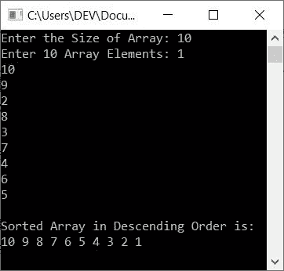
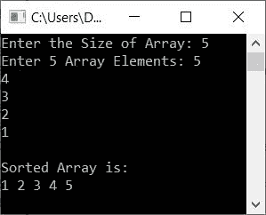

# C++ 程序：用于选择排序

> 原文：<https://codescracker.com/cpp/program/cpp-program-selection-sort.htm>

在本文中，您将学习并获得在 C++ 中实现选择排序的代码。以下是本文中提供的关于选择排序的程序列表:

*   选择按升序排序
*   选择按降序排序
*   使用函数进行选择排序
*   使用类和对象进行选择排序

但是在创建这些程序之前，如果你不知道选择排序，参考[选择排序算法和例子](/computer-fundamental/selection-sort.htm)来获得关于它的所有必需的东西 。

## C++ 中的选择排序

在 [C++](/cpp/index.htm) 编程中，要使用选择排序技术对[数组](/cpp/cpp-arrays.htm)进行升序排序，必须要求用户输入数组的大小和元素。 现在使用如下程序所示的选择排序技术对数组进行排序:

**注意-** 选择排序的工作方式是，最初最小的元素被选中并移动到第一个索引(第 0 个<sup>第</sup>个索引，因为数组中的索引从 0 开始)，然后第二个最小的元素被选中 并移动到第二个(第 1 个<sup>第</sup>个)索引，依此类推。

```
#include<iostream>
using namespace std;
int main()
{
    int tot, arr[50], i, j, temp, small, chk, index;
    cout<<"Enter the Size of Array: ";
    cin>>tot;
    cout<<"Enter "<<tot<<" Array Elements: ";
    for(i=0; i<tot; i++)
        cin>>arr[i];
    for(i=0; i<(tot-1); i++)
    {
        chk=0;
        small = arr[i];
        for(j=(i+1); j<tot; j++)
        {
            if(small>arr[j])
            {
                small = arr[j];
                chk++;
                index = j;
            }
        }
        if(chk!=0)
        {
            temp = arr[i];
            arr[i] = small;
            arr[index] = temp;
        }
    }
    cout<<"\nSorted Array is:\n";
    for(i=0; i<tot; i++)
        cout<<arr[i]<<" ";
    cout<<endl;
    return 0;
}
```

这个程序是在 *Code::Blocks* IDE 下构建和运行的。下面是它的运行示例:



现在输入大小，比如说 **10** ，然后输入任意 10 个数组元素，比如说 T3】10，1，9，2，8，3，7，4，6，5 ，按 `ENTER`键使用选择排序技术对数组进行排序，然后打印新排序的数组，如下图 所示:



使用与上面的示例运行中提供的相同用户输入对上面的程序进行模拟运行，如下所示:>

*   当用户输入 10 作为尺寸时，它被存储在 **tot** 中。所以 **tot=10**
*   当用户输入 10 个元素时，它会以这样的方式存储在 **arr** 中:
    *   arr[0]=10
    *   arr[1]=1
    *   arr[2]=9
    *   依此类推，直到
    *   arr[9]=5
*   现在开始执行程序循环的第二个*,或者为执行 选择排序而创建的循环*
*   也就是说， **0** 被初始化为 **i** 并且条件 **i < (tot-1)** 或 **0 < (10-1)** 或 **0<9**被评估为真，因此程序流程进入循环内部
*   在循环内部， **0** 被初始化为 **chk** 。所以 **chk=0**
*   并且 **arr[i]** 或 **arr[0]** 或 **10** 被初始化为**小**。所以 **small=10** ，我们已经 假设 10 是最小的元素。现在让我们将它与静态元素索引进行比较
*   每次我们都假设当前索引处的元素是最小的元素，然后将其与元素的其余部分进行比较，如果发现它大于任何元素，那么我们就将一个新元素初始化为最小的元素
*   现在开始执行循环的内部*。也就是说，【T2(I+1)】T3 或 **0+1** 或 **1** 得到初始化为 **j** 的 ，并且条件 **j < tot** 或 **1 < 10** 评估为真，因此程序 流程进入循环内部*
*   在这个循环中，**if**)**small>arr【j】**或**10>arr【1】**或 **10 > 1** 的条件评估为真，因此程序流程进入 **if** 体
*   并且 **arr[j]** 或 **arr[1]** 或 **1** 被初始化为**小**。 **chk** 的值增加 。所以 **chk=1** 。最后 **j** 或 **1** 被初始化为**索引**
*   现在 **j** 的值增加了。因此 **j=2** 和条件 **j < tot** 或 **2 < 10** 再次评估为真，因此程序流程再次进入循环。该过程继续，直到循环的*的 条件评估为假*
*   因为，1 是最小的元素，所以从这个循环退出后**小=1** 。而 1 是在 **1<sup>ST</sup>T5 的索引，因此**索引=1****
*   退出该循环后，**if****chk！=0** 或 **1！=0** 评估为真， 因此 **arr[i]** 或 **arr[0]** 或 **10** 被初始化为 **temp** ， **small** 或 **1** 被初始化为 **arr[i]** 或 **arr[0]** ，最后是 **temp** 或
*   现在程序流程转到循环的外部*的更新部分，并增加 **i** 的值。 所以 **i=1** 。并且条件再次被评估*
*   即条件 **i < (tot-1)** 或 **1 < (10-1)** 或 **1 < 9** 再次评估为真， 因此程序流程再次进入循环
*   这个过程一直持续到条件评估为假
*   这样，选择排序就实现了

要在每次排序后打印数组，只需放置以下代码块:

```
cout<<"Step "<<i+1<<": ";
for(j=0; j<tot; j++)
    cout<<arr[j]<<" ";
cout<<endl;
```

在...之后

```
if(chk!=0)
{
    temp = arr[i];
    arr[i] = small;
    arr[index] = temp;
}
```

也就是说，将代码最后放在为执行选择排序而创建的循环的*中。现在， 示例运行的用户输入与之前的示例运行相同，如下所示:*



## 选择按降序排序

要使用选择排序技术对数组进行降序排序，只需替换条件 **if** 。那 就是，替换以下条件:

```
small>arr[j]
```

在下面给出的条件下

```
small<arr[j]
```

**注意-** 仅仅是一个大于号(>)和小于号(<)的问题，整个程序就颠倒过来了。

但是，如果你想选择降序排序的完整程序，那么这里是:

```
#include<iostream>
using namespace std;
int main()
{
    int tot, arr[50], i, j, temp, big, chk, index;
    cout<<"Enter the Size of Array: ";
    cin>>tot;
    cout<<"Enter "<<tot<<" Array Elements: ";
    for(i=0; i<tot; i++)
        cin>>arr[i];
    for(i=0; i<(tot-1); i++)
    {
        chk=0;
        big = arr[i];
        for(j=(i+1); j<tot; j++)
        {
            if(big<arr[j])
            {
                big = arr[j];
                chk++;
                index = j;
            }
        }
        if(chk!=0)
        {
            temp = arr[i];
            arr[i] = big;
            arr[index] = temp;
        }
    }
    cout<<"\nSorted Array in Descending Order is:\n";
    for(i=0; i<tot; i++)
        cout<<arr[i]<<" ";
    cout<<endl;
    return 0;
}
```

下面给出的快照显示了这个程序的示例运行，使用用户输入， **10** 作为大小， 1，10，9，2，8，3，7，4，6，5 作为 10 个数组元素:



## 使用函数进行选择排序

现在让我们创建另一个程序，它的工作与第一个程序相同。也就是说，这个程序使用用户定义的函数 **selSort()** 实现了选择排序，以升序对数组进行排序。

函数 **selSort()** 有两个参数。第一个参数是数组，而第二个参数 是它的大小。此函数使用选择排序技术对数组进行排序:

```
#include<iostream>
using namespace std;
void selSort(int [], int);
int main()
{
    int tot, arr[50], i;
    cout<<"Enter the Size of Array: ";
    cin>>tot;
    cout<<"Enter "<<tot<<" Array Elements: ";
    for(i=0; i<tot; i++)
        cin>>arr[i];
    selSort(arr, tot);
    cout<<"\nSorted Array is:\n";
    for(i=0; i<tot; i++)
        cout<<arr[i]<<" ";
    cout<<endl;
    return 0;
}
void selSort(int arr[], int tot)
{
    int i, j, temp, small, chk, index;
    for(i=0; i<(tot-1); i++)
    {
        chk=0;
        small = arr[i];
        for(j=(i+1); j<tot; j++)
        {
            if(small>arr[j])
            {
                small = arr[j];
                chk++;
                index = j;
            }
        }
        if(chk!=0)
        {
            temp = arr[i];
            arr[i] = small;
            arr[index] = temp;
        }
    }
}
```

这个程序产生了与本文第一个程序相同的输出。下面是它的运行示例，用户输入的 **5** 为大小， **5，4，3，2，1** 为 5 个数组元素:



## 使用类进行选择排序

这是本文最后一个用 C++ 实现选择排序的程序。这个程序使用了*类和*、 对象，这是 C++ 面向对象的特性。

```
#include<iostream>
using namespace std;
class CodesCracker
{
    public:
        void selSort(int [], int);
};
void CodesCracker::selSort(int arr[], int tot)
{
    int i, j, temp, small, chk, index;
    for(i=0; i<(tot-1); i++)
    {
        chk=0;
        small = arr[i];
        for(j=(i+1); j<tot; j++)
        {
            if(small>arr[j])
            {
                small = arr[j];
                chk++;
                index = j;
            }
        }
        if(chk!=0)
        {
            temp = arr[i];
            arr[i] = small;
            arr[index] = temp;
        }
    }
}
int main()
{
    CodesCracker c;
    int tot, arr[50], i;
    cout<<"Enter the Size of Array: ";
    cin>>tot;
    cout<<"Enter "<<tot<<" Array Elements: ";
    for(i=0; i<tot; i++)
        cin>>arr[i];
    c.selSort(arr, tot);
    cout<<"\nSorted Array is:\n";
    for(i=0; i<tot; i++)
        cout<<arr[i]<<" ";
    cout<<endl;
    return 0;
}
```

在 **main()** 函数中创建了一个类型为 **CodesCracker** 的对象 **c** 。并且使用 这个对象，我们已经使用 **点(.)**运算符。其余的事情都是类似的，比如函数。

#### 其他语言的相同程序

*   [C 选择排序](/c/program/c-program-selection-sort.htm)
*   [Java 选择排序](/java/program/java-program-selection-sort.htm)

[C++ 在线测试](/exam/showtest.php?subid=3)

* * *

* * *