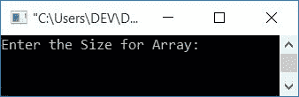
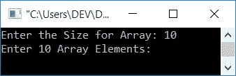
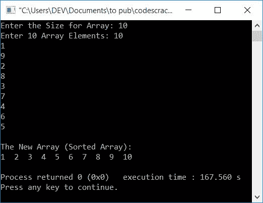
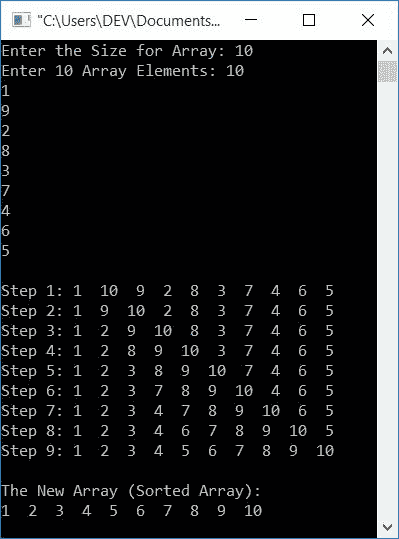
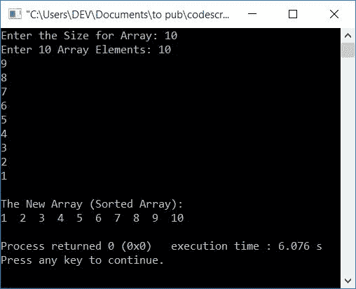

# 用于插入排序的 C++程序

> 原文：<https://codescracker.com/cpp/program/cpp-program-Insertion-sort.htm>

在本文中，您将学习并获得在 C++中使用插入排序技术对数组进行排序的代码。以下是关于插入排序的程序列表:

*   简单插入排序程序
*   每次排序后打印数组
*   使用函数插入排序

在浏览这些程序之前，如果你不知道插入排序背后的步骤和逻辑，那么参考[插入排序算法和例子](/computer-fundamental/insertion-sort.htm)到 得到所有需要的东西。

## C++中的插入排序

要在 [C++](/cpp/index.htm) 编程中使用插入排序技术对[数组](/cpp/cpp-arrays.htm)进行排序，您必须要求用户输入数组的大小，然后以 随机顺序输入该大小的元素。接收到输入后，使用插入排序对给定数组进行升序排序，如下面给出的程序 所示:

问题是，**用 C++写个程序实现插入排序。**下面是它的回答:

```
#include<iostream>
using namespace std;
int main()
{
    int arr[50], tot, i, j, k, elem, index;
    cout<<"Enter the Size for Array: ";
    cin>>tot;
    cout<<"Enter "<<tot<<" Array Elements: ";
    for(i=0; i<tot; i++)
        cin>>arr[i];
    for(i=1; i<tot; i++)
    {
        elem = arr[i];
        if(elem<arr[i-1])
        {
            for(j=0; j<=i; j++)
            {
                if(elem<arr[j])
                {
                    index = j;
                    for(k=i; k>j; k--)
                        arr[k] = arr[k-1];
                    break;
                }
            }
        }
        else
            continue;
        arr[index] = elem;
    }
    cout<<"\nThe New Array (Sorted Array):\n";
    for(i=0; i<tot; i++)
        cout<<arr[i]<<"  ";
    cout<<endl;
    return 0;
}
```

这个程序是在 *Code::Blocks* IDE 下构建和运行的。下面是它的运行示例:



现在为阵列提供尺寸，比如说 **10** ，然后按`ENTER`。以下是您将看到的输出:



现在提供任意 10 个数字作为 10 个数组元素，逐一说出 **10，1，9，2，8，3，7，4，6，5** 。提供 所有 10 个输入后，按`ENTER`键排序并打印新数组，如下图所示:



上述程序(接收用户输入)的预演如下:

*   当用户输入数组的大小，比如说 **10** 时，它被存储在 **tot** 中。所以 **tot=10**
*   现在我们已经为循环创建了一个*来接收 10 个输入作为 10 个元素*
*   也就是说，循环内的语句继续执行，直到条件**I<tot**T5【循环的*的】评估为假*
*   每次进入循环时，我们都会在 **arr[]** 中收到一个数字
*   循环的*第一次运行时，其初始化(first)部分首先执行，但只执行一次。 因此**最初我=0***
*   并且条件 **i < tot** 得到评估。也就是说，条件 **i < tot** 或**0<10**T13】评估为真，因此程序流程进入循环，并从用户接收一个数字。数字 存储在 **arr[i]** 或 **arr[0]** 中
*   现在， **i** 的值增加。所以 **i=1** 。并且条件 **i < tot** 再次用新的值 *i* 来评估
*   同样在第二次，条件， **i < tot** 或 **1 < 10** 评估为真，因此 接收另一个值并初始化为 **arr[1]** 。这样，10 个元素被初始化为 **arr[]**，第一个元素存储在 **arr[0]** 中，第二个元素存储在 **arr[1]** 中，以此类推， 直到第十个元素存储在 **arr[9]** 中

上面的程序中插入排序代码的模拟运行，使用用户输入， **10** 作为大小， 10，1，9，2，8，3，7，4，6，5 作为数组的元素，如下所示:

*   循环的*从 1 开始。所以最初 **i=1***
*   条件， **i < tot** 或 **1 < 10** 评估为真，因此程序流程进入 循环，并且 **arr[i]或**arr[1]T7 或 **1** 被初始化为 **elem******
*   现在条件(if**)， **elem < arr[i-1]** 或 **1 < arr[1-1]** 或 **1 < arr[0]** 或 **1<10**评估为真，因此程序流程进入 if** 的主体内
*   循环还有另一个*，最初 **j=0** 且条件 **j < =i** 或 **0 < =1** 评估为真，因此程序流程进入循环内部*
*   并且条件 **if** ，**elem<arr【j】**或**1<arr【0】**或 **1 < 10** 评估为 为真，因此如果的体，程序流程进入**内部，并且 **j** 或 **0** 被初始化为 **索引****
*   循环还有一个*，通过这个循环， **i** (1)的值被初始化为 **k** 。 因此 **k=1** ，并且条件 **k > j** 或 **1 > =0** 评估为真，因此程序流 进入循环内部，并且**arr【k-1】**或**arr【1-1】**或**arr【0】**或 **10** 被初始化为*
*   现在， **k** 的值递减。所以 **k=0**
*   条件， **k > j** 或 **0 > 0** 评估为假，因此该循环的执行暂时结束 。并使用 **break** 关键字，跳过执行*外部 for 循环*
*   现在 **elem** (1)的值被初始化为 **arr[index]** 或 **arr[0]** 。所以 **arr[0]=1**
*   最后，两个元素，即第一和第二位置的元素被交换。所以**arr[0]= 1**T4**arr[1]= 10**
*   这个过程继续，直到循环(最外面的)的条件*评估为假*
*   现在打印 **arr[]** 的值，这将是排序形式的相同数组

### 每次排序后打印数组

在这个程序中，使用插入排序在每次排序后打印新数组。在观看了这个程序的输出之后，您可以理解它对元素排序的深入细节

```
#include<iostream>
using namespace std;
int main()
{
    int arr[50], tot, i, j, k, elem, index;
    cout<<"Enter the Size for Array: ";
    cin>>tot;
    cout<<"Enter "<<tot<<" Array Elements: ";
    for(i=0; i<tot; i++)
        cin>>arr[i];
    for(i=1; i<tot; i++)
    {
        elem = arr[i];
        if(elem<arr[i-1])
        {
            for(j=0; j<=i; j++)
            {
                if(elem<arr[j])
                {
                    index = j;
                    for(k=i; k>j; k--)
                        arr[k] = arr[k-1];
                    break;
                }
            }
        }
        else
            continue;
        arr[index] = elem;
        cout<<"\nStep "<<i<<": ";
        for(j=0; j<tot; j++)
            cout<<arr[j]<<"  ";
    }
    cout<<"\n\nThe New Array (Sorted Array):\n";
    for(i=0; i<tot; i++)
        cout<<arr[i]<<"  ";
    cout<<endl;
    return 0;
}
```

下面是它的示例运行，用户输入与前面程序的示例运行中提供的相同:



## 使用函数插入排序

这是本文的最后一个程序，与本文的第一个程序做同样的工作。唯一不同的是，这个程序使用了一个用户自定义函数 **insertionSort()** 来对 用户输入的数组进行排序。

这个函数接收一个数组和它的大小作为它的两个参数。

```
#include<iostream>
using namespace std;
void insertionSort(int [], int);
int main()
{
    int arr[50], tot, i;
    cout<<"Enter the Size for Array: ";
    cin>>tot;
    cout<<"Enter "<<tot<<" Array Elements: ";
    for(i=0; i<tot; i++)
        cin>>arr[i];
    insertionSort(arr, tot);
    cout<<"\nThe New Array (Sorted Array):\n";
    for(i=0; i<tot; i++)
        cout<<arr[i]<<"  ";
    cout<<endl;
    return 0;
}
void insertionSort(int arr[], int tot)
{
    int i, elem, j;
    for(i=1; i<tot; i++)
    {
        elem = arr[i];
        j = i-1;
        while((elem<arr[j]) && (j>=0))
        {
            arr[j+1] = arr[j];
            j--;
        }
        arr[j+1] = elem;
    }
}
```

以下是用户输入的示例运行，大小为 **10** ，数组的元素 为 **10，9，8，7，6，5，4，3，2，1** :



#### 其他语言的相同程序

*   [C 插入排序](/c/program/c-program-Insertion-sort.htm)
*   [Java 插入排序](/java/program/java-program-Insertion-sort.htm)

[C++在线测试](/exam/showtest.php?subid=3)

* * *

* * *