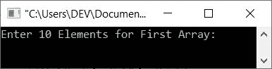
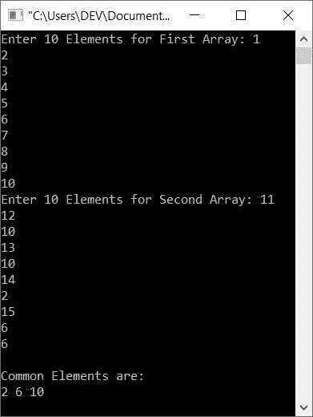
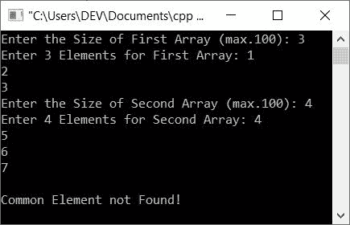
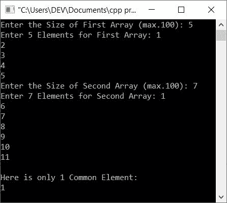

# C++程序，用于查找和打印两个数组之间的公共元素

> 原文：<https://codescracker.com/cpp/program/cpp-common-elements-from-two-arrays.htm>

本文介绍了一些用 C++编写的程序，这些程序用于查找和打印用户在运行时在两个给定数组之间出现的所有公共元素。

例如，如果两个给定的数组是:

```
arr1[10] = 10, 20, 30, 40, 50, 60, 70, 80, 90, 100
arr2[10] = 10, 34, 10, 67, 54, 90, 84, 39, 30, 54
```

那么这两个数组之间的公共元素是 **10，90，30** 。因为这三个元素在两个数组中都可用。

## 寻找两个数组之间的公共元素

问题是，**用 C++写一个程序，在运行时从用户那里接收任意两个数组，找到并打印两个给定数组之间的所有公共元素 。**下面是它的回答:

```
#include<iostream>

using namespace std;

int main()
{
   int arr1[10], arr2[10], arr3[10], i, j, k=0, x, tot;
   cout<<"Enter 10 Elements for First Array: ";
   for(i=0; i<10; i++)
      cin>>arr1[i];
   cout<<"Enter 10 Elements for Second Array: ";
   for(i=0; i<10; i++)
      cin>>arr2[i];

   // Finding and storing common elements
   for(i=0; i<10; i++)
   {
      for(j=0; j<10; j++)
      {
         if(arr1[i]==arr2[j])
         {
            tot = 0;
            for(x=0; x<k; x++)
            {
               if(arr1[i]==arr3[x])
                  tot++;
            }
            if(tot==0)
            {
               arr3[k] = arr1[i];
               k++;
            }
         }
      }
   }

   // Printing common elements
   cout<<"\nCommon Elements are:\n";
   for(i=0; i<k; i++)
      cout<<arr3[i]<<" ";

   cout<<endl;
   return 0;
}
```

下面给出的快照显示了上面的 C++程序在运行时查找并打印两个给定数组之间的所有公共元素时产生的初始输出:



现在提供输入，比如说 1，2，3，4，5，6，7，8，9，10 作为第一个数组的十个元素，提供 **11，12，10，13，10，14，2，15，6，6** 作为第二个数组的 十个元素。以下是基于这些输入的运行示例:



上述程序是以这样的方式创建的:

*   首先，所有 10 个元素被接收并存储在数组 **arr1[]** 中
*   第二，所有 10 个元素被接收并存储在数组 **arr2[]** 中
*   现在我已经将 **arr1[]** 中第一个(或第 0 个<sup>)索引的元素与第二个 数组的每个元素进行了比较，即 **arr2[]**</sup>
*   如果找到任何匹配，那么元素被初始化或存储在第三个名为 **arr3[]** 的数组中
*   然后我将 **arr1[]** 中第二个(或第一个<sup>第一个</sup>)索引处的元素与第二个 数组中的每一个元素进行了比较
*   同样，如果找到匹配，那么元素被初始化为 **arr3[]**
*   这样，第三个数组 **arr3[]** 只保存给定的两个数组之间的公共元素

### 寻找任意大小的两个数组之间的公共元素

这是前一个程序的修改版本。这个程序允许用户定义数组的大小。此外，该程序根据输出打印消息。也就是说，如果在给定的两个数组之间没有找到公共元素，那么程序会显示消息 **Common Element not Found！**。这提供了更好的用户体验。

```
#include<iostream>

using namespace std;

int main()
{
   int a[100], b[100], c[100], i, j, k=0;
   int a_size, b_size, x, cnt=0;
   cout<<"Enter the Size of First Array (max.100): ";
   cin>>a_size;
   cout<<"Enter "<<a_size<<" Elements for First Array: ";
   for(i=0; i<a_size; i++)
      cin>>a[i];
   cout<<"Enter the Size of Second Array (max.100): ";
   cin>>b_size;
   cout<<"Enter "<<b_size<<" Elements for Second Array: ";
   for(i=0; i<b_size; i++)
      cin>>b[i];
   for(i=0; i<a_size; i++)
   {
      for(j=0; j<b_size; j++)
      {
         if(a[i]==b[j])
         {
            cnt = 0;
            for(x=0; x<k; x++)
            {
               if(a[i]==c[x])
                  cnt++;
            }
            if(cnt==0)
            {
               c[k] = a[i];
               k++;
            }
         }
      }
   }
   if(k==0)
      cout<<"\nCommon Element not Found!";
   else if(k==1)
   {
      cout<<"\nHere is only 1 Common Element:\n";
      cout<<c[0];
   }
   else
   {
      cout<<"\nHere are all "<<k<<" Common elements:\n";
      for(i=0; i<k; i++)
         cout<<c[i]<<" ";
   }
   cout<<endl;
   return 0;
}
```

下面是用户输入的运行示例， **3** 作为第一个数组的大小， **1，2，3** 作为第一个数组的三个元素。 和 **4** 为第二数组的大小， **4，5，6，7** 为第二数组的四个元素:



这是另一个使用用户输入运行的示例， **5** 和 **1，2，3，4，5** 作为第一个数组的大小和元素，而 **7** 和 **1，6，7，8，9，10，11** 作为第二个数组的大小和元素:



[C++在线测试](/exam/showtest.php?subid=3)

* * *

* * *