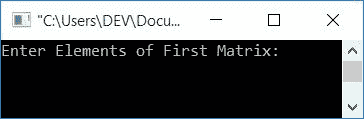
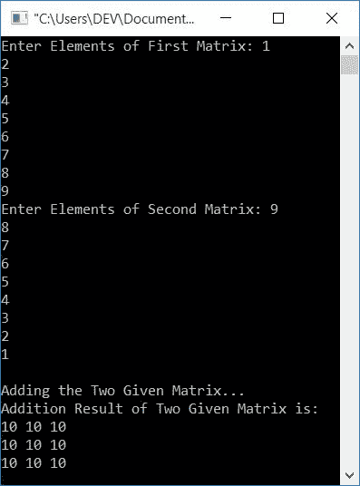
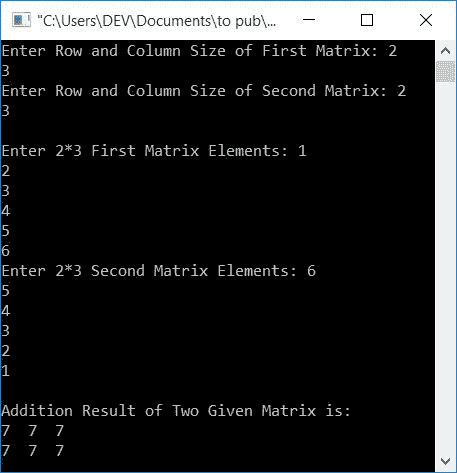

# C++ 程序：添加两个矩阵

> 原文：<https://codescracker.com/cpp/program/cpp-program-add-two-matrices.htm>

在这篇文章中，你将学习并获得 C++ 中两个矩阵相加的代码。这里有两个关于矩阵加法的程序:

*   两个 3*3 矩阵相加
*   添加两个矩阵，其大小由用户在运行时定义

在这两种情况下，矩阵的元素必须由用户在运行时输入。

### 如何将两个矩阵相加？

为[矩阵加法](/nonprog/matrix-addition.htm)创建单独的文章。如果你不 了解它，那么我建议你跟随这篇文章，在很短的时间内完全了解它。

但现在，让我告诉你，即添加两个矩阵，我们必须添加相应的元素。也就是说，第一个矩阵的第一行第一列的元素与第二个矩阵的第一行第一列的元素相加。以类似的方式，第一矩阵的第一行和第二列的元素与第二矩阵的第一行和第二列的元素相加。诸如此类。

要在 C++ 编程中添加两个矩阵，你必须要求用户输入两个矩阵的元素。现在添加相同位置的元素来形成一个新的矩阵。添加两个矩阵后，显示第三个矩阵，它是两个矩阵的相加结果，如下面的程序所示。

## 两个 3*3 矩阵相加

这个程序要求用户输入任意两个 **3*3** 矩阵。也就是说，允许用户为第一个 输入 9 个元素，为第二个矩阵输入 9 个元素。然后将它们相加以打印第三个矩阵，该矩阵将是给定两个矩阵的相加结果 :

```
#include<iostream>
using namespace std;
int main()
{
    int mat1[3][3], mat2[3][3], i, j, mat3[3][3];
    cout<<"Enter Elements of First Matrix: ";
    for(i=0; i<3; i++)
    {
        for(j=0; j<3; j++)
            cin>>mat1[i][j];
    }
    cout<<"Enter Elements of Second Matrix: ";
    for(i=0; i<3; i++)
    {
        for(j=0; j<3; j++)
            cin>>mat2[i][j];
    }
    cout<<"\nAdding the Two Given Matrix...\n";
    for(i=0; i<3; i++)
    {
        for(j=0; j<3; j++)
            mat3[i][j] = mat1[i][j]+mat2[i][j];
    }
    cout<<"Addition Result of Two Given Matrix is:\n";
    for(i=0; i<3; i++)
    {
        for(j=0; j<3; j++)
            cout<<mat3[i][j]<<" ";
        cout<<endl;
    }
    return 0;
}
```

这个程序是在 *Code::Blocks* IDE 下构建和运行的。下面是它的运行示例:



现在输入任意 9 个数字，比如说 **1，2，3，4，5，6，7，8，9** 作为第一个矩阵的元素，然后再输入 9 个数字，比如说 **9，8，7，6，5，4，3，2，1** 作为第二个矩阵的元素。按`ENTER`键查看 两个给定矩阵的相加结果，如下图输出所示:



当用户输入第一个矩阵的 9 个元素时，它以如下方式存储:

*   第一个元素存储在 **mat1[0][0]**
*   第二次在 **mat1[0][1]**
*   第三在 **mat1[0][2]**
*   第四次在 **mat1[1][0]**
*   第五在 **mat1[1][1]**
*   等等

类似地，第二矩阵的 9 个元素也以类似的方式存储。两个矩阵相加的方式是:

*   mat 3[0][0]= mat 1[0][0]+mat 2[0][0]。也就是说，第一个矩阵的第一个元素与第二个矩阵的第一个元素相加，并初始化为第三个矩阵的第一个元素
*   mat 3[0][1]= mat 1[0][1]+mat 2[0][1]。也就是说，两个矩阵的第二个元素相加并初始化为第三个矩阵的第二个矩阵
*   以类似的方式，矩阵被添加

打印第三个矩阵，这将是两个给定矩阵的求和结果。

### 允许用户定义大小

这个程序允许用户定义两个矩阵的大小。

**注-** 要定义两个矩阵的加法，两个矩阵必须具有相同的阶数。这里相同的顺序意味着， 第一矩阵的行大小必须等于第二矩阵的行大小，并且第一矩阵的列大小也必须 等于第二矩阵的列大小。

```
#include<iostream>
using namespace std;
int main()
{
    int rowOne, colOne, rowTwo, colTwo, i, j;
    int mat1[10][10], mat2[10][10], sum=0;
    cout<<"Enter Row and Column Size of First Matrix: ";
    cin>>rowOne>>colOne;
    cout<<"Enter Row and Column Size of Second Matrix: ";
    cin>>rowTwo>>colTwo;
    if(rowOne==rowTwo && colOne==colTwo)
    {
        cout<<"\nEnter "<<rowOne<<"*"<<colOne<<" First Matrix Elements: ";
        for(i=0; i<rowOne; i++)
        {
            for(j=0; j<colOne; j++)
                cin>>mat1[i][j];
        }
        cout<<"Enter "<<rowOne<<"*"<<colOne<<" Second Matrix Elements: ";
        for(i=0; i<rowOne; i++)
        {
            for(j=0; j<colOne; j++)
                cin>>mat2[i][j];
        }
        cout<<"\nAddition Result of Two Given Matrix is:\n";
        for(i=0; i<rowOne; i++)
        {
            for(j=0; j<colOne; j++)
            {
                sum = mat1[i][j]+mat2[i][j];
                cout<<sum<<"  ";
            }
            cout<<endl;
        }
    }
    else
        cout<<"\nSize Mismatched!\n";
    return 0;
}
```

假设用户已经输入矩阵的行大小和列大小都是 2 和 3，第一个矩阵的元素是 **1，2，3，4，5，6** ，第二个矩阵的元素是 **6，5，4，3，2，1** ，下面是它的运行示例:



#### 其他语言的相同程序

*   [C 添加两个矩阵](/c/program/c-program-add-two-matrices.htm)
*   [Java 添加两个矩阵](/java/program/java-program-add-two-matrices.htm)
*   [Python 添加两个矩阵](/python/program/python-program-add-two-matrices.htm)

[C++ 在线测试](/exam/showtest.php?subid=3)

* * *

* * *