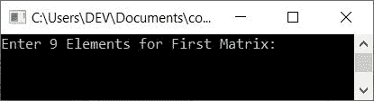
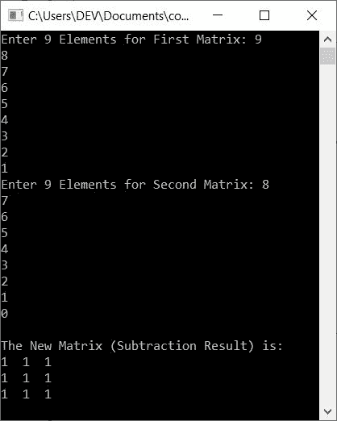
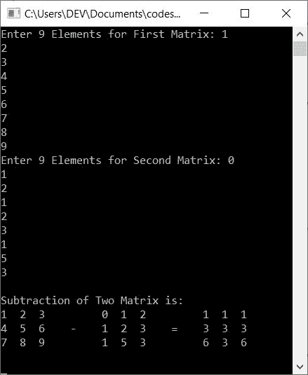
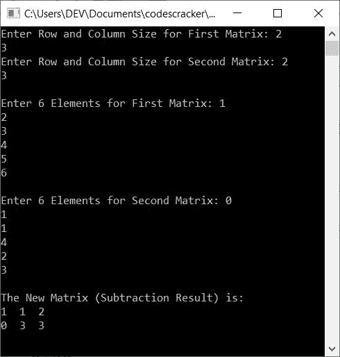

# C++ 程序：两个矩阵相减

> 原文：<https://codescracker.com/cpp/program/cpp-program-subtract-matrices.htm>

在本文中，您将学习并获得使用 C++ 程序来减去两个矩阵的代码。以下是矩阵减法的程序列表:

*   减去两个 3*3 矩阵
*   减去并打印 A-B = c。A 是第一个矩阵，B 是第二个矩阵
*   允许用户定义矩阵的大小

但是在浏览这些程序之前，如果你不知道这个主题，那么参考[矩阵减法](/nonprog/matrix-subtraction.htm)的文章来得到每一个需要的东西。

**注意-** 在矩阵减法中，第二个矩阵的相同行和列元素从第一个矩阵的 相同行和列元素中减去。让我给你举个例子:

```
1  2  3     0  1  3     1  1  0
4  5  6  -  3  1  2  =  1  4  4
7  8  9     1  2  3     6  6  6
```

如您所见，第二个矩阵(0)的第一行第一列的元素从第一个矩阵(1)的第一行第一列的元素中减去。类似地，从第一矩阵(2)的第一行第二列的元素中减去第二矩阵(1)的第一行第二列的元素，依此类推。

## 减去两个 3*3 矩阵

在 [C++](/cpp/index.htm) 编程中要减去两个矩阵，你必须要求用户输入 两个 3*3 矩阵。第一个矩阵有 9 个元素(数字),第二个矩阵有 9 个元素。然后从第一个矩阵中减去第二个 矩阵，如下程序所示:

```
#include<iostream>
using namespace std;
int main()
{
    int matOne[3][3], matTwo[3][3], matSub[3][3], i, j;
    cout<<"Enter 9 Elements for First Matrix: ";
    for(i=0; i<3; i++)
    {
        for(j=0; j<3; j++)
            cin>>matOne[i][j];
    }
    cout<<"Enter 9 Elements for Second Matrix: ";
    for(i=0; i<3; i++)
    {
        for(j=0; j<3; j++)
            cin>>matTwo[i][j];
    }
    for(i=0; i<3; i++)
    {
        for(j=0; j<3; j++)
            matSub[i][j] = matOne[i][j] - matTwo[i][j];
    }
    cout<<"\nThe New Matrix (Subtraction Result) is:\n";
    for(i=0; i<3; i++)
    {
        for(j=0; j<3; j++)
            cout<<matSub[i][j]<<"  ";
        cout<<endl;
    }
    cout<<endl;
    return 0;
}
```

这个程序是在 *Code::Blocks* IDE 下构建和运行的。下面是它的运行示例:



现在提供输入，比如说 9，8，7，6，5，4，3，2，1 作为第一矩阵的 9 个元素，T2 8，7，6，5，4，3，2，1，0 作为第二矩阵的 9 个 T4 元素。以下是减去两个给定矩阵后的输出示例:



当用户输入 **9，8，7，6，5，4，3，2，1** 作为第一个矩阵的 9 个元素时，它会以这样的方式存储在 **matOne[][]** 中:

*   matOne[0][0]=9
*   matOne[0][1]=8
*   matOne[0][2]=7
*   matOne[1][0]=6
*   matOne[1][1]=5
*   依此类推，直到
*   matOne[2][2]=1

而 9 个元素 8，7，6，5，4，3，2，1，0 以类似的方式存储在第二个矩阵中，比如 T2 的 matTwo[][]和 T4 的 mat two[]，即:

*   matTwo[0][0]=8
*   matTwo[0][1]=7
*   matTwo[0][2]=6
*   依此类推，直到
*   matTwo[2][2]=0

现在，执行以下代码块的矩阵减法:

```
for(i=0; i<3; i++)
{
    for(j=0; j<3; j++)
        matSub[i][j] = matOne[i][j] - matTwo[i][j];
}
```

当我们评估这段代码时，它的预演如下:

*   matSub[0][0]= matOne[0][0]-mat two[0][0]
*   matSub[0][1]= matOne[0][1]-mat two[0][1]
*   matSub[0][2]= matOne[0][2]-mat two[0][2]
*   matSub[1][0]= matOne[1][0]-mat two[1][0]
*   matSub[1]= matOne[1][1]-mat two[1][1]
*   matSub[1][2]= matOne[1][2]-mattwone[1][2]
*   matSub[2][0]= matOne[2][0]-mat two[2][0]
*   matSub[2][1]= matOne[2][1]-mattwone[2][1]
*   matSub[2]= matOne[2][2]-mattwone[2][2]

现在输入每个的数字或值:

*   matSub[0][0] = 9 - 8
*   matSub[0][0] = 8 - 7
*   matSub[0][0] = 7 - 6
*   matSub[0][0] = 6 - 5
*   matSub[0][0] = 5 - 4
*   matSub[0][0] = 4 - 3
*   matSub[0][0] = 3 - 2
*   matSub[0][0] = 2 - 1
*   matSub[0][0] = 1 - 0

如你所见，减法结果在所有情况下都是 1，因此在 **matSub[][]** 的每个索引中，1 被存储。

#### 减去两个矩阵，打印出 A-B=C

这个程序类似于以前的程序。但是这个程序还有一个额外的功能。额外的特点是，这个程序显示了矩阵减法的一般方法，用 **A-B=C** 。这里 **A** 是第一个 矩阵，B 是第二个矩阵， **C** 是两个矩阵的相减结果。

```
#include<iostream>
using namespace std;
int main()
{
    int matOne[3][3], matTwo[3][3], matSub[3][3], i, j;
    cout<<"Enter 9 Elements for First Matrix: ";
    for(i=0; i<3; i++)
    {
        for(j=0; j<3; j++)
            cin>>matOne[i][j];
    }
    cout<<"Enter 9 Elements for Second Matrix: ";
    for(i=0; i<3; i++)
    {
        for(j=0; j<3; j++)
            cin>>matTwo[i][j];
    }
    for(i=0; i<3; i++)
    {
        for(j=0; j<3; j++)
            matSub[i][j] = matOne[i][j] - matTwo[i][j];
    }
    cout<<"\nSubtraction of Two Matrix is:\n";
    for(i=0; i<3; i++)
    {
        for(j=0; j<3; j++)
            cout<<matOne[i][j]<<"  ";
        if(i==1)
            cout<<"  -\t";
        else
            cout<<"\t";
        for(j=0; j<3; j++)
            cout<<matTwo[i][j]<<"  ";
        if(i==1)
            cout<<"  =\t";
        else
            cout<<"\t";
        for(j=0; j<3; j++)
            cout<<matSub[i][j]<<"  ";
        cout<<endl;
    }
    cout<<endl;
    return 0;
}
```

下面是它的示例运行，用户输入的 **1，2，3，4，5，6，7，8，9** 作为第一矩阵元素， **0，1， 2，1，2，3，1，5，3** 作为第二矩阵元素:



### 减去两个给定大小的矩阵

这个程序允许用户在输入元素之前定义矩阵的大小。其余的事情与本文的第一个程序相似:

```
#include<iostream>
using namespace std;
int main()
{
    int rowOne, colOne, rowTwo, colTwo, i, j;
    int matOne[10][10], matTwo[10][10], matSub[10][10];
    cout<<"Enter Row and Column Size for First Matrix: ";
    cin>>rowOne>>colOne;
    cout<<"Enter Row and Column Size for Second Matrix: ";
    cin>>rowTwo>>colTwo;
    if(rowOne==rowTwo && colOne==colTwo)
    {
        cout<<"\nEnter "<<rowOne*colOne<<" Elements for First Matrix: ";
        for(i=0; i<rowOne; i++)
        {
            for(j=0; j<colOne; j++)
                cin>>matOne[i][j];
        }
        cout<<"\nEnter "<<rowTwo*colTwo<<" Elements for Second Matrix: ";
        for(i=0; i<rowTwo; i++)
        {
            for(j=0; j<colTwo; j++)
                cin>>matTwo[i][j];
        }
        cout<<"\nThe New Matrix (Subtraction Result) is:\n";
        for(i=0; i<rowOne; i++)
        {
            for(j=0; j<colOne; j++)
            {
                matSub[i][j] = matOne[i][j] - matTwo[i][j];
                cout<<matSub[i][j]<<"  ";
            }
            cout<<endl;
        }
    }
    else
        cout<<"\nRow and Column Size of Both Matrix Mismatched!";
    cout<<endl;
    return 0;
}
```

现在提供以下输入:

*   第一个矩阵的 **2** 为行， **3** 为列大小
*   第二矩阵的 **2** 为行， **3** 为列大小
*   **1，2，3，4，5，6** 作为第一矩阵的 6 个元素
*   **0，1，1，4，2，3** 作为第二矩阵的 6 个元素

提供这些输入后，下面是示例输出:



#### 其他语言的相同程序

*   [C 减去两个矩阵](/c/program/c-program-subtract-matrices.htm)
*   [Java 减去两个矩阵](/java/program/java-program-subtract-matrices.htm)
*   [Python 减去两个矩阵](/python/program/python-program-subtract-two-matrices.htm)

[C++ 在线测试](/exam/showtest.php?subid=3)

* * *

* * *