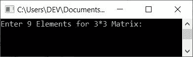
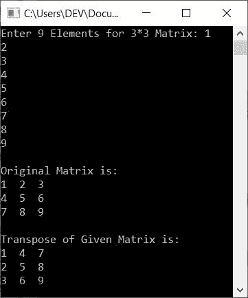
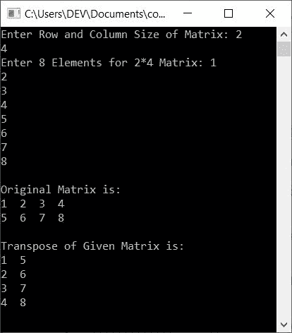

# C++ 程序：转置矩阵

> 原文：<https://codescracker.com/cpp/program/cpp-program-transpose-matrix.htm>

在这篇文章中，你将学习并获得代码来查找用户使用 C++ 程序输入矩阵的转置。下面是本文中可用的程序列表:

*   寻找一个 3*3 矩阵的转置
*   寻找给定大小的矩阵的转置

### 如何求一个矩阵的转置？

矩阵的转置可以通过交换行和列来计算。例如，如果一个矩阵的值比如说**矩阵 A** 是:

```
1  2  3
4  5  6
7  8  9
```

那么它的转置(**A<sup>T</sup>T3】就会是:**

```
1  4  7
2  5  8
3  6  9
```

## 查找并打印转置一个给定的矩阵

在 [C++ 编程](/cpp/index.htm)中要转置任何矩阵，你必须要求用户输入矩阵的元素 。然后用列替换行，用行替换列来转置矩阵。然后在输出上显示或打印给定矩阵的转置 ，如下图所示:

```
#include<iostream>
using namespace std;
int main()
{
    int mat[3][3], i, j, matT[3][3];
    cout<<"Enter 9 Elements for 3*3 Matrix: ";
    for(i=0; i<3; i++)
    {
        for(j=0; j<3; j++)
            cin>>mat[i][j];
    }
    cout<<"\nOriginal Matrix is:\n";
    for(i=0; i<3; i++)
    {
        for(j=0; j<3; j++)
            cout<<mat[i][j]<<"  ";
        cout<<endl;
    }
    // copying the transpose of given matrix to matT[][]
    for(i=0; i<3; i++)
    {
        for(j=0; j<3; j++)
            matT[j][i] = mat[i][j];
    }
    cout<<"\nTranspose of Given Matrix is:\n";
    for(i=0; i<3; i++)
    {
        for(j=0; j<3; j++)
            cout<<matT[i][j]<<"  ";
        cout<<endl;
    }
    cout<<endl;
    return 0;
}
```

这个程序是在 *Code::Blocks* IDE 下构建和运行的。下面是它的运行示例:



现在将输入作为 9 个元素提供。以下是提供 9 个元素后的示例输出:



以下代码块:

```
for(i=0; i<3; i++)
{
    for(j=0; j<3; j++)
        matT[j][i] = mat[i][j];
}
```

将给定矩阵 **mat[][]** 的转置复制到 **matT[][]** 。因此，带有用户输入 **1、2、3、4、5、6、7、8、9** 的代码块 的预演如下:

*   因为用户输入这 9 个元素作为输入，所以它以这样的方式存储在 **mat[][]** 中:
    *   mat[0][0]=1
    *   mat[0][1]=2
    *   mat[0][2]=3
    *   mat[1][0]=4
    *   mat[1][1]=5
    *   依此类推，直到
    *   mat[2][2]=9
*   现在让我们来看代码块，它将矩阵的转置复制到 **matT[][]** 。最初 **0** 被初始化为 **i** 并且条件 **i < 3** 或 **0 < 3** 评估为真，因此 程序流程进入循环内部
*   在循环内部，还有另一个循环的*。因此 **0** 被初始化为 **j** 并且条件 T6】j<3 或 **0 < 3** 评估为真，因此程序流程进入该循环并且 T10】mat[I][j]或**mat[0]**或 **1** 被初始化为 **matT[j][i]** 或 所以**马特[0][0]=1***
*   现在程序流程转到循环的内部*的更新部分，并增加 **j** 的值。 因此 **j=1** 并且条件 **j < 3** 或 **1 < 3** 再次评估为真*
*   因此，程序流再次进入循环内部，并且 **mat[i][j]** 或 **mat[0][1]** 或 **2** 将 初始化为 **matT[j][i]** 或 **matT[1][0]** 。所以 **mat[1][0]=2**
*   现在程序流程再次转到循环的*内部更新，并增加 **j** 的值。 因此 **j=2** 并且条件 **j < 3** 再次评估为真，因此程序流再次进入循环 内。这个过程一直持续到条件评估为假*
*   当循环内*的条件评估为假时，程序流程转到循环*外*的更新部分 并增加 **i** 的值。因此 **i=1** 且条件**I<3**T14】或 **1 < 3** 再次评估为真，因此程序流程进入循环内部。该过程继续 直到条件评估为假*
*   这样，矩阵 **mat[][]** 的转置被复制到 **matT[][]** 。
*   所以只需打印出 **matT[][]** 的值

### 允许用户定义矩阵维度

这个程序类似于以前的程序。唯一的区别是，在查找和打印给定矩阵的转置之前，我们允许用户输入矩阵的维数及其元素:

```
#include<iostream>
using namespace std;
int main()
{
    int mat[10][10], matT[10][10];
    int matRow, matCol, i, j;
    cout<<"Enter Row and Column Size of Matrix: ";
    cin>>matRow>>matCol;
    cout<<"Enter "<<matRow*matCol<<" Elements for "<<matRow<<"*"<<matCol<<" Matrix: ";
    for(i=0; i<matRow; i++)
    {
        for(j=0; j<matCol; j++)
            cin>>mat[i][j];
    }
    cout<<"\nOriginal Matrix is:\n";
    for(i=0; i<matRow; i++)
    {
        for(j=0; j<matCol; j++)
            cout<<mat[i][j]<<"  ";
        cout<<endl;
    }
    // copying the transpose of given matrix to matT[][]
    for(i=0; i<matRow; i++)
    {
        for(j=0; j<matCol; j++)
            matT[j][i] = mat[i][j];
    }
    cout<<"\nTranspose of Given Matrix is:\n";
    for(i=0; i<matCol; i++)
    {
        for(j=0; j<matRow; j++)
            cout<<matT[i][j]<<"  ";
        cout<<endl;
    }
    cout<<endl;
    return 0;
}
```

以下是其以用户输入 **2** 和 **4** 为维度的示例运行。即， **2** 为行大小， T6】4 为列大小，那么 **1，2，3，4，5，6，7，8** 为其 8 个元素。以下是使用这些 输入运行的示例:



#### 其他语言的相同程序

*   [C 转置一个矩阵](/c/program/c-program-transpose-matrix.htm)
*   [Java 转置一个矩阵](/java/program/java-program-transpose-matrix.htm)
*   [Python 转置一个矩阵](/python/program/python-program-transpose-matrix.htm)

[C++ 在线测试](/exam/showtest.php?subid=3)

* * *

* * *