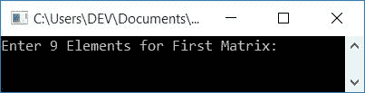
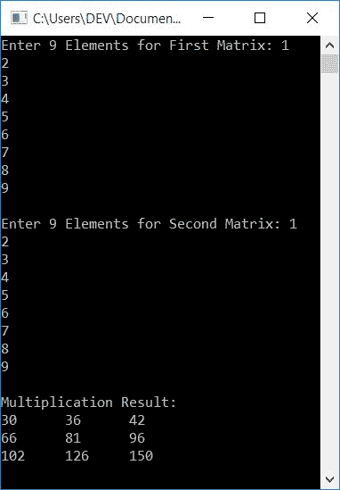
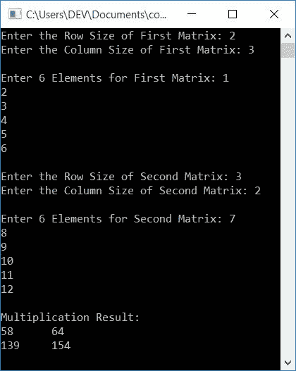

# C++ 程序：两个矩阵相乘

> 原文：<https://codescracker.com/cpp/program/cpp-program-multiply-two-matrices.htm>

在本文中，您将学习并获得 C++中矩阵乘法的代码。以下是本文中可用的矩阵乘法程序列表:

*   将两个 3*3 矩阵相乘。3*3 矩阵是指 3 行 3 列的矩阵
*   给定大小(维数)的两个矩阵相乘

在浏览这些程序之前，如果你不知道两个矩阵相乘的步骤，请参考[矩阵相乘步骤](/nonprog/matrix-multiplication.htm)以获得关于 矩阵相乘的所有必要信息。

## C++中的矩阵乘法

在 C++ 编程中，要将两个矩阵相乘，你必须要求用户输入两个(第一个和第二个)矩阵的 元素。现在应用公式将两个矩阵相乘，并将第三个矩阵的 乘法结果的元素逐一初始化，如下面给出的程序所示:

这个程序不允许用户输入矩阵的大小，而是要求输入第一个 3*3 矩阵的 9 个元素和第二个 3 * 3 矩阵的 9 个元素。随后，给出了允许输入矩阵大小的相同程序。

问题是，**用 C++写一个程序，把两个矩阵相乘。**下面是它的回答:

```
#include<iostream>
using namespace std;
int main()
{
    int matOne[3][3], matTwo[3][3], matThree[3][3];
    int i, j, k, sum=0;
    cout<<"Enter 9 Elements for First Matrix: ";
    for(i=0; i<3; i++)
    {
        for(j=0; j<3; j++)
            cin>>matOne[i][j];
    }
    cout<<"\nEnter 9 Elements for Second Matrix: ";
    for(i=0; i<3; i++)
    {
        for(j=0; j<3; j++)
            cin>>matTwo[i][j];
    }
    // Multiplying two matrices...
    for(i=0; i<3; i++)
    {
        for(j=0; j<3; j++)
        {
            sum=0;
            for(k=0; k<3; k++)
                sum = sum + (matOne[i][k] * matTwo[k][j]);
            matThree[i][j] = sum;
        }
    }
    cout<<"\nMultiplication Result:\n";
    for(i=0; i<3; i++)
    {
        for(j=0; j<3; j++)
            cout<<matThree[i][j]<<"\t";
        cout<<endl;
    }
    cout<<endl;
    return 0;
}
```

这个程序是在 *Code::Blocks* IDE 下构建和运行的。下面是它的运行示例:



现在提供或输入 9 个数字作为第一个矩阵的 9 个元素，再提供或输入 9 个数字作为第二个矩阵的 9 个元素。然后按`ENTER`键将两个矩阵相乘并打印第三个矩阵(存储两个给定矩阵的乘法结果 ),如下图所示:



### 将两个给定大小的矩阵相乘

这个程序在运行时将用户给定大小两个矩阵相乘。也就是说，除了要求为两个矩阵输入元素之外，该程序首先接收大小，然后要求为第一个和第二个矩阵输入给定大小的元素。

```
#include<iostream>
using namespace std;
int main()
{
    int matOne[10][10], matTwo[10][10], matThree[10][10];
    int matOneRow, matOneCol, matTwoRow, matTwoCol;
    int i, j, k, sum;
    cout<<"Enter the Row Size of First Matrix: ";
    cin>>matOneRow;
    cout<<"Enter the Column Size of First Matrix: ";
    cin>>matOneCol;
    cout<<"\nEnter "<<matOneRow*matOneCol<<" Elements for First Matrix: ";
    for(i=0; i<matOneRow; i++)
    {
        for(j=0; j<matOneCol; j++)
            cin>>matOne[i][j];
    }
    cout<<"\nEnter the Row Size of Second Matrix: ";
    cin>>matTwoRow;
    cout<<"Enter the Column Size of Second Matrix: ";
    cin>>matTwoCol;
    cout<<"\nEnter "<<matTwoRow*matTwoCol<<" Elements for Second Matrix: ";
    for(i=0; i<matTwoRow; i++)
    {
        for(j=0; j<matTwoCol; j++)
            cin>>matTwo[i][j];
    }
    if(matOneCol != matTwoRow)
    {
        cout<<"\nMultiplication Not Possible!\n";
        return 0;
    }
    // Multiplying the two matrix...
    for(i=0; i<matOneRow; i++)
    {
        for(j=0; j<matTwoCol; j++)
        {
            sum = 0;
            for(k=0; k<matOneCol; k++)
                sum = sum + (matOne[i][k] * matTwo[k][j]);
            matThree[i][j] = sum;
        }
    }
    cout<<"\nMultiplication Result:\n";
    for(i=0; i<matOneRow; i++)
    {
        for(j=0; j<matTwoCol; j++)
            cout<<matThree[i][j]<<"\t";
        cout<<endl;
    }
    cout<<endl;
    return 0;
}
```

以下是用户输入的运行示例:

*   **2** 作为第一个矩阵的行大小
*   **3** 作为第一个矩阵的列大小
*   **1，2，3，4，5，6** 作为第一矩阵的六个元素
*   **3** 作为第二矩阵的行大小
*   **2** 作为第二矩阵的列大小
*   **7，8，9，10，11，12** 作为第二矩阵的六个元素

提供这些输入后，按`ENTER`键将两个给定的矩阵相乘，并打印 乘法结果，如下图所示:



**注-** 要定义矩阵乘法，第一个矩阵的列数必须等于第二个矩阵的 行数。

因此，在开始乘法之前，我们已经检查了 **matOneCol** 的值是否不等于 mattworw 的值。如果条件满足，则不能定义矩阵乘法，否则 定义矩阵乘法并打印结果，如上面给出的程序所示。

#### 其他语言的相同程序

*   [C 乘两个矩阵](/c/program/c-program-multiply-two-matrices.htm)
*   [Java 将两个矩阵相乘](/java/program/java-program-multiply-two-matrices.htm)
*   [Python 将两个矩阵相乘](/python/program/python-program-matrix-multiplication.htm)

[C++在线测试](/exam/showtest.php?subid=3)

* * *

* * *