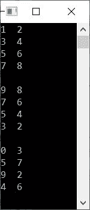
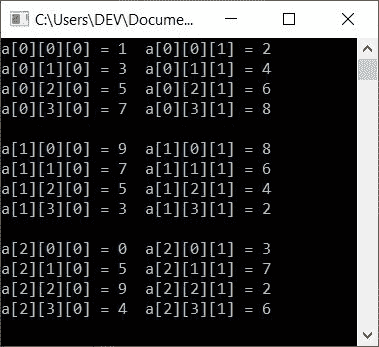
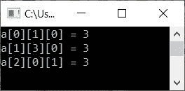
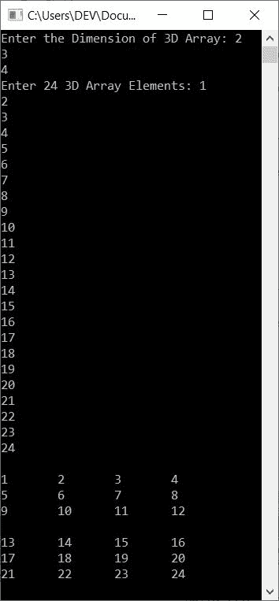

# C++ 三维数组程序

> 原文：<https://codescracker.com/cpp/program/cpp-program-three-dimensional-array.htm>

在本文中，您将学习并获得在 C++ 中实现三维(3D) [数组](/cpp/cpp-arrays.htm)的代码。下面是本文中可用的程序列表:

*   初始化并打印三维(3D)数组
*   打印带索引的三维数组
*   程序展示，如何访问三维数组的元素？
*   从用户处接收三维数组的尺寸和元素，并打印该数组

**注-** 三维(3D)数组属于多维数组的范畴。多维 数组是指数组的数组。

**注-** 三维(3D)数组是二维(2D)数组的集合。

**注-** 在 3D 数组中，有三个维度(下标)。第一个显示块大小，第二个显示行大小， ，第三个显示列大小。这里的行列大小是 2D 数组的维数。而块大小显示 有多少个 2D 数组。例如，如果 3D 数组的尺寸为 **3*4*2** 。表示 4*2 维的 3 2D 数组。还意味着大小为 4 行 2 列的 3 个 2D 数组。

## C++ 中的 3D 数组程序

这个程序将元素初始化为三维数组，名为 **threeDimArr[][][]** ，大小为 **3*4*2** 。 在所有的 24 个元素被初始化后，我们已经在输出屏幕上打印出 3D 数组，如下面给出的程序中的 所示:

```
#include<iostream>
using namespace std;
int main()
{
    int i, j, k;
    int threeDimArr[3][4][2] = {
        { {1, 2}, {3, 4}, {5, 6}, {7, 8} },
        { {9, 8}, {7, 6}, {5, 4}, {3, 2} },
        { {0, 3}, {5, 7}, {9, 2}, {4, 6} }
        };
    for(i=0; i<3; i++)
    {
        for(j=0; j<4; j++)
        {
            for(k=0; k<2; k++)
                cout<<threeDimArr[i][j][k]<<"  ";
            cout<<endl;
        }
        cout<<endl;
    }
    cout<<endl;
    return 0;
}
```

这个程序是在 *Code::Blocks* IDE 下构建和运行的。下面是它的示例输出:



如你所见，有三个大小为 4*2 二维数组。也就是说，每个二维 数组包含 4 行和 2 列。

要打印 3D 数组，必须使用三个**用于**循环。循环(最内层循环)的第三个**组成 1D 数组，**循环的第二个**组成 2D 数组，**循环(最外层循环)的第三个**组成三维数组。**

换句话说，循环的最外层(第一个)*是块大小，第二个是 2D 数组的行大小， ，第三个是 2D 数组的列大小。*

### 打印带索引的 3D 数组

这个程序类似于前面的程序。除了前一个程序所做的工作之外，这个程序打印 3D 数组的所有元素以及索引。这个程序也展示了元素是如何存储在 3D 数组中的:

```
#include<iostream>
using namespace std;
int main()
{
    int i, j, k;
    int a[3][4][2] = {
        { {1, 2}, {3, 4}, {5, 6}, {7, 8} },
        { {9, 8}, {7, 6}, {5, 4}, {3, 2} },
        { {0, 3}, {5, 7}, {9, 2}, {4, 6} }
        };
    for(i=0; i<3; i++)
    {
        for(j=0; j<4; j++)
        {
            for(k=0; k<2; k++)
                cout<<"a["<<i<<"]["<<j<<"]["<<k<<"] = "<<a[i][j][k]<<"  ";
            cout<<endl;
        }
        cout<<endl;
    }
    cout<<endl;
    return 0;
}
```

下面给出的快照显示了这个 C++ 程序在三维数组上产生的示例输出:



### 三维数组的存取和打印元素

这个 C++ 程序展示了如何访问一个 3D 数组的元素。在这个程序中，我们用索引访问了 3D 数组的三个元素。

```
#include<iostream>
using namespace std;
int main()
{
    int i, j, k;
    int a[3][4][2] = {
        { {1, 2}, {3, 4}, {5, 6}, {7, 8} },
        { {9, 8}, {7, 6}, {5, 4}, {3, 2} },
        { {0, 3}, {5, 7}, {9, 2}, {4, 6} }
        };
    cout<<"a[0][1][0] = "<<a[0][1][0]<<endl;
    cout<<"a[1][3][0] = "<<a[1][3][0]<<endl;
    cout<<"a[2][0][1] = "<<a[2][0][1]<<endl;
    cout<<endl;
    return 0;
}
```

下面是它的示例输出:



**注意-** 在上面的程序中，首先构建一个两个元素的 1D 数组。然后将四个这样的 1D 数组 一个放在另一个下面，得到包含四行的 2D 数组。然后，将三个这样的 2D 数组一个放在另一个的后面，以产生包含三个 2D 数组的 3D 数组。

### 从用户接收 3D 数组的元素

这个程序允许用户输入三维数组的尺寸和元素。根据用户输入，我们将 3D 数组打印回输出屏幕:

```
#include<iostream>
using namespace std;
int main()
{
    int i, j, k, a[10][10][10];
    int one, two, three;
    cout<<"Enter the Dimension of 3D Array: ";
    cin>>one>>two>>three;
    cout<<"Enter "<<one*two*three<<" 3D Array Elements: ";
    for(i=0; i<one; i++)
    {
        for(j=0; j<two; j++)
        {
            for(k=0; k<three; k++)
                cin>>a[i][j][k];
        }
    }
    cout<<endl;
    for(i=0; i<one; i++)
    {
        for(j=0; j<two; j++)
        {
            for(k=0; k<three; k++)
                cout<<a[i][j][k]<<"  ";
            cout<<endl;
        }
        cout<<endl;
    }
    cout<<endl;
    return 0;
}
```

以下是它的示例运行，使用用户输入， **2，3，4** 作为维度， **1，2，3，4，5，6，7，8，9，10， 11，12，13，14，15，16，17，18，19，20，21，22，23，24** 作为 24 个 3D 数组元素:



#### 其他语言的相同程序

*   [C 三维数组程序](/c/program/c-program-three-dimensional-array.htm)
*   [Java 三维数组程序](/java/program/java-program-three-dimensional-array.htm)

[C++ 在线测试](/exam/showtest.php?subid=3)

* * *

* * *