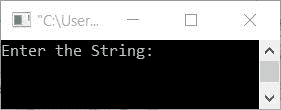
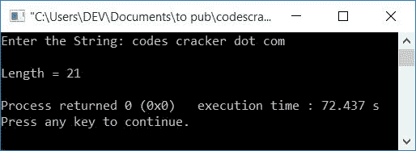
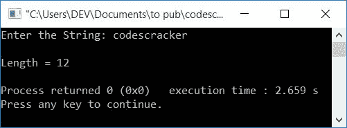

# C++ 程序：求字符串长度

> 原文：<https://codescracker.com/cpp/program/cpp-program-find-length-of-string.htm>

在本文中，您将学习并开始在运行时用 C++ 语言查找和打印用户给定的任意字符串的长度。该计划是在以下方法的帮助下创建的:

*   不使用任何库或内置函数如 **strlen()** 来查找字符串的长度
*   使用 strlen()函数
*   使用指针

## 不使用 strlen()函数查找字符串长度

要在 C++ 编程中找到一个[字符串的长度，你必须要求用户首先输入 该字符串。然后找到它的长度，如下面给出的程序所示。](/cpp/cpp-strings.htm)

这个程序使用基于用户的代码来查找字符串的长度。也就是这个程序不使用库函数或者内置函数， **strlen()** 。

```
#include<iostream>
#include<stdio.h>
using namespace std;
int main()
{
    char str[200];
    int len=0, i=0;
    cout<<"Enter the String: ";
    gets(str);
    while(str[i])
    {
        len++;
        i++;
    }
    cout<<"\nLength = "<<len;
    cout<<endl;
    return 0;
}
```

这个程序是在 *Code::Blocks* IDE 下构建和运行的。下面是它的运行示例:



现在输入任意字符串，比如说**codes cracker . com**，按`ENTER`键查找并打印给定字符串的长度 ，如下图所示:



下面是另一个使用用户输入运行的示例， **codescracker** :



用户输入上述程序， **codescracker** 的试运行如下:

*   初始值， **len=0** ， **i=0**
*   当用户输入字符串时，比如说 **codescracker** 作为输入，然后它被存储到 **str[]** 中，这样:
    *   str[0]=c
    *   str[1]=o
    *   str[2]=d
    *   依此类推，直到
    *   str[11]=r
*   现在，while 循环的条件得到评估。这就是条件， **str[i]** 或 **str[0]** 或 **c** 评估为真。因此程序流进入循环内部
*   当没有任何字符剩余时，条件评估为假。也就是说，其条件在第 **12 <sup>个</sup>个**索引处评估为假
*   现在在循环内部， **len** 和 **i** 的值递增。所以 **i=1** 和 **len=1**
*   程序流返回并再次评估该条件。因为条件 **str[i]** 或 **str[1]** 再次评估为真，因此程序流再次进入循环。
*   这个过程一直持续到**码书员**的最后一个字符。
*   并且每次 len 的值增加时
*   因此，当 **while** 循环的条件评估为假时，我们将有一个变量， **len**保存字符串的长度，或者用户在运行时输入的字符串中有多少字符可用
*   因此，将 **len** 的值打印为显示给定字符串长度的输出

## 使用 strlen()函数查找字符串的长度

这是另一个 C++ 程序，也可以查找并打印用户输入的字符串长度。与之前的程序唯一不同的是，这个程序使用了一个名为 **strlen()** 的 C++ 内置或库函数。

函数 **strlen()** 将字符串作为其参数，并返回其长度。这个函数定义在 **的 string.h** 头文件中。

```
#include<iostream>
#include<stdio.h>
#include<string.h>
using namespace std;
int main()
{
    char str[200];
    int len=0;
    cout<<"Enter the String: ";
    gets(str);
    len = strlen(str);
    cout<<"\nLength = "<<len;
    cout<<endl;
    return 0;
}
```

这个程序产生的输出类似于前面的程序。

## 使用指针查找字符串的长度

现在，让我们创建一个相同目的的程序，这是找到一个字符串的长度，但使用指针。字符串第一个字符的地址被初始化为指针类型变量，比如说 **ptr** ，使用这个变量，字符串的 长度被计算出来。

**注-****&**称为操作员的**地址。而 ***** 在**操作器处被称为 **值。 **ptr++** ( **char** 指针类型变量)移动到下一个字符的地址**

```
#include<iostream>
#include<stdio.h>
using namespace std;
int main()
{
    char str[200], *ptr;
    int len=0;
    cout<<"Enter the String: ";
    gets(str);
    ptr = &str[0];
    while(*ptr)
    {
        len++;
        ptr++;
    }
    cout<<"\nLength = "<<len;
    cout<<endl;
    return 0;
}
```

#### 其他语言的相同程序

*   [C 找出字符串的长度](/c/program/c-program-find-length-of-string.htm)
*   [Java 查找字符串长度](/java/program/java-program-find-length-of-string.htm)
*   [Python 查找字符串长度](/python/program/python-program-find-length-of-string.htm)

[C++ 在线测试](/exam/showtest.php?subid=3)

* * *

* * *