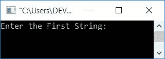
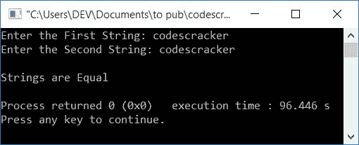
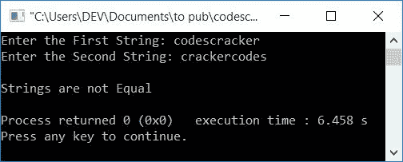
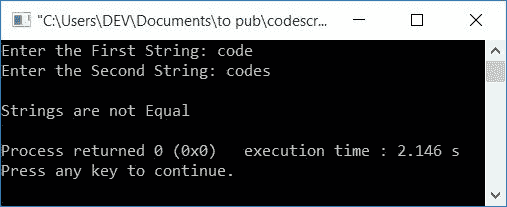
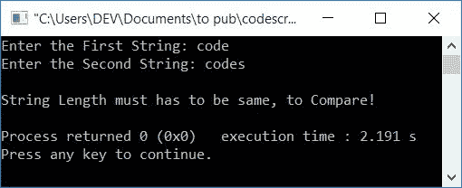
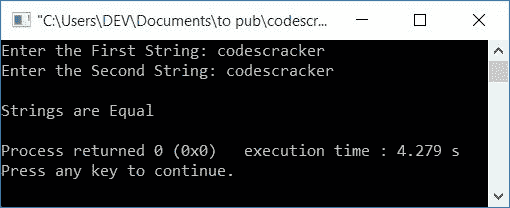

# C++ 程序：比较两个字符串

> 原文：<https://codescracker.com/cpp/program/cpp-program-compare-two-string.htm>

在本文中，您将学习并获得 C++中比较两个字符串的代码。该程序通过以下方式创建:

*   不使用 strcmp()函数比较两个字符串
*   使用 strcmp()函数

## 不使用 strcmp()比较两个字符串

要在 C++ 编程中比较两个[字符串，您必须要求用户输入 这两个字符串，并且不使用任何类型的库函数来比较它们，如下面给出的程序中的 所示，例如 **strcmp()** 。让我们先看一下程序，稍后会得到解释:](/cpp/cpp-strings.htm)

```
#include<iostream>
using namespace std;
int main()
{
    char str1[50], str2[50];
    int i=0, chk=0;
    cout<<"Enter the First String: ";
    cin>>str1;
    cout<<"Enter the Second String: ";
    cin>>str2;
    while(str1[i]!='\0' || str2[i]!='\0')
    {
        if(str1[i]!=str2[i])
        {
            chk = 1;
            break;
        }
        i++;
    }
    if(chk==0)
        cout<<"\nStrings are Equal";
    else
        cout<<"\nStrings are not Equal";
    cout<<endl;
    return 0;
}
```

这个程序是在 *Code::Blocks* IDE 下构建和运行的。下面是它的运行示例:



现在输入第一串的值，比如说**打码机**，然后再次输入第二串的值 比如说**打码机**。按`ENTER`键查看输出，如下图所示:



下面是另一个运行示例，用户输入的 **codescracker** 作为第一个字符串， **crackercodes** 作为第二个 字符串:



下面是最后一个示例运行，用户输入的**代码**作为第一个字符串，而**代码**作为第二个输入:



当用户输入第一串时，它被初始化为 **str1** (假设用户输入 **代码**作为第一串):

*   第一个字符( **c** )被初始化为 **str1[0]**
*   第二个字符( **o** )被初始化为**str 1【1】**
*   同样 **str1[2]=d** ， **str1[3]=e**
*   然后在输入字符串的最后一个字符后自动赋值一个空终止字符 **\0** ， so**str[4]= \ 0**

同样，第二个字符串被初始化为 **str2** 。现在有了用户输入，**代码**和**代码** 作为第一和第二字符串，上面程序的预演如下:

*   在 **while 循环**中，条件:
    `str1[i]!='\0' || str2[i]!='\0'`
    由于最初 **i=0** ，因此在将 **i** 替换为 0 后，条件变为
    `str1[0]!='\0' || str2[0]!='\0'`
    ，将字符放在字符串

    的第 0 个<sup>索引处，则条件评估为真。</sup>
*   因为第一个字符串的第一个字符和第二个字符串的第一个字符都不等于空终止字符 **\0**
*   因此程序流程进入循环内部，如果语句评估**的条件，即
    `str1[i]!=str2[i]`
    或
    `c!=c`
    评估为假。因此程序流程不会进入 **if** 体，而是增加 **i** 的 值，并再次返回到 **while 循环**的状态**
*   因为现在 **i=1** ，因此使用 **i** 的更新值进行相同的过程
*   过程继续，直到 **while** 循环中的两个条件中的任何一个评估为假。或者如果(循环内)的**的 条件评估为真，则程序流程进入 **if** 的 体并初始化 **1** 到 **chk** ，然后使用 **break** 关键字，程序流程退出 **while 循环**继续执行**
*   从 **while** 循环中退出后(或者通过评估其条件为假，或者如果的条件为真，则通过评估 **)，检查 **chk** 的值，如果其保持其初始值 (0)，则程序流不会进入 **if** 的主体。这意味着，在(两个 字符串的)相同索引处没有任何字符不匹配。这意味着，字符串是相等的。否则，如果发现任何不匹配，则字符串不相等**

### 如果用户输入长度不等的字符串会怎样？

正如你所看到的带有两个字符串**代码**和**代码**的输出，while 循环运行了 4 次(比较 **代码**，第一个字符串的前 4 个字符，带有**代码**，第二个字符串的前 4 个字符)而没有任何 原因。因为如果两个字符串的长度不相等，那么它们肯定不会相同。

因此，在这种情况下，我们不需要在循环时对*求值。因此下面给出的程序首先找到字符串的 [长度，然后检查两个字符串的 长度是否相等。如果相等，将继续比较字符串。否则打印一条消息，如 不等长或其他任何内容(取决于您):](/cpp/program/cpp-program-find-length-of-string.htm)*

```
#include<iostream>
using namespace std;
int main()
{
    char str1[50], str2[50];
    int i, chk=0, len1=0, len2=0;
    cout<<"Enter the First String: ";
    cin>>str1;
    cout<<"Enter the Second String: ";
    cin>>str2;
    i=0;
    while(str1[i]!='\0')
    {
        len1++;
        i++;
    }
    i=0;
    while(str2[i]!='\0')
    {
        len2++;
        i++;
    }
    if(len1==len2)
    {
        i=0;
        while(str1[i]!='\0' || str2[i]!='\0')
        {
            if(str1[i]!=str2[i])
            {
                chk = 1;
                break;
            }
            i++;
      }
      if(chk==0)
        cout<<"\nStrings are Equal";
      else
        cout<<"\nStrings are not Equal";
    }
    else
        cout<<"\nString Length must has to be same, to Compare!";
    cout<<endl;
    return 0;
}
```

下面是它的示例运行，用户输入的**代码**和**代码**作为第一个和第二个字符串:



## 使用 strcmp()比较两个字符串

在库函数的帮助下，程序变小了。因为我们不需要编写一些额外的代码，如*查找字符串长度*或*比较字符串长度*，这可以在库 函数的帮助下轻松处理，如 **strlen ()** 或 **strcmp()** 。

函数 **strcmp()** 将两个字符串作为参数，如果两个字符串相等，则返回 0。而 函数 **strlen ()** 以单个字符串为自变量，返回其长度。

```
#include<iostream>
#include<string.h>
using namespace std;
int main()
{
    char str1[50], str2[50];
    int len1, len2;
    cout<<"Enter the First String: ";
    cin>>str1;
    cout<<"Enter the Second String: ";
    cin>>str2;
    len1 = strlen(str1);
    len2 = strlen(str2);
    if(len1==len2)
    {
      if(strcmp(str1, str2)==0)
        cout<<"\nStrings are Equal";
      else
        cout<<"\nStrings are not Equal";
    }
    else
        cout<<"\nStrings are not Equal";
    cout<<endl;
    return 0;
}
```

以下是用户输入 **codescracker** 作为第一个和第二个字符串的示例运行:



#### 其他语言的相同程序

*   [C 比较两个字符串](/c/program/c-program-compare-two-string.htm)
*   [Java 比较两个字符串](/java/program/java-program-compare-two-string.htm)
*   [Python 比较两个字符串](/python/program/python-program-compare-two-strings.htm)

[C++在线测试](/exam/showtest.php?subid=3)

* * *

* * *