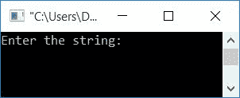
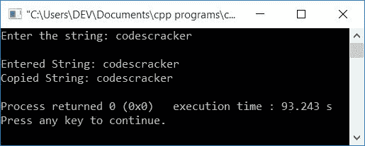
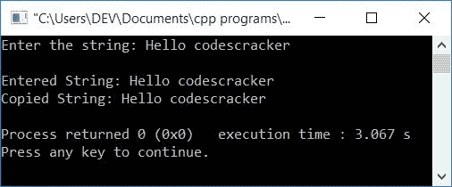

# C++ 程序：将一个字符串复制到另一个字符串

> 原文：<https://codescracker.com/cpp/program/cpp-program-copy-string.htm>

在本文中，您将学习并获得在 C++ 中将一个字符串复制到另一个字符串的代码。该程序通过以下方法创建:

*   不使用 **strcpy()** 函数复制字符串
*   使用指针
*   使用用户定义的函数
*   使用库函数， **strcpy()**

## 不使用 strcpy()函数复制字符串

这个程序复制字符串(用户在运行时输入)而不使用任何库函数，比如 **strcpy()** 让我们先来看看这个程序。稍后给出其解释:

问题是，**用 C++ 写一个程序，把一个字符串复制到另一个字符串。**下面是它的回答:

```
#include<iostream>
#include<stdio.h>
using namespace std;
int main()
{
    char strOrig[100], strCopy[100], i=0;
    cout<<"Enter the string: ";
    gets(strOrig);
    while(strOrig[i]!='\0')
    {
        strCopy[i] = strOrig[i];
        i++;
    }
    strCopy[i] = '\0';
    cout<<"\nEntered String: "<<strOrig;
    cout<<"\nCopied String: "<<strCopy;
    cout<<endl;
    return 0;
}
```

这个程序是在 *Code::Blocks* IDE 下构建和运行的。下面是它的运行示例:



现在输入字符串说 **codescracker** 并按`ENTER`键将其复制到另一个字符串。 这是其样本运行的最终快照:



用户输入上述程序， **codescracker** 的试运行如下:

*   初始值， **i=0**
*   当用户输入字符串 say **codescracker** 时，它被存储在变量 **strOrig[]** 中的 中，存储方式如下:
    *   strOrig[0]=c
    *   strOrig[1]=o
    *   strOrig[2]=d
    *   strOrig[3]=e
    *   斯特鲁尔[4]=s
    *   strOrig[5]=c
    *   strOrig[6]=r
    *   斯特鲁尔[7]=a
    *   strOrig[8]=c
    *   strOrig[9]=k
    *   strOrig[10]=e
    *   strOrig[11]=r
*   也就是说，字符串(codescracker)的第一个字符(c)存储在 **strOrig[]** 的第一个索引(0)处。第二个字符(o)存储在第二个索引(1)处，依此类推。
*   因为 **strOrig[]** 的最大长度是 100，而输入的字符串只有 **12** 字符 长，所以在 **12 <sup>th</sup>** 索引(最后一个字符的索引之后的索引)处，一个空终止的 字符( **\0** )被自动初始化。表示字符串结束，或者从这个(第 12 个<sup>到第</sup>个)索引起**strog**中没有留下任何字符。
*   现在的情况， **strOrig[i]！='\0'** 或 **strOrig[0]！='\0'** 或 **c！='\0'** 评估为真， 因此程序流程进入循环，并且 **strOrig[]** 的 **0 <sup>th</sup>** 索引的字符在同一索引处被初始化为 **strCopy[]**
*   也就是说， **strOrig[i]** 或 **strOrig[0]** 或 **c** 被初始化为 **strCopy[i]** 或 **str copy[0]**
*   现在， **i** 的值增加。所以 **i=1**
*   程序流程返回并评估**的条件，同时再次循环**。
*   因为空终止字符( **\0** )在**12<sup>th</sup>T5】索引处可用，所以两个 语句(在 *while 循环*的主体中可用)被执行 12 次**
*   因此所有的字符被一个接一个地复制到 **strCopy[]** 变量中
*   当循环结束执行**时，不要忘记在最后一个字符的索引后初始化一个空终止的 字符**
*   现在只需打印两个变量的值，比如**strog[]**和 **strCopy[]**

## 使用指针复制字符串

这个程序使用指针复制字符串。问题是，**用 C++ 写一个程序，用指针**把 的内容从一个字符串复制到另一个字符串。以下是它的答案:

```
#include<iostream>
#include<stdio.h>
using namespace std;
int main()
{
    char strOrig[100], strCopy[100];
    char *origPtr, *copPtr;
    cout<<"Enter the string: ";
    gets(strOrig);
    origPtr = &strOrig[0];
    copPtr = &strCopy[0];
    while(*origPtr)
    {
        *copPtr = *origPtr;
        origPtr++;
        copPtr++;
    }
    *copPtr = '\0';
    cout<<"\nEntered String: "<<strOrig;
    cout<<"\nCopied String: "<<strCopy;
    cout<<endl;
    return 0;
}
```

这是用户输入的运行示例， **Hello codescracker**



声明，

```
origPtr = &strOrig[0];
```

初始化 **strOrig[]** 变量的初始地址。那是它的**0<sup>th</sup>T5】索引的地址。 与声明、**

```
copPtr = &strCopy[0];
```

还初始化 **strCopy[]** 的**0<sup>th</sup>T3】索引的地址**

**注意-** 如果一个指针类型的变量保存了任何包含一些值的变量的地址，那么变量(指针)发生的任何 都会改变原来的地址。因为它保存的是地址，而不是值。因此，任何通过指针类型变量执行的 操作都会直接影响该地址的值。

***** 在处称为**值。而 **&** 被称为**操作符的**地址。**

语句，`origPtr++;`表示，**originptr**现在保存下一个索引的地址。

同样使用指针，原始字符串的所有字符都被复制(以一个接一个的方式)到 **strCopy[]**

## 使用用户定义的函数复制字符串

这个程序也将一个字符串复制到另一个字符串，但是使用一个名为 **cpystr()** 的用户定义函数

```
#include<iostream>
#include<stdio.h>
using namespace std;
void cpystr(char *, char *);
int main()
{
    char strOrig[100], strCopy[100];
    cout<<"Enter the string: ";
    gets(strOrig);
    cpystr(strOrig, strCopy);
    cout<<"\nEntered String: "<<strOrig;
    cout<<"\nCopied String: "<<strCopy;
    cout<<endl;
    return 0;
}
void cpystr(char *origPtr, char *copPtr)
{
    while(*origPtr)
    {
        *copPtr = *origPtr;
        origPtr++;
        copPtr++;
    }
    *copPtr = '\0';
}
```

这个程序产生与前一个程序相同的输出。

### 使用 strcpy()函数

这是最后一个使用 C++ 库函数的程序，名为 **strcpy()** 复制 string。它以 两个字符串作为它的参数。第二个参数的值被复制到第一个参数中。

```
#include<iostream>
#include<stdio.h>
#include<string.h>
using namespace std;
int main()
{
    char strOrig[100], strCopy[100];
    cout<<"Enter the string: ";
    gets(strOrig);
    strcpy(strCopy, strOrig);
    cout<<"\nEntered String: "<<strOrig;
    cout<<"\nCopied String: "<<strCopy;
    cout<<endl;
    return 0;
}
```

#### 其他语言的相同程序

*   [C 复制字符串](/c/program/c-program-copy-string.htm)
*   [Java 复制字符串](/java/program/java-program-copy-string.htm)
*   [Python 复制字符串](/python/program/python-program-copy-string.htm)

[C++ 在线测试](/exam/showtest.php?subid=3)

* * *

* * *