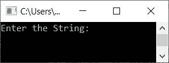
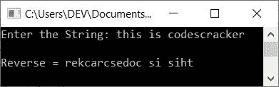

# 反转字符串的 C++程序

> 原文：<https://codescracker.com/cpp/program/cpp-program-reverse-string.htm>

在本文中，您将学习并获得在 C++编程中反转字符串的代码。以下是在运行时对用户输入的字符串进行反转的程序列表:

*   不使用库函数反转字符串
*   使用*反转字符串，同时循环*
*   对循环使用*反转字符串*

## 不使用库函数反转字符串

要在 [C++](/cpp/index.htm) 编程中反转一个[字符串](/cpp/cpp-strings.htm)，要求 用户输入一个字符串。然后反转它并打印反转的字符串，如下面给出的程序所示:

问题是，**写一个 C++程序，把用户**输入的一个字符串反过来。以下是它的答案:

```
#include<iostream>
#include<stdio.h>
using namespace std;
int main()
{
    char str[200], strTemp[200];
    int len, i=0;
    cout<<"Enter the String: ";
    gets(str);
    while(str[i]!='\0')
        i++;
    len = i;
    strTemp[len] = '\0';
    len--;
    i = 0;
    while(str[i]!='\0')
    {
        strTemp[len] = str[i];
        i++;
        len--;
    }
    i=0;
    while(strTemp[i]!='\0')
    {
        str[i] = strTemp[i];
        i++;
    }
    cout<<"\nReverse = "<<str;
    cout<<endl;
    return 0;
}
```

这个程序是在 *Code::Blocks* IDE 下构建和运行的。下面是它的运行示例:



现在输入字符串，说**这是 codescracker** 作为输入，按`ENTER`键将其反转， 打印其反转，如下图所示:



以下代码块:

```
while(str[i]!='\0')
    i++;
```

用于[查找字符串](/cpp/program/cpp-program-find-length-of-string.htm)的长度。也就是说，如果 字符串表示**这是用户输入的 codescracker** ，那么它以这样的方式存储在**字符串**中:

*   str[0]=t
*   str[1]=h
*   str[2]=i
*   依此类推，直到
*   str[19]=r

在最后一个索引处，自动分配一个空终止字符(\0)。所以 **str[20]=\0** 。

现在因为， **i** 的初始值为 0，所以条件 *while 循环* ) **str[i]！='\0'** 或 **str[0]！='\0'** 或 **t！='\0'** 评估为真，因此 **i** 的值增加，并且 再次评估条件。这个过程继续，直到条件评估为假。当 条件被评估为假时，变量 **i** 保持其值为 **20** ，等于 输入字符串的长度。

下面的 C++代码块:

```
while(str[i]!='\0')
{
    strTemp[len] = str[i];
    i++;
    len--;
}
```

用于复制原始字符串(逐字符模式)，将 **str** 的第(0 <sup>第</sup>个索引的字符初始化为 **strTemp** 的最后一个索引。也就是说，我们复制了 **strTemp[]** 中的 原始字符串，使得 **strTemp** 以相反的顺序保存原始字符串。

使用这段代码:

```
while(strTemp[i]!='\0')
{
    str[i] = strTemp[i];
    i++;
}
```

**strTemp** 的值被复制到 **str** 中。因为 **strTemp** 以逆序保存原始字符串的值 ，所以字符串的逆序以逐字符的方式被初始化为 **str** 。 现在在输出上打印**字符串**的值，显示输入字符串的反码。

#### 不使用其他字符串反转一个字符串

以前的程序也可以用这种方式创建，不需要使用任何其他的字符数组(字符串)如 **strTemp[]** :

```
#include<iostream>
#include<stdio.h>
using namespace std;
int main()
{
    char str[200], ch;
    int len, i=0, j;
    cout<<"Enter the String: ";
    gets(str);
    while(str[i]!='\0')
        i++;
    len = i;
    i = 0;
    j = len-1;
    while(i<j)
    {
        ch = str[i];
        str[i] = str[j];
        str[j] = ch;
        i++;
        j--;
    }
    cout<<"\nReverse = "<<str;
    cout<<endl;
    return 0;
}
```

该程序的工作方式是，第 0 <sup>个</sup>索引的字符移动到最后一个索引，最后一个索引的字符 移动到第 0 个<sup>索引。第二个索引处的字符再次移动到倒数第二个索引 ，倒数第二个索引处的字符移动到第二个索引，依此类推。</sup>

这里变量 **i** 从 0 开始，而变量 **j** 从 **len-1** (或最后一个索引的值)开始。 并且移动字符的过程继续，直到 **i** 的值变得等于或大于 **j** 的 值。

## 使用 while 循环反转字符串

这个程序使用*反转一个字符串，同时循环*。除了 这个程序使用 **string.h** 头文件的 **strlen()** 函数来查找字符串的长度之外，它与上一个程序完全相同。

```
#include<iostream>
#include<stdio.h>
#include<string.h>
using namespace std;
int main()
{
    char str[200], ch;
    int i, j, len;
    cout<<"Enter the String: ";
    gets(str);
    i = 0;
    len = strlen(str);
    j = len-1;
    while(i<j)
    {
        ch = str[i];
        str[i] = str[j];
        str[j] = ch;
        i++;
        j--;
    }
    cout<<"\nReverse = "<<str;
    cout<<endl;
    return 0;
}
```

## 使用 for 循环反转字符串

现在让我们使用循环的*创建相同的程序。这里给出的所有程序都产生相同的输出:*

```
#include<iostream>
#include<stdio.h>
#include<string.h>
using namespace std;
int main()
{
    char str[200], ch;
    int i, j, len;
    cout<<"Enter the String: ";
    gets(str);
    len = strlen(str);
    j = len-1;
    for(i=0; i<j; i++, j--)
    {
        ch = str[i];
        str[i] = str[j];
        str[j] = ch;
    }
    cout<<"\nReverse = "<<str;
    cout<<endl;
    return 0;
}
```

#### 其他语言的相同程序

*   [C 反转一个字符串](/c/program/c-program-reverse-string.htm)
*   [Java 反转一个字符串](/java/program/java-program-reverse-string.htm)
*   [Python 反转一个字符串](/python/program/python-program-reverse-string.htm)

[C++在线测试](/exam/showtest.php?subid=3)

* * *

* * *