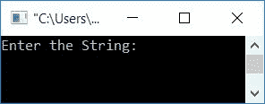
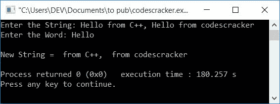
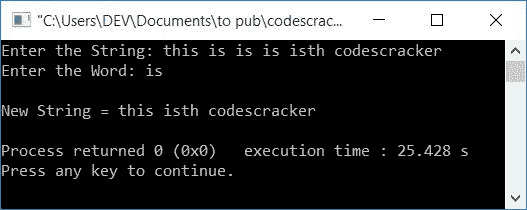
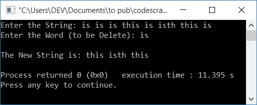

# C++ 程序：从字符串中删除单词

> 原文：<https://codescracker.com/cpp/program/cpp-program-delete-words-from-sentence.htm>

在本文中，您将学习并获得在 C++ 中从一个[字符串](/cpp/cpp-strings.htm)中删除一个单词的代码。用户必须在运行时输入单词和字符串。

这是程序列表，您将浏览:

*   从字符串中删除一个单词
*   上述程序的修改(完整)版本
*   使用二维数组从字符串中删除一个单词

**注意** -第一个程序有一个限制，如果用户输入字符串作为**这是 codescracker** 和 单词(删除)作为**是**。然后**是**的**，这个**也被删除。因此新字符串将是第 **个 codescracker** 。为了解决这个问题，我们修改了这个程序。

第二个程序(修改后的程序)也从新字符串中删除多余的空格。

## 从字符串中删除一个单词

在 [C++](/cpp/index.htm) 编程中，要从给定的字符串中删除任何想要的单词，你必须让用户的 输入字符串和单词。然后从输入的 字符串中删除输入的单词(及其副本)。

问题是，**用 C++ 写一个程序，从字符串中删除一个单词。**下面是它的回答:

```
#include<iostream>
#include<stdio.h>
#include<string.h>
using namespace std;
int main()
{
    char str[200], wrd[20];
    int i, j, strLen, wrdLen, tmp, chk=0;
    cout<<"Enter the String: ";
    gets(str);
    cout<<"Enter the Word: ";
    cin>>wrd;
    strLen = strlen(str);
    wrdLen = strlen(wrd);
    for(i=0; i<strLen; i++)
    {
        tmp = i;
        for(j=0; j<wrdLen; j++)
        {
            if(str[i]==wrd[j])
                i++;
        }
        chk = i-tmp;
        if(chk==wrdLen)
        {
            i = tmp;
            for(j=i; j<(strLen-wrdLen); j++)
                str[j] = str[j+wrdLen];
            strLen = strLen-wrdLen;
            str[j]='\0';
        }
    }
    cout<<"\nNew String = "<<str;
    cout<<endl;
    return 0;
}
```

这个程序是在 *Code::Blocks* IDE 下构建和运行的。下面是它的运行示例:



现在提供任何一个字符串，比如来自 C++ 的 **Hello，来自 codescracker 的**Hello 和一个单词 say **Hello** 。 按`ENTER`键从输入的字符串中删除 *Hello* ，如下图 所示:



上面的程序与上面的示例运行中提供的用户输入一起进行模拟运行，如下所示:

*   初始值， **chk=0**
*   当用户输入字符串 **Hello from C++，Hello from codescracker** 时，它被存储到 **str** 中，存储方式为:
    *   str[0]=H
    *   str[1]=e
    *   str[2]=l
    *   等等
*   类似地，输入的单词 say **Hello** 以这样的方式存储到 **wrd** 中:
    *   wrd[0]=H
    *   wrd[1]=e
    *   等等
*   函数 **strlen ()** 将一个字符串作为其参数，并返回该字符串的长度
*   所以 **strLen** 保存字符串的长度，而 **wrdLen** 保存单词的长度。即 **strLen=39** 和 **wrdLen=5**
*   现在程序流开始评估循环的
**   第一次，初始化部分被执行，而且只执行一次*   因此 **i=0** and 条件， **i < strLen** 或 **0 < 39** 评估为真，因此程序 流程进入循环内部。从下一次开始， **i** 的值增加并评估条件。 每次，程序流程进入循环，直到其条件评估为假*   现在在循环内部， **i** (0)的值被初始化为 **tmp***   从这里还有另一个*用于循环**   因此 0 被初始化为 **j** 并且条件 **j < wrdLen** 或 **0 < 5** 评估为真， 因此程序流进入循环并且条件 **str[i]==wrd[j]** 或 **str[0]==wrd[0]** 或 **H==H** 评估为真，因此的值所以 **i=1***   现在 **j** 的值增加了。所以 **j=1** 。然后条件， **j < wrdLen** 或 T6】1<5 评估为真，因此程序流再次进入循环，并且条件， str[I]= = wrd[j]或 **str[1]==wrd[1]** 或 **e==e** 评估为真，因此 T14】I【T15*   该过程继续，直到循环的条件*评估为假**   因为，单词与字符串的第一个单词匹配，即 **Hello** ，与 逐字符匹配*   所以退出这个循环后， **i** 的值将为 **5** ，并且 **i-tmp** 或 T6】5-0 或 **5** 被初始化为 **chk** 。这里 **0** (tmp 的值)是 **i** 的前一个值。 即进入循环内层*之前的值**   该语句检查单词的每个字符是否都与字符串的每个字符匹配(从索引开始，在这个循环之前)*   现在因为， **chk** 的值等于 **wrdLen** 的值。所以只需将匹配单词后的所有字符 移回索引 5。因为 5 是单词的长度*   所以在执行这个 **if** 的 代码块后，新的字符串将是来自 C++ 的**，来自 codescracker** 的 Hello*   不要忘记在最后一个字符的索引后初始化一个空终止字符*   现在程序流程再次回到循环的外部*，增加 **i** 的值，并评估 条件**   这个过程一直持续到条件评估为假*   退出循环后，只需打印 **str** 的值*

 ***注意**——如果你想创建同一个程序，不使用字符串函数 **strlen ()** ，那么你可以 引用[统计一个字符串中一个单词的出现次数](/cpp/program/cpp-count-occurrence-of-word-in-string.htm)。我知道节目不一样，但是那篇文章和这篇文章有点相似。在这里，我们不使用任何字符串函数，从字符串中计算出所需的 单词。所以你可以把那篇文章当作一个想法，自己去实现。那会对你更有帮助。

### 先前程序的修改版本

这是前面程序的完整版本，它从字符串中删除一个单词。这个程序还删除了新字符串中多余的空格。

```
#include<iostream>
#include<stdio.h>
#include<string.h>
using namespace std;
int main()
{
    char str[200], wrd[20];
    int i, j, strLen, wrdLen, tmp, chk=0;
    int doIncrement, isSpace;
    cout<<"Enter the String: ";
    gets(str);
    cout<<"Enter the Word: ";
    cin>>wrd;
    strLen = strlen(str);
    wrdLen = strlen(wrd);
    for(i=0; i<strLen; i++)
    {
        tmp = i;
        doIncrement = 0;
        for(j=0; j<wrdLen; j++)
        {
            if(str[i]==wrd[j])
            {
                if(tmp>0 && (tmp+wrdLen)<strLen)
                {
                    if(str[tmp-1]== ' ' && str[tmp+wrdLen]==' ')
                        doIncrement=1;
                }
                else if(tmp==0 && (tmp+wrdLen)<strLen)
                {
                    if(str[tmp+wrdLen]==' ')
                        doIncrement=1;
                }
                else if(tmp>0 && (tmp+wrdLen)==strLen)
                {
                    if(str[tmp-1]== ' ')
                        doIncrement=1;
                }
                if(doIncrement==1)
                    i++;
                else
                    break;
            }
        }
        chk = i-tmp;
        if(chk==wrdLen)
        {
            i = tmp;
            for(j=i; j<(strLen-wrdLen); j++)
                str[j] = str[j+wrdLen];
            strLen = strLen-wrdLen;
            i = tmp;
            str[j]='\0';
        }
    }
    strLen = strlen(str);
    i=0;
    while(str[i]!='\0')
    {
        isSpace = 0;
        if(str[i]==' ' && str[i+1]==' ')
        {
            for(j=i; j<(strLen-1); j++)
            {
                str[j] = str[j+1];
                isSpace = 1;
            }
        }
        if(i==0 && str[i]==' ')
        {
            for(j=i; j<(strLen-1); j++)
            {
                str[j] = str[j+1];
                isSpace = 1;
            }
        }
        if(isSpace==0)
            i++;
        else
        {
            str[j]='\0';
            strLen--;
        }
    }
    cout<<"\nNew String = "<<str;
    cout<<endl;
    return 0;
}
```

这是用户输入的运行示例，**this is is is is is isth codescracker**为字符串， **is** 为要删除的 单词:



### 使用二维数组

使用[二维数组](/cpp/program/cpp-program-two-dimensional-array.htm)，程序变得 更容易创建或理解。程序如下:

```
#include<iostream>
#include<stdio.h>
#include<string.h>
using namespace std;
int main()
{
    char str[400], wrd[20], strInTwoDArray[20][20];
    int i, j=0, k=0;
    cout<<"Enter the String: ";
    gets(str);
    cout<<"Enter the Word (to be Delete): ";
    gets(wrd);
    for(i=0; str[i]!='\0'; i++)
    {
        if(str[i]==' ')
        {
            strInTwoDArray[k][j]='\0';
            k++;
            j=0;
        }
        else
        {
            strInTwoDArray[k][j]=str[i];
            j++;
        }
    }
    strInTwoDArray[k][j] = '\0';
    j=0;
    for(i=0; i<(k+1); i++)
    {
        if(!strcmp(strInTwoDArray[i], wrd))
            strInTwoDArray[i][j]='\0';
    }
    cout<<"\nThe New String is: ";
    j=0;
    for(i=0; i<(k+1); i++)
    {
        if(strInTwoDArray[i][j] == '\0')
            continue;
        else
            cout<<strInTwoDArray[i];
    }
    cout<<endl;
    return 0;
}
```

下面是用户输入的示例，**is is is this is this is this is**(字符串形式) **is** (单词形式):



#### 其他语言的相同程序

*   从字符串中删除单词
*   [Java 从字符串删除单词](/java/program/java-program-delete-words-from-sentence.htm)
*   [Python 从字符串中删除单词](/python/program/python-program-remove-word-from-sentence.htm)

[C++ 在线测试](/exam/showtest.php?subid=3)

* * *

* * **