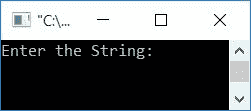
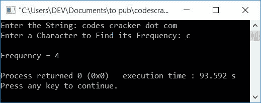
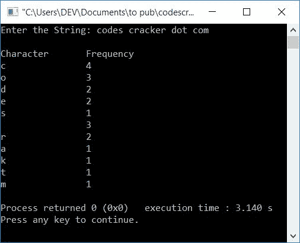
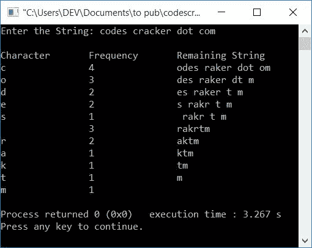

# C++ 程序：查找字符串中字符频率

> 原文：<https://codescracker.com/cpp/program/cpp-program-frequency-character.htm>

在本文中，您将学习并获得使用 C++语言查找和打印字符串中字符(单个和所有)频率的代码。下面是本文中可用的程序列表:

*   查找字符串中某个字符的频率
*   查找字符串中所有字符的频率
*   找出每个字符的频率并并排打印剩余的字符串

**注-** 字符串中某个字符的出现频率是指该字符在给定字符串中出现的总次数。 或字符串中某个字符的出现。

**注意-** 字符和字符串都必须由用户在运行时输入

## 查找字符串中某个字符的频率

要使用 C++ 编程来查找[字符串](/cpp/cpp-strings.htm)中字符的频率，您必须要求用户首先输入字符串，然后要求输入字符来查找其 频率，如下面给出的程序所示:

问题是，**用 C++写一个程序，求一个字符在一个字符串中的出现频率。**下面是它的回答:

```
#include<iostream>
#include<stdio.h>
using namespace std;
int main()
{
    char str[100], ch;
    int i=0, freq=0;
    cout<<"Enter the String: ";
    gets(str);
    cout<<"Enter a Character to Find its Frequency: ";
    cin>>ch;
    while(str[i])
    {
        if(ch==str[i])
            freq++;
        i++;
    }
    cout<<"\nFrequency = "<<freq;
    cout<<endl;
    return 0;
}
```

这个程序是在 *Code::Blocks* IDE 下构建和运行的。下面是它的运行示例:



现在提供任何字符串，比如说**codes cracker . com**，然后在按下`ENTER`键后提供一个字符，比如说 **c** 来找到它的频率 。以下是示例输出:



具有相同用户输入的上述程序的模拟运行(如上面给出的示例运行中所提供的)如下所示:

*   初始值， **i=0** 和 **freq=0**
*   当用户输入字符串时，它被存储到 **str[]** 中，如下所示:
    *   str[0]=c
    *   str[1]=o
    *   str[2]=d
    *   str[3]=e
    *   str[4]=s
    *   str[5]=' '
        空格
    *   str[6]=c
    *   str[7]=r
    *   依此类推，直到
    *   str[20]=m
*   当用户输入一个字符，比如说 **c** ，它就会被存储在 **ch** 中
*   现在开始执行 *while 循环*。它的执行一直持续到它的条件( **str[i]** ) 评估为假。当 **i** 的值变为 21 时，则因为在第 21 个<sup>索引</sup>处，没有剩余 任何字符，则它的条件评估为假
*   在第一次运行 *while 循环*时，条件 **str[i]** 或 **str[0]** (在放置 *i* ) 或 **c** 的值时)评估为真，因此程序流程进入循环内部
*   并且**的条件如果**，即 **ch==str[i]** 或 **c==str[0]** 或 **c==c** 评估为 真，因此如果的主体和 **freq** 的值增加，程序流进入**内部。 所以 **freq=1****
*   现在 **i** 的值也增加，程序流程返回并评估 *的条件，同时用新的 **i** (1)的值再次循环*
*   即，条件 **str[i]** 或 **str[1]** 或 **o** 再次评估为真，因此 程序流再次进入循环
*   但是这次，**的条件 if** ，即 **ch==str[i]** 或 **c==str[1]** 或 **c==o** 评估为假，因此 **freq** 的值不会递增。因此只有 **I**的值增加。现在 **i=2** ，程序流程返回并评估条件 和*，同时再次循环*
*   这个过程继续，直到其条件评估为假
*   每次进入它的主体时，我们都会将 **ch** 的值与字符串 **str** 中的每个字符 进行比较。如果字符匹配，那么**频率**的值增加
*   因此，在退出循环后，我们将有一个变量 **freq** 来保存字符的频率。 所以只需将其值作为输出打印出来。

## 查找字符串中所有字符的频率

这个程序只要求用户输入字符串。因为这个程序查找并打印给定字符串中所有字符出现频率:

```
#include<iostream>
#include<stdio.h>
#include<string.h>
using namespace std;
int main()
{
    char str[100], ch;
    int i, j, k, len, freq=0;
    cout<<"Enter the String: ";
    gets(str);
    len = strlen(str);
    cout<<"\nCharacter\tFrequency";
    for(i=0; i<len; i++)
    {
        ch = str[i];
        for(j=0; j<len; j++)
        {
            if(ch==str[j])
            {
                freq++;
                for(k=j; k<(len-1); k++)
                    str[k] = str[k+1];
                len--;
                str[len] = '\0';
                j--;
            }
        }
        cout<<endl<<ch<<"\t\t"<<freq;
        freq=0;
        i--;
    }
    cout<<endl;
	return 0;
}
```

下面是用户输入的运行示例，**codes cracker . com**:



在上面的程序中，每次当一个字符与任何索引中的一个字符匹配时，我们都将这个字符从它的下一个索引移回一个索引。

**注意-** 不要忘记在新字符串的最后一个索引处初始化一个空终止字符( **\0** )。

### 每次计算每个字符并打印剩余的字符串

该程序与之前的程序相同。唯一的区别是，该程序还打印第三列中的剩余字符串:

```
#include<iostream>
#include<stdio.h>
#include<string.h>
using namespace std;
int main()
{
    char str[100], ch;
    int i, j, k, len, freq=0;
    cout<<"Enter the String: ";
    gets(str);
    len = strlen(str);
    cout<<"\nCharacter\tFrequency\tRemaining String";
    for(i=0; i<len; i++)
    {
        ch = str[i];
        for(j=0; j<len; j++)
        {
            if(ch==str[j])
            {
                freq++;
                for(k=j; k<(len-1); k++)
                    str[k] = str[k+1];
                len--;
                str[len] = '\0';
                j--;
            }
        }
        cout<<endl<<ch<<"\t\t"<<freq<<"\t\t"<<str;
        freq=0;
        i--;
    }
    cout<<endl;
	return 0;
}
```

下面是它的示例运行，用户输入与上一个程序中提供的相同:



#### 其他语言的相同程序

*   [C 查找字符串中字符的频率](/c/program/c-program-frequency-character.htm)
*   [Java 查找字符串中字符的频率](/java/program/java-program-find-frequency-of-character.htm)
*   [Python 查找字符串中字符的频率](/python/program/python-program-count-character-in-string.htm)

[C++在线测试](/exam/showtest.php?subid=3)

* * *

* * *