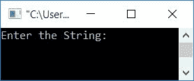
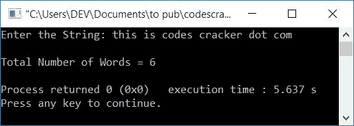
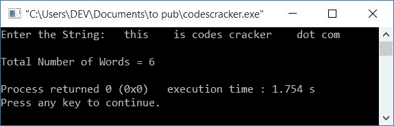

# C++ 程序：计算字符串中单词数

> 原文：<https://codescracker.com/cpp/program/cpp-program-count-words-in-sentence.htm>

在本文中，您将学习并获得在 C++ 语言中计算用户在运行时给定的[字符串](/cpp/cpp-strings.htm)中出现或可用的单词总数的代码。

例如，如果输入的字符串是，**codes cracker . com**，那么总字数是 **4** 。

## 计算字符串中的总字数

在 C++ 编程中，要计算一个字符串中可用单词的总数，你必须要求用户首先输入字符串或句子。然后计数并打印结果，如下面给出的程序所示。

问题是，**用 C++ 写一个程序，计算一个字符串中的总字数。**下面是它的回答。

```
#include<iostream>
#include<stdio.h>
using namespace std;
int main()
{
    char str[200];
    int i=0, chk=0, countWord=0;
    cout<<"Enter the String: ";
    gets(str);
    while(str[i]!='\0')
    {
        if(str[i]==' ')
        {
            if(chk!=0)
                countWord++;
            chk=0;
        }
        else
        {
            chk++;
        }
        i++;
    }
    if(chk!=0)
        countWord++;
    cout<<"\nTotal Number of Words = "<<countWord;
    cout<<endl;
    return 0;
}
```

这个程序是在 *Code::Blocks* IDE 下构建和运行的。下面是它的运行示例:



现在输入任意一个字符串，比如**this is codes cracker . com**，按`ENTER`键 计算并打印输入字符串中可用的单词总数:



这是另一个运行示例，用户输入如下:

```
  this    is codes cracker    dot com  
```

也就是**_ _ 这个 _ _ _ _ 是 _codes_cracker____dot_com__** 。在这个字符串中，每个 单词前有 2，4，1，1，4，1 个空格，最后一个单词后有 2 个空格:



用户输入的上述程序的预演，**这是代码破解点 com** 是这样的:

*   初始值， **i=0** ， **chk=0** ， **countWord=0**
*   当用户输入一个字符串时，它会以一种 的方式存储在 **str** 变量中
    *   str[0]=t
    *   str[1]=h
    *   str[2]=i
    *   以此类推，直到
    *   str[28]=m
*   因为 **str[]** 的最大大小是 **200** ，但是输入的字符串的大小是 **29** (因为 索引是从 0 开始的，所以 **28(最后一个索引)+1** 将是这个大小)。因此，在最后一个字符的 索引之后的索引处，自动分配一个空终止字符( **\0** )。所以 **str[29]=\0**
*   以空字符结尾的字符表示索引中没有剩余的可用字符
*   现在，`while`循环的条件得到评估
*   也就是条件， **str[i]！='\0'** 或 **str[0]！='\0'** 或 **t！='\0'** 评估为真， 因此程序流程进入循环
*   在那里，如果得到评估，则**的条件**
*   也就是说，条件，**str[I]= ' '**或**str[0]= ' '**或 **t==' '** 评估为假， 因此程序流不进入其主体内部，而是进入 **else** 的主体并递增 **chk** 的 值。所以 **chk=1**
*   作为最后一条语句， **i** 的值递增。所以 **i=1**
*   现在程序流程返回并评估*的条件，同时再次循环*
*   该过程继续，直到循环的条件*评估为假*
*   在继续评估*的同时循环*时，以下是每次评估后的值:
    *   chk=1，i=1
    *   chk=2，i=2
    *   chk=3，i=3
    *   chk=4、i=4
    *   chk=0，countWord=1，i=5
    *   chk=1，i=6
    *   chk=2，i=7
    *   chk=0，countWord=2，i=8
    *   chk=1，i=9
    *   chk=2，i=10
    *   chk=3，i=11
    *   chk=4，i=12
    *   chk=5，i=13
    *   chk=0，countWord=3，i=14
    *   chk=1，i=15
    *   chk=2，i=16
    *   chk=3，i=17
    *   chk=4，i=18
    *   chk=5，i=19
    *   chk=6，i=20
    *   chk=7，i=21
    *   chk=0，countWord=4，i=22
    *   chk=1，i=23
    *   chk=2，i=24
    *   chk=3，i=25
    *   chk=0，countWord=5，i=26
    *   chk=1，i=27
    *   chk=2，i=28
    *   chk=3，i=29
*   从 *`while`循环*退出后，条件 **chk！=0** 或 **3！=0** 评估为真， 因此**计数字**的值增加。所以 **countWord=6**
*   现在打印 countWord 的值，作为字符串中总字数的输出

[C++ 在线测试](/exam/showtest.php?subid=3)

* * *

* * *