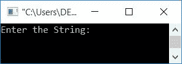
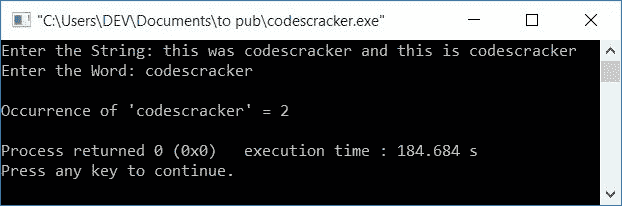
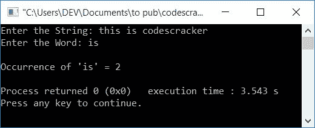
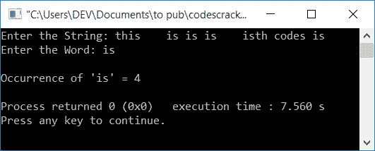

# C++ 程序：来计算一个单词在字符串中的出现次数

> 原文：<https://codescracker.com/cpp/program/cpp-count-occurrence-of-word-in-string.htm>

在本文中，您将学习并获得用 C++计算字符串中单词出现次数的代码。这里是可用程序的列表:

*   查找单词在字符串中的出现频率
*   上述程序的修改版本

## 查找单词在字符串中的频率

这个程序计算一个单词在给定字符串中的出现次数。但是这个程序最适合在一个字符串(由用户输入)中找到一个子字符串(没有空格)的频率。稍后我会告诉你原因。

问题是，**用 C++写一个程序，找出一个单词(子串)在字符串**中的出现频率。以下是它的答案:

```
#include<iostream>
#include<stdio.h>
using namespace std;
int main()
{
    char str[200], word[20];
    int i=0, j, temp, countW=0, chk;
    cout<<"Enter the String: ";
    gets(str);
    cout<<"Enter the Word: ";
    gets(word);
    while(str[i]!='\0')
    {
        temp = i;
        j=0;
        while(word[j]!='\0')
        {
            if(str[i]==word[j])
                i++;
            j++;
        }
        chk = i-temp;
        if(chk==j)
            countW++;
        i = temp;
        i++;
    }
    cout<<"\nOccurrence of '"<<word<<"' = "<<countW;
    cout<<endl;
    return 0;
}
```

这个程序是在 *Code::Blocks* IDE 下构建和运行的。下面是它的运行示例:



现在提供任意一个字符串，说**this was codescracker and this is codescracker**，然后说一个单词 **codescracker** 来查找单词 **codescracker** 在字符串中的出现频率。下面是 示例运行的最终快照:



上面的程序在用户输入下的预演，**这是 codescracker，这是 codescracker** 作为字符串 和 **codescracker** 作为单词:

*   初始值， **i=0** ， **countW=0**
*   当用户输入字符串时，它以这样的方式存储在 **str** 中:
    *   str[0]=t
    *   str[1]=h
    *   str[2]=i
    *   依此类推，直到
    *   str[45]=r
*   类似地，输入的单词 say **codescracker** 以这种方式存储在**单词**中:
    *   word[0]=c
    *   word[1]=o
    *   word[2]=d
    *   依此类推，直到
    *   word[11]=r
*   因为字符串和字的最大尺寸，即 **str[]** 和 **word[]** 分别是 **200** 和 **20** 。 但输入的字符串和单词大小只有 **46** 和 **12** 。因此，空终止字符( **\0** ) 会自动分配到字符串和单词的最后一个字符的索引之后
*   现在 **while 循环**的条件，也就是 **str[i]！='\0'** 或 **str[0]！='\0'** 或 **t！='\0'** 评估为真，因此程序流程进入循环
*   并且 **i** 或 **0** 被初始化为**温度**。所以 **temp=0** 。并且 **j=0**
*   条件，**字[j]！='\0'** 或**字[0]！='\0'** 或 **c！='\0'** 评估为真，因此 程序流程进入循环
*   而 **if** 的条件，即 **str[i]==word[j]** 或 **str[0]==word[0]** 或 **t==c** 求值为假，因此程序流程不进入其主体(if 的主体)内部。因此，它只是增加 **j** 的值 ，然后返回并再次评估内部 *while 循环*的条件
*   评估此 *while 循环*的过程继续，直到其条件评估为假
*   当它的条件评估为假时，那么在暂时退出该循环后， **i** 的值将为 0， **j=12**
*   现在 **i-temp** 或 **0-0** 或 **0** 被初始化为 **chk**
*   并且条件， **chk==j** 或 **0==12** 评估为假，因此程序流不进入其(if)体内的 。
*   现在**温度** (0)的值被初始化为 **i** 。所以 **i=0**
*   最后 **i** 的值增加。所以 **i=1**
*   程序流程返回并评估*的条件，同时再次循环*
*   该过程继续，直到外部 while 循环的条件*评估为假*
*   继续评估，下面是每次评估后我们将得到的值:
    *   temp=0(在内层 *while* 之前)，j=0(在内层 *while* 之前)，i=0 (在内层 *while* 之后)，j=12(在内层 *while* 之后)，countW=0，i=1(最终)
    *   temp=1(内 *while* 之前)，j=0(内 *while* 之前)，i=1 (内 *while* 之后)，j=12(内 *while* 之后)，countW=0，i=2(最终)
    *   类似地，temp=2，j=0，i=2，j=12，countW=0，i=3
    *   温度=3，j=0，i=4，j=12，countW=0，i=4
    *   temp=4，j=0，i=4，j=12，countW=0，i=5
    *   temp=5，j=0，i=5，j=12，countW=0，i=6
    *   temp=6，j=0，i=7，j=12，countW=0，i=7
    *   temp=7，j=0，i=8，j=12，countW=0，i=8
    *   temp=8，j=0，i=8，j=12，countW=0，i=9
    *   temp=9，j=0，i=21，j=12，countW=1，i=10
    *   温度=10，j=0，i=21，j=12，countW=1，i=11
    *   依此类推，直到
    *   温度=45，j=0，i=46，j=12，countW=2，i=46
*   现在打印出 **countW** 的值作为结果输出

### 先前程序的修改版本

如果你的唯一目的是计算一个单词在一个给定的字符串中的出现次数(不考虑整个单词)，那么前面的程序是正确的，否则如果你想找出一个单词在一个字符串中的出现频率，那么上面的程序有一个限制，如下所示。

**重要-** 上面的程序有一个限制，如果 输入的单词出现在字符串中的任何其他单词中，它就增加 **countW** 的值。例如，如果字符串为， **this is codescracker** ，输入的单词为，**为**。因此**是来自**的**，这个**也被计算在内。

以下是(前一个程序的)样本运行的快照，它阐明了我想说的东西:



为了改进之前的程序，这是那个程序的修改版本:

```
#include<iostream>
#include<stdio.h>
#include<string.h>
using namespace std;
int main()
{
    char str[100], word[20];
    int i, j, ls, lw, k, countWord=0, chk, doIncrement;
    cout<<"Enter the String: ";
    gets(str);
    cout<<"Enter the Word: ";
    gets(word);
    ls = strlen(str);
    lw = strlen(word);
    for(i=0; i<ls; i++)
    {
        k = i;
        doIncrement = 0;
        for(j=0; j<lw; j++)
        {
            if(str[i]==word[j])
            {
                if(k>0 && (k+lw)<ls)
                {
                    if(str[k-1]== ' ' && str[k+lw]==' ')
                        doIncrement=1;
                }
                else if(k==0 && (k+lw)<ls)
                {
                    if(str[k+lw]==' ')
                        doIncrement=1;
                }
                else if(k>0 && (k+lw)==ls)
                {
                    if(str[k-1]== ' ')
                        doIncrement=1;
                }
                if(doIncrement==1)
                    i++;
                else
                    break;
            }
        }
        chk = i-k;
        if(chk==lw)
            countWord++;
        i = k;
    }
    cout<<"\nOccurrence of '"<<word<<"' = "<<countWord;
    cout<<endl;
    return 0;
}
```

下面是它的运行示例:



[C++在线测试](/exam/showtest.php?subid=3)

* * *

* * *