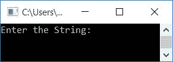

# C++ 程序：从字符串中移除所有多余空格

> 原文：<https://codescracker.com/cpp/program/cpp-program-remove-spaces-from-string.htm>

在本文中，您将学习并获得使用 C++ 程序从字符串中删除空格的代码。以下是用户在运行时从输入的字符串中删除空格的程序列表:

*   删除字符串中的所有空格
*   仅删除字符串中多余的空格

在这两个程序中，字符串都必须由用户在运行时输入。

## 删除字符串中的所有空格

要移除或删除一个[字符串](/cpp/cpp-strings.htm)或一个句子中的所有空格，你 必须要求用户输入该字符串。然后检查空格，如果找到空格，则将所有的 字符从找到空格的地方向后移动一个索引，如下面给出的程序所示:

问题是，**用 C++ 写一个程序，去掉字符串中的所有空格。**下面是它的回答:

```
#include<iostream>
#include<stdio.h>
using namespace std;
int main()
{
    char str[200];
    int i=0, j, chk;
    cout<<"Enter the String: ";
    gets(str);
    while(str[i]!='\0')
    {
        chk=0;
        if(str[i]==' ')
        {
            for(j=i; str[j-1]!='\0'; j++)
                str[j] = str[j+1];
            chk = 1;
        }
        if(chk==0)
            i++;
    }
    cout<<"\nString without Spaces: "<<str;
    cout<<endl;
    return 0;
}
```

这个程序是在 *Code::Blocks* IDE 下构建和运行的。下面是它的运行示例:


现在供应任何字符串说**代码破解。com** 作为输入，按`ENTER`键删除其中的所有 空格，并打印没有任何空格的相同字符串，如下图所示:


用用户输入的**代码破解上述程序。com** 是这样的:

*   当用户输入字符串时，它会以如下方式存储在 **str** 变量中:
    *   str[0]=c
    *   str[1]=o
    *   str[2]=d
    *   str[3]=e
    *   str[4]=s
    *   str[5]= ' '
    *   str[6]=c
    *   str[7]=r
    *   依此类推，直到
    *   str[18]=m
    *   在最后一个索引处，即第 19 个<sup>索引处，空终止字符(\0)自动被赋予 。所以 **str[19]='\0'**</sup>
*   因为 **i** 的初始值是 **0** 。因此条件 *`while`循环* **str[I]！='\0'** 或 **str[0]！='\0'** 或 **c！='\0'** 评估为真，因此程序流程进入循环内部
*   在循环内部， **0** 被初始化为 **chk** 。所以 **chk=0**
*   现在**的条件 if** ，即**str[0]= ' '**或 **c==' '** 评估为假，因此 程序流程评估第二个 **if** 的条件
*   也就是说，条件 **chk==0** 或 **0==0** 评估为真，因此程序流程进入 if 的**体内，并增加 **i** 的值。所以 **i=1****
*   现在程序流评估*的条件，同时再次循环*。也就是条件 **str[I]！='\0'** 或 **str[1]！='\0'** 或 **o！='\0'** 再次评估为真，因此程序流 再次进入循环
*   这个过程继续，直到循环的条件*评估为假*
*   如果出现空格，那么从找到空格的索引开始，我们将所有的字符移回一个索引。例如，如果在索引号 5 处找到一个空格，则:
    *   第 6 个<sup>索引</sup>处的角色移动到第 5 个<sup>索引</sup>处
    *   第 7 个<sup>索引</sup>处的角色移动到第 6 个<sup>索引</sup>处
    *   第 8 个<sup>索引</sup>处的角色移动到第 7 个<sup>索引</sup>处
    *   等等
*   在移动所有的字符后，我们已经初始化了 **1** 到 **chk** 。检查其值，是否 保持其先前的值(0)。如果它保持其先前的值，则递增 **i** 、 的值，否则，不递增 **i** 的值，从相同的(先前的)索引或最后评估的索引开始
*   因为通过上面移动字符的例子，我们已经将第 6 <sup>号</sup>索引的字符移动到第 号<sup>号</sup>索引，这就是现在的新字符。这就是为什么，我们使用了 **chk** 变量来检查和 增加 **i** 的值
*   这样，字符串 **str** 中的所有空格都被删除。所以只需在执行 任务后打印其值

## 删除字符串中多余的空格

这个程序只删除给定字符串中多余的空格。例如，如果任意两个单词之间有多个空格，那么除了一个以外的所有空格都将被删除。让我们来看看这个程序:

```
#include<iostream>
#include<stdio.h>
#include<string.h>
using namespace std;
int main()
{
    char str[200];
    int i, j, len;
    cout<<"Enter the String: ";
    gets(str);
    len = strlen(str);
    for(i=0; i<len; i++)
    {
        if(str[0]==' ')
        {
            for(i=0; i<(len-1); i++)
                str[i] = str[i+1];
            str[i] = '\0';
            len--;
            i=-1;
            continue;
        }
        if(str[i]==' ' && str[i+1]==' ')
        {
            for(j=i; j<(len-1); j++)
            {
                str[j] = str[j+1];
            }
            str[j] = '\0';
            len--;
            i--;
        }
    }
    cout<<"\nString without Extra Spaces: "<<str;
    cout<<endl;
    return 0;
}
```

以下是该程序产生的初始输出:



现在提供两个单词之间包含一个以上空格的任何字符串，并按`ENTER`从给定的字符串中删除 多余的空格，并打印新字符串，如下图所示:


#### 其他语言的相同程序

*   从字符串中删除空格
*   [Java 从字符串中删除空格](/java/program/java-program-remove-spaces-from-string.htm)
*   [Python 删除字符串中的空格](/python/program/python-program-remove-spaces-from-string.htm)

[C++ 在线测试](/exam/showtest.php?subid=3)

* * *

* * *