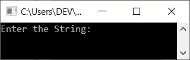
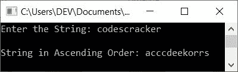
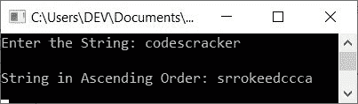
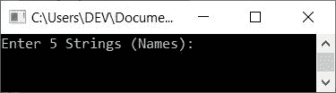
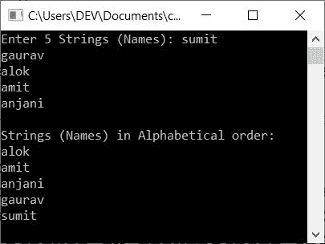
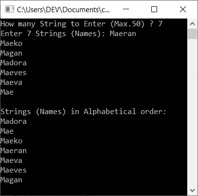

# C++ 程序：排序字符串

> 原文：<https://codescracker.com/cpp/program/cpp-program-sort-string.htm>

在本文中，您将学习并获得在 C++ 中排序字符串的代码。以下是对用户在运行时输入的字符串进行排序的程序列表:

*   按升序对字符串排序
*   按降序对字符串排序
*   按字母顺序对字符串(名称)排序

## 按升序对字符串排序

这个程序对用户输入的字符串进行升序排序。例如，如果给定的字符串是 **bcabcz** 。 那么同样的字符串按升序排列就是 **abbccz** 。让我们来看看这个程序:

问题是，**用 C++ 写一个程序，对一个字符串进行升序排序。**下面是它的回答:

```
#include<iostream>
#include<stdio.h>
#include<string.h>
using namespace std;
int main()
{
    char str[200], ch;
    int i, j, len;
    cout<<"Enter the String: ";
    gets(str);
    len = strlen(str);
    for(i=0; i<len; i++)
    {
        for(j=0; j<(len-1); j++)
        {
            if(str[j]>str[j+1])
            {
                ch = str[j];
                str[j] = str[j+1];
                str[j+1] = ch;
            }
        }
    }
    cout<<"\nString in Ascending Order: "<<str;
    cout<<endl;
    return 0;
}
```

这个程序是在 *Code::Blocks* IDE 下构建和运行的。下面是它的运行示例:



现在提供输入，比如说 **codescracker** 作为字符串，然后按`ENTER`键按升序 排序，并在输出上打印排序后的字符串，如下图所示:



用户输入上述程序， **codescracker** 的试运行如下:

*   当用户输入一个字符串时，它被存储在 **str** 中，存储方式是:
    *   str[0]=c
    *   str[1]=o
    *   str[2]=d
    *   依此类推，直到
    *   str[11]=r
*   现在使用函数 **strlen()** ，字符串的长度被初始化为 **len** 变量。因为 的长度是 12，所以 **len=12**
*   现在开始执行循环的*。也就是说， **i=0** 且条件 **i < len** 或 T6】0<12 评估为真，因此程序在循环内流动*
*   在循环内部，还有另一个循环的*。因此 **j=0** 和条件 **j < (len-1)** 或 **0<11**评估为真，因此程序流程进入循环内部*
*   现在使用 **if** 我们已经使用 **j** 比较了当前索引处的字符串与其使用 **j+1**的相邻索引。
*   也就是说，条件(of**if**)**str[j]>str[j+1]**或 **str[0] > str[1]** 或 **c > o** 评估为假，因此程序流程不会进入 **if** 的主体。但是每当条件 评估为真时，程序流进入主体内部并交换或交换字符
*   现在程序流程转到循环的内部*的更新部分，并增加 **j** 的值。现在 **j=1** 并且条件再次被评估*
*   条件 **j < (len-1)** 或 **1 < 11** 再次评估为真，因此程序 流程进入循环内部。这个过程一直持续到条件评估为假
*   当循环的内层*的求值结束时，程序流程转到循环*的外层 *的更新部分，并递增 **i** 的值。所以 **i=1** 并且条件再次被评估*
*   条件 **i < len** 或 **1 < 12** 再次评估为真，因此程序再次在 循环内流动。这个过程一直持续到条件评估为假
*   这样，字符串以升序排序。
*   所以从循环的外部*退出后，只需打印 **str** 的值*

**注意-** 手动计算字符串的长度，不使用 **strlen()** 函数，参考 [计算字符串长度](/cpp/program/cpp-program-find-length-of-string.htm)文章，获取每个需要的 代码来实现。

## 按降序对字符串排序

要按降序排序字符串，如果(来自上一个)程序，只需改变**的以下条件:**

```
if(str[j]>str[j+1])
```

使用下面给出的代码:

```
if(str[j]<str[j+1])
```

**注-** 只是一个**大于(> )** 和**小于(< )** 符号的问题，整个程序 得到反转。

这是它的示例运行，用户输入与之前程序的示例运行相同，即 **codescracker** :



## 按字母顺序对字符串(名称)进行排序

在 [C++](/cpp/index.htm) 编程中，要将[字符串](/cpp/cpp-strings.htm)(人名)按字母顺序排序，你必须要求用户输入几个人名(字符串)。然后将这些输入的字符串或名称按照 的字母顺序排序，如下面给出的程序所示:

这个程序在运行时只接收来自用户的 5 个名字。问题是**用 C++ 写一个程序，将用户输入的 5 个名字 按字母顺序排序。**下面是它的回答:

```
#include<iostream>
#include<string.h>
using namespace std;
int main()
{
    char nameAll[5][20], nameOne[20];
    int i, j;
    cout<<"Enter 5 Strings (Names): ";
    for(i=0; i<5; i++)
        cin>>nameAll[i];
    for(i=1; i<5; i++)
    {
        for(j=1; j<5; j++)
        {
            if(strcmp(nameAll[j-1], nameAll[j])>0)
            {
                strcpy(nameOne, nameAll[j-1]);
                strcpy(nameAll[j-1], nameAll[j]);
                strcpy(nameAll[j], nameOne);
            }
        }
    }
    cout<<"\nStrings (Names) in Alphabetical order:\n";
    for(i=0; i<5; i++)
        cout<<nameAll[i]<<endl;
    cout<<endl;
    return 0;
}
```

以下是该程序产生的初始输出:



现在提供任意 5 个字符串(名称)。也就是说，输入第一个字符串或名字，比如说 **sumit** 并按下`ENTER` 键，然后输入第二个字符串，比如说 **gaurav** 并再次按下`ENTER`键，以此类推，直到输入第五个 字符串(名字)，比如说 **anjani** 并按下`ENTER`键，这次将所有 5 个名字按字母顺序 排序。现在打印字符串(按字母顺序排列)，如下面给出的输出所示:



**注意-** 手动比较两个字符串(不使用 **strcmp()** 函数)，参考 [比较两个字符串](/cpp/program/cpp-program-compare-two-string.htm)文章，获取每一个需要的 关于题目的东西。

**注-** 手动复制字符串(不使用 **strcpy()** 函数)，参考 [复制字符串](/cpp/program/cpp-program-copy-string.htm)实现基于用户的代码做同样的 任务。

#### 允许用户定义名称的大小

现在这个程序允许用户输入尺寸。这就是用户想要输入的名字的数量。然后按照字母顺序对所有输入的名称进行排序，如下所示:

```
#include<iostream>
#include<string.h>
using namespace std;
int main()
{
    int i, j, tot;
    char nameAll[50][20], nameOne[20];
    cout<<"How many String to Enter (Max.50) ? ";
    cin>>tot;
    cout<<"Enter "<<tot<<" Strings (Names): ";
    for(i=0; i<tot; i++)
        cin>>nameAll[i];
    for(i=1; i<tot; i++)
    {
        for(j=1; j<tot; j++)
        {
            if(strcmp(nameAll[j-1], nameAll[j])>0)
            {
                strcpy(nameOne, nameAll[j-1]);
                strcpy(nameAll[j-1], nameAll[j]);
                strcpy(nameAll[j], nameOne);
            }
        }
    }
    cout<<"\nStrings (Names) in Alphabetical order:\n";
    for(i=0; i<tot; i++)
        cout<<nameAll[i]<<endl;
    cout<<endl;
    return 0;
}
```

下面是它的示例运行，用户输入 7 个名字作为名字的大小，7 个名字是**梅兰、梅科、马根、马多拉、梅韦斯、梅瓦**、T6 和**梅**:



#### 其他语言的相同程序

*   [C 排序字符串](/c/program/c-program-sort-string.htm)
*   [Java 排序字符串](/java/program/java-program-sort-string.htm)
*   [Python 排序字符串](/python/program/python-program-sort-string-in-alphabetical-order.htm)

[C++ 在线测试](/exam/showtest.php?subid=3)

* * *

* * *