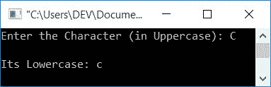

# C++ 程序：将大写字母转换成小写字母

> 原文：<https://codescracker.com/cpp/program/cpp-program-convert-uppercase-into-lowercase.htm>

在本文中，您将学习并获得 C++ 中大写字符/字符串到小写字符转换的代码。该程序是使用和不使用标准库(或字符串)函数创建的。以下是程序列表:

*   不使用字符串函数将大写字符转换为小写字符
*   处理无效输入的程序
*   不使用字符串函数将大写字符串转换为小写
*   使用字符串函数将大写字符/字符串转换为小写字符， **strlwr()**

### 大写字符

大写字符基本上是用大写字母书写的字母字符。比如 **C** 。 所有 26 个大写字母字符的 ASCII 值为 **65-90** 。其中 **65** 是 T6 A 的 ASCII 值， **66** 是 **B** 的 ASCII 值，以此类推， **90** 是 **Z** 的 ASCII 值

### 小写字符

小写字符基本上是用小写字母书写的字母表字符。比如 **c** 。 所有 26 个小写字母字符的 ASCII 值为 **97-122** 。即 **a→97** 、 **b→98** 、 **c→99** ，以此类推。

### 大写和小写字符串

如果一个字符串中所有可用的字符都是大写的，那么它被称为大写字符串。如果一个字符串的所有字符都是小写的，那么它就叫做小写字符串。

**注-** 字符串是多个字符的组合。例如， **CODESCRACKER** (大写 字符串)或 **codescracker** (小写字符串)

### 大写到小写公式

因为 A(大写字母)的 ASCII 值是 65，而 A(小写字母)的 ASCII 值是 97。两者相差 **32** 。因此，在将大写字母 **A** 的 ASCII 值加上 **32** 后，我们将得到其小写对应字母的 ASCII 值。也就是说:

```
65 (ASCII value of A) + 32 = 97 (ASCII value of a)
```

## C++ 大写字符到小写字符

在 [C++](/cpp/index.htm) 编程中，要将一个字符从大写转换成小写，你必须让用户的 输入一个大写字符，然后将其转换成对应的小写字符。最后 在输出中打印小写的等价字符。

```
#include<iostream>
using namespace std;
int main()
{
    char chUpper, chLower;
    int ascii;
    cout<<"Enter the Character (in Uppercase): ";
    cin>>chUpper;
    ascii = chUpper;
    ascii = ascii+32;
    chLower = ascii;
    cout<<"\nIts Lowercase: "<<chLower;
    cout<<endl;
    return 0;
}
```

这个程序是在 *Code::Blocks* IDE 下构建和运行的。下面是它的运行示例:


现在提供大写的字符输入，比如说 **C** ,并按`ENTER`键打印小写的对应 字符，如下图所示:



在上面的程序中，当用户输入 **C** 作为大写字符输入时，它被存储在 **chUpper** 变量中。所以下面给出的声明:

```
ascii = chUpper;
```

将 **C** 的 ASCII 值初始化为 **ascii 码**。所以， **ascii = 67** 。现在声明:

```
ascii = ascii+32;
```

将 **67+32** 或 **99** 初始化为 **ascii 码**。所以 **ascii** 的新值是 **99** ，也就是 **c** (小写)的 ASCII 值。所以声明:

```
chLower = ascii;
```

由于 **chLower** 是 **char** (字符)类型变量，因此字符对应的 **99** (ASCII 值)被初始化为 **chLower** 。所以 **chLower=c** 。现在打印出 **chLower** 的值作为输出。

### 如何处理一个无效的输入？

如果用户输入了一个无效的输入，如已经是小写的字母字符或任何其他字符，如数字，或特殊字符，然后按照下面给出的程序。在这种情况下，以前的程序无法正常工作。

```
#include<iostream>
using namespace std;
int main()
{
    char chUpper, chLower;
    int ascii;
    cout<<"Enter the Character: ";
    cin>>chUpper;
    if(chUpper>='A' && chUpper<='Z')
    {
        ascii = chUpper;
        ascii = ascii+32;
        chLower = ascii;
        cout<<"\nIts Lowercase: "<<chLower;
    }
    else if(chUpper>='a' && chUpper<='z')
        cout<<"\nAlready in Lowercase";
    else
        cout<<"\nInvalid Input!";
    cout<<endl;
    return 0;
}
```

下面是用户输入 **D** 的运行示例


下面是另一个运行用户输入 **d** 的示例(已经是小写形式):


这是用户输入的最终样本 **4** (不是字母表):


## C++ 大写字符串到小写

现在让我们把字符串从大写转换成小写。下面的 C++ 程序要求用户输入一个字符串，如 **CODESCRACKER** (大写)以将其转换并打印成小写:

```
#include<iostream>
#include<stdio.h>
using namespace std;
int main()
{
    char strUpper[50]="", strLower[50]="";
    int i=0, ascii, chk=0;
    cout<<"Enter the String: ";
    gets(strUpper);
    while(strUpper[i]!='\0')
    {
        if(strUpper[i]>='A' && strUpper[i]<='Z')
        {
            ascii = strUpper[i];
            ascii = ascii+32;
            strLower[i] = ascii;
            chk++;
        }
        else
            strLower[i] = strUpper[i];
        i++;
    }
    strLower[i]='\0';
    if(chk==0)
        cout<<"\nString is already in Lowercase";
    else
        cout<<"\nLowercase of String: "<<strLower;
    cout<<endl;
    return 0;
}
```

这是它的示例运行，字符串输入为**这是 CodesCracker** :


## C++ 大写到小写使用函数

问题是，**用 C++ 写一个程序，使用字符串 函数将大写字符或字符串转换成小写。**这个问题的答案如下:

```
#include<iostream>
#include<stdio.h>
#include<string.h>
using namespace std;
int main()
{
    char str[50];
    int len;
    cout<<"Enter the Character/String: ";
    gets(str);
    len = strlen(str);
    if(len==1)
        cout<<"\nLowercase of Given Character: "<<strlwr(str);
    else
        cout<<"\nLowercase of Given String: "<<strlwr(str);
    cout<<endl;
    return 0;
}
```

下面是它使用字符串输入 **CODESCRACKER** 运行的示例:


#### 其他语言的相同程序

*   [C 大写到小写](/c/program/c-program-convert-uppercase-into-lowercase.htm)
*   [Java 大写到小写](/java/program/java-program-convert-uppercase-to-lowercase.htm)
*   [Python 大写到小写](/python/program/python-program-convert-uppercase-to-lowercase.htm)

[C++ 在线测试](/exam/showtest.php?subid=3)

* * *

* * *