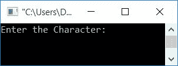
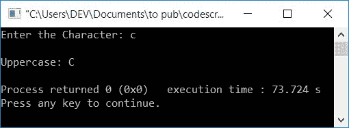
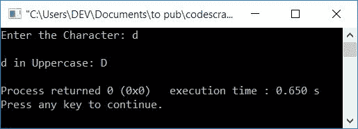
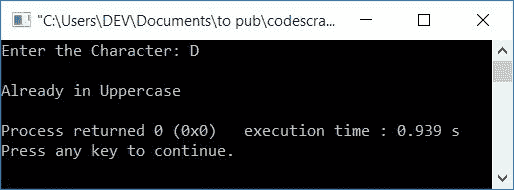
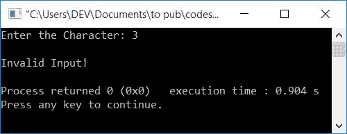
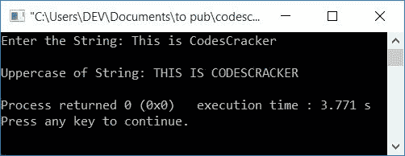

# 将小写转换成大写的 C++程序

> 原文：<https://codescracker.com/cpp/program/cpp-program-convert-lowercase-into-uppercase.htm>

在本文中，您将学习并获得 C++中字符和字符串的小写到大写转换的代码。程序创建时使用和不使用库函数。这里是可用程序的列表:

*   不使用库函数的小写字符到大写字符的转换
*   处理无效输入的程序
*   小写字符串到大写不带库函数， **strupr()**
*   使用库函数 **strupr()**

**注-** 这里的小写和大写字符实际上是指小写/大写字母字符。

### 小写字符

用小写字母表示的字母字符称为小写字母字符。所有 26 个小写字母(a-z)的 ASCII 值 为 **97-122** 。即 **a** 的 ASCII 值为 **97** ， T8】b 为 **98** ， **c** 为 **99** 等等。

### 大写字符

用大写字母写的字母字符称为大写字母。 所有 26 个大写字母(A-Z)的 ASCII 值为 **65-90** 。即 **A** 的 ASCII 值为 **65** ， **B** 为 **66** ， **C** 为 **67** 等等。

### 小写和大写字符串

如果一个字符串的所有字母字符都写成小写字母，那么这个字符串就可以称为小写字符串。比如 **codescracker** 。反之，如果一个字符串的所有字母字符都用大写字母 书写，那么这个字符串就可以称为大写字符串。比如 **CODESCRACKER**

## C++小写字符转换为大写字符

让我们创建一个程序，在运行时从用户那里接收一个字母字符(小写)。现在转换&打印给定(输入)字符的等价大写值(小写),而不使用库函数

问题是，**用 C++写一个程序，将用户输入的小写字符转换成等价的 大写字符。**下面是这个问题的答案。

```
#include<iostream>
using namespace std;
int main()
{
    char chLower, chUpper;
    int ascii;
    cout<<"Enter the Character: ";
    cin>>chLower;
    ascii = chLower;
    ascii = ascii-32;
    chUpper = ascii;
    cout<<"\nUppercase: "<<chUpper;
    cout<<endl;
    return 0;
}
```

这个程序是在 *Code::Blocks* IDE 下构建和运行的。下面是它的运行示例:



现在提供字符输入(小写),比如说 **c** ,并按`ENTER`键查看其大写的等价 值，如下图所示:



从上面的程序中，语句:

```
ascii = chLower;
```

将 **chLower** 中存储的字符的 ASCII 值初始化为 **ascii** 。因为， **chLower** 属于 **char** (字符)类型变量，而 **ascii** 属于 **int** (整数)类型变量，所以 **chLower** 的 ASCII 值(整数)被初始化为 **ascii** 。

例如，如果用户输入 **c** 作为小写字母字符输入，那么 **c** 被存储在 **chLower** 中，并且它的 ASCII 值 **99** 被初始化为 **ascii**

**注-** 因为<u>A**(大写字母)的 ASCII 值是 **65****</u> **。而 **a** (小写字母)的 <u>ASCII 值 为**97**T13】。两个 ASCII 值之间的<u>差值为**32**T17】。因此， <u>从小写字母字符的 ASCII 值中减去 32，得到等价的大写 字母字符的 ASCII 值</u>。</u></u>**

 **所以声明，

```
ascii = ascii-32;
```

将 **ascii-32** 或 **99-32** 或 **67** 初始化为 **ascii** 。所以 **ascii** 的新值是 **67** 。而 **67** 是 **C** 的 ASCII 值(大写字母)

因此给出如下声明:

```
chUpper = ascii;
```

初始化 ASCII 值为 **67** 的字符值。那将是 **C** 。所以**丘珀= C** 。现在 打印 **chUpper** 的值。

### 如果用户输入了无效的输入怎么办？

处理用户(在运行时)收到的无效输入，例如:

*   一个数字
*   一个特殊的角色
*   或者大写字符

然后，这里有另一个程序来处理这些类型的输入:

```
#include<iostream>
using namespace std;
int main()
{
    char chLower, chUpper;
    int ascii;
    cout<<"Enter the Character: ";
    cin>>chLower;
    if(chLower>='a' && chLower<='z')
    {
        ascii = chLower;
        ascii = ascii-32;
        chUpper = ascii;
        cout<<endl<<chLower<<" in Uppercase: "<<chUpper;
    }
    else if(chLower>='A' && chLower<='Z')
        cout<<"\nAlready in Uppercase";
    else
        cout<<"\nInvalid Input!";
    cout<<endl;
    return 0;
}
```

下面是用户输入 **d** 的运行示例:



下面是另一个使用用户输入 **D** 运行的示例:



这是最后一次使用用户输入运行的示例 **3** :



## C++小写字符串转换为大写

现在让我们将用户收到的小写字符串转换成等价的大写字符串。因为字符串是字符的组合，所以我们必须将所有字符(字符串中可用的)逐个转换为大写，如下面给出的程序所示:

```
#include<iostream>
#include<stdio.h>
using namespace std;
int main()
{
    char strLower[50], strUpper[50];
    int ascii, i=0, chk=0;
    cout<<"Enter the String: ";
    gets(strLower);
    while(strLower[i]!='\0')
    {
        if(strLower[i]>='a' && strLower[i]<='z')
        {
            ascii = strLower[i];
            ascii = ascii-32;
            strUpper[i] = ascii;
            chk++;
        }
        else
            strUpper[i] = strLower[i];
        i++;
    }
    strUpper[i]='\0';
    if(chk==0)
        cout<<"\nString is already in Uppercase";
    else
        cout<<"\nUppercase of String: "<<strUpper;
    cout<<endl;
    return 0;
}
```

这是用户输入的示例运行**这是 CodesCracker** :



### 使用库函数 strupr()

这是最后一个使用库函数 **strupr()** 的程序。该函数将 string 作为其参数， 将其转换为等价的大写字符串。该函数定义在 **string.h** 头文件中。

```
#include<iostream>
#include<stdio.h>
#include<string.h>
using namespace std;
int main()
{
    char str[50];
    cout<<"Enter the String: ";
    gets(str);
    cout<<"\nUppercase of String: "<<strupr(str);
    cout<<endl;
    return 0;
}
```

这个程序产生与前一个程序相同的输出。

#### 其他语言的相同程序

*   [C 小写到大写](/c/program/c-program-convert-lowercase-into-uppercase.htm)
*   [Java 小写转大写](/java/program/java-program-convert-lowercase-to-uppercase.htm)
*   [Python 小写到大写](/python/program/python-program-convert-lowercase-to-uppercase.htm)

[C++在线测试](/exam/showtest.php?subid=3)

* * *

* * ***