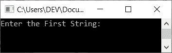
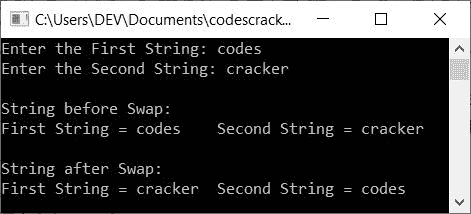

# C++ 程序：交换两个字符串

> 原文：<https://codescracker.com/cpp/program/cpp-program-swap-two-strings.htm>

在本文中，您将学习并获得交换用户使用 C++程序输入的两个字符串的代码。以下是交换两个给定字符串的程序列表:

*   使用库函数交换两个字符串
*   不使用库函数交换两个字符串

## 使用库函数交换两个字符串

要在 C++ 编程中交换两个[字符串，你必须要求用户输入两个 字符串。两个字符串的值都存储在两个](/cpp/cpp-strings.htm)[变量](/cpp/cpp-variables.htm)中，比如 **strOne** (第一个字符串)和 **strTwo** (第二个字符串)。现在，在库函数 **strcpy()** 的帮助下，使用第三个变量 比如 **strTmp** 交换这两个字符串，如下面给出的程序所示:

```
#include<iostream>
#include<stdio.h>
#include<string.h>
using namespace std;
int main()
{
    char strOne[50], strTwo[50], strTmp[50];
    cout<<"Enter the First String: ";
    gets(strOne);
    cout<<"Enter the Second String: ";
    gets(strTwo);
    cout<<"\nString before Swap:\n";
    cout<<"First String = "<<strOne<<"\tSecond String = "<<strTwo;
    strcpy(strTmp, strOne);
    strcpy(strOne, strTwo);
    strcpy(strTwo, strTmp);
    cout<<"\n\nString after Swap:\n";
    cout<<"First String = "<<strOne<<"\tSecond String = "<<strTwo;
    cout<<endl;
    return 0;
}
```

这个程序是在 *Code::Blocks* IDE 下构建和运行的。下面是它的运行示例:



现在提供两个字符串，说**代码**作为第一个字符串，说**破解**作为第二个字符串。下面是用这两个字符串作为输入运行的示例 :



以下代码块:

```
strcpy(strTmp, strOne);
strcpy(strOne, strTwo);
strcpy(strTwo, strTmp);
```

负责两个字符串的交换。例如，如果用户输入与上述程序示例运行中给出的相同的两个字符串。最初**strOne =代码**和**strTwo =破解**。现在执行完第一条语句 (上面三行语句):

```
strcpy(strTmp, strOne);
```

**strOne** 的值被复制到 **strTmp** 中。所以 **strTmp=codes** 。以类似的方式，在执行 以下(第二)语句后:

```
strcpy(strOne, strTwo);
```

**strTwo** 的值被复制到 **strOne** 中。所以 **strOne=cracker** 。而用第三种说法， 那就是:

```
strcpy(strTwo, strTmp);
```

**strTmp** 的值被复制到 **strTwo** 中。所以 **strTwo=codes** 。通过这种方式，使用 C++的 **strcpy()** 库函数来执行 交换。

## 不使用库函数交换两个字符串

这个程序只是手动复制字符串(使用基于用户的代码)，没有使用库函数 **strcpy()** :

```
#include<iostream>
#include<stdio.h>
using namespace std;
int main()
{
    char strOne[50], strTwo[50], strTmp[50];
    int i=0;
    cout<<"Enter the First String: ";
    gets(strOne);
    cout<<"Enter the Second String: ";
    gets(strTwo);
    cout<<"\nString before Swap:\n";
    cout<<"First String = "<<strOne<<"\tSecond String = "<<strTwo;
    while(strOne[i]!='\0')
    {
        strTmp[i] = strOne[i];
        i++;
    }
    strTmp[i] = '\0';
    i=0;
    while(strTwo[i]!='\0')
    {
        strOne[i] = strTwo[i];
        i++;
    }
    strOne[i] = '\0';
    i=0;
    while(strTmp[i]!='\0')
    {
        strTwo[i] = strTmp[i];
        i++;
    }
    strTwo[i] = '\0';
    cout<<"\n\nString after Swap:\n";
    cout<<"First String = "<<strOne<<"\tSecond String = "<<strTwo;
    cout<<endl;
    return 0;
}
```

这个程序产生与前一个程序相同的输出。在上面的程序中，我们没有使用 **strcpy()** 函数来复制字符串，而是使用基于用户的代码做了同样的事情。

**注-** 要了解更多关于将一个字符串复制到另一个字符串的信息，请参考 [复制字符串程序](/cpp/program/cpp-program-copy-string.htm)以获得关于 主题的所有必要信息。在那里，你会得到关于如何在以前的程序给出的代码工作的全部细节。

#### 其他语言的相同程序

*   [C 交换两个字符串](/c/program/c-program-swap-two-strings.htm)
*   [Java 交换两个字符串](/java/program/java-program-swap-two-strings.htm)
*   [Python 交换两个字符串](/python/program/python-program-swap-two-strings.htm)

[C++在线测试](/exam/showtest.php?subid=3)

* * *

* * *