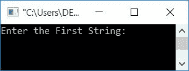
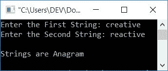

# C++ 程序：，检查字符串是否是字谜

> 原文：<https://codescracker.com/cpp/program/cpp-anagram-program.htm>

在本文中，您将学习使用 C++ 编程来检查用户给定的两个字符串是否是变位词。但是在走程序之前，我们先了解一下，字谜是什么意思。

### 什么是变位字符串？

当且仅当两个字符串包含相同数量的字符时，它们才是互变位。

**注意**——字符顺序无关紧要。

如果两个字符串是变位词，那么一个字符串可以重新排列形成另一个。例如:

*   abc 和 cba 是变位词。
*   创造性和反应性也是变位词

现在让我们继续这个项目。

## 检查 C++ 中的字谜字符串

在 [C++](/cpp/index.htm) 编程中，要检查两个[字符串](/cpp/cpp-strings.htm)是否是变位词，你必须要求用户输入两个字符串开始检查 变位词，并在屏幕上显示结果(该字符串是否是变位词)，如下面的 程序所示。

```
#include<iostream>
#include<string.h>
using namespace std;
int main()
{
    char str1[20], str2[20];
    int len1, len2, i, j, found=0, not_found=0;
    cout<<"Enter the First String: ";
    cin>>str1;
    cout<<"Enter the Second String: ";
    cin>>str2;
    len1 = strlen(str1);
    len2 = strlen(str2);
    if(len1 == len2)
    {
        for(i=0; i<len1; i++)
        {
            found = 0;
            for(j=0; j<len1; j++)
            {
                if(str1[i] == str2[j])
                {
                    found = 1;
                    break;
                }
            }
            if(found == 0)
            {
                not_found = 1;
                break;
            }
        }
        if(not_found == 1)
            cout<<"\nStrings are not Anagram";
        else
            cout<<"\nStrings are Anagram";
    }
    else
        cout<<"\nCharacter count Mismatched!";
    cout<<endl;
    return 0;
}
```

这个程序是在 *Code::Blocks* IDE 下构建和运行的。下面是它的运行示例:



现在供应任意两串说**创意**和**无功**并按`ENTER`键查看 以下输出:



在这里，首先我们必须检查两个字符串的长度，如果长度相等，然后进一步处理。否则打印长度不等的消息，如**字符数不匹配！**。既然两个字符串要变位， 它们的长度必须相同。

现在这里逐一比较第一个字符串的第一个字符和第二个字符串的所有字符。然后将第一个字符串的第二个字符与第二个字符串的所有字符进行比较。再次将第一个字符串的第三个字符与第二个字符串的所有字符进行比较，依此类推。

在比较时，如果第一个字符串的任何一个字符与第二个字符串的字符匹配，那么将 1 初始化为一个[变量](/cpp/cpp-variables.htm)，比如说**找到了**，并退出[循环](/cpp/cpp-loop-types.htm)。 如果没有找到任何字符的匹配，那么 1 不会初始化到找到的**。因此， **found** 将等于 0(其先前值或初始值)，因此在退出循环的内部 [并检查 的条件 **之后，如果 (found==0)** ，则假定为真，1 被初始化为 **not_found** 并退出 外部循环。因此，在退出或完成外循环后，我们必须检查 **not_found** 是否等于 1 或 0。如果 **not_found** 将等于 1，那么字符串不是变位词，否则字符串是变位词。](/cpp/cpp-iteration-statements.htm)**

 **#### 上述程序的试运行

例如，让我们假设用户输入两个字符串作为**创意**和**反应**，那么上面的 程序用这个输入进行模拟运行如下:

1.  字符串**无功**初始化为 **str1** 和**创意** 初始化为**创意**的方式是:
    *   str1[0]=r
    *   str1[1]=e
    *   str1[2]=a
    *   str1[3]=c
    *   str1[4]=t
    *   str1[5]=i
    *   str1[6]=v
    *   str1[7]=e
    *   str2[0]=c
    *   str2[1]=r
    *   str2[2]=e
    *   str2[3]=a
    *   str2[4]=t
    *   str2[5]=i
    *   str2[6]=v
    *   str2[7]=e
2.  因为两条弦的长度都是 7。因此 7 被初始化为 **len1** 和 **len2**
3.  由于长度相等，因此如果块评估为真，则**的条件为真，因此程序 流程进入其块内**
4.  使用循环的*，0 被初始化为 **i** 并检查条件。条件评估为 真，因此程序流程进入循环*
5.  0 被初始化为**发现**
6.  现在将*用于循环*，0 被初始化为 **j** ，并检查其是否小于 **len1** 的值
7.  条件评估为真，程序流进入该循环体
8.  评估条件 **str1[i]==str2[j]** 。因为 **i** 和 **j** 的值都是 0，因此 **str 1[0]= = str 2[0]**或 **r==c**
9.  条件评估为假，因此程序流程转到该主体的第一个父循环的更新部分，并增加 **j** 的值
10.  现在 **j=2**
11.  比较 **str1[i]==str2[j]** 或 **str1[0]==str2[1]** 或 **r==r**
12.  条件评估为真
13.  1 被初始化为 **found** 并使用 [break 关键字](/cpp/cpp-jump-statements.htm)，程序流程跳过循环的该*的所有下一次执行 。*
14.  退出该循环后，检查 **found** 的值是否为 0，如果为**0**T6】则第一个字符串当前索引处的字符与第二个字符串的任何字符都不匹配， 因此 1 被初始化为 **not_found**
15.  在这个 **if 语句**之后，创建另一个 **if 块**来检查 **not_found** 的值是否等于 1，条件评估为真，则打印字符串为非变位，否则打印为变位 。
16.  如果**发现**的值为 1，则程序流程转到循环的外部*的更新*
17.  这样，现在 **i=1** ，**发现=0** ， **j=0**
18.  比较 **str1[i]==str2[j]** 或 **str1[1]==str2[0]** 或 **e==c**
19.  条件评估为假，因此再次比较 **str1[i]==str2[j]** 或 **str1[1]==str2[1]** 或 **e==r**
20.  条件再次评估为假，因此再次比较 **str1[i]==str2[j]** 或 **str 1[1]= = str 2[2]**或 **e==e**
21.  该时间条件评估为真，因此**发现=1** 并使用**中断关键字**程序 流程从内部*退出循环*
22.  并以新值 **i** 从第 14 步开始
23.  继续执行，直到 **i** 的值等于 **len1** 的值

#### 其他语言的相同程序

*   [C 检查是否为字谜](/c/program/c-anagram-program.htm)
*   [Java 检查是否为字谜](/java/program/java-program-check-anagram.htm)

[C++ 在线测试](/exam/showtest.php?subid=3)

* * *

* * ***