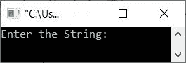
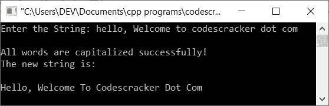

# C++ 程序：将字符串中每个单词的首字母大写

> 原文：<https://codescracker.com/cpp/program/cpp-capitalize-every-word-in-string.htm>

这篇文章提供了一个 C++ 程序，它在运行时将用户输入的字符串中每个单词的首字母大写。

例如，如果用户输入的字符串是 **hello，Welcome To Codescracker . Com**，那么给定字符串的每个单词大写 后的输出看起来像 **Hello，Welcome To Codescracker . Com**

## 所有单词的首字母大写

问题是，**用 C++ 写一个程序，从用户那里接收一个字符串作为输入，并将给定字符串的每个单词大写。** 这个问题的答案是:

```
#include<iostream>
#include<string.h>
#include<stdio.h>

using namespace std;
int main()
{
   char str[200], ch;
   int len, i, asc_val;
   cout<<"Enter the String: ";
   gets(str);
   len = strlen(str);
   for(i=0; i<len; i++)
   {
      ch = str[i];
      if(i==0)
      {
         asc_val = ch;
         if(asc_val>=97 && asc_val<=122)
         {
            asc_val = asc_val-32;
            ch = asc_val;
            str[i] = ch;
         }
      }
      if(ch==' ')
      {
         ch = str[i+1];
         asc_val = ch;
         if(asc_val>=97 && asc_val<=122)
         {
            asc_val = asc_val-32;
            ch = asc_val;
            str[i+1] = ch;
         }
      }
   }
   cout<<"\nAll words are capitalized successfully!";
   cout<<"\nThe new string is:\n\n";
   cout<<str;
   cout<<endl;
   return 0;
}
```

下面是上面的 C++ 程序在运行时由用户将给定字符串中的每个单词大写时产生的初始输出:



现在提供字符串输入 say **hello，Welcome to codescracker . com**并按`ENTER`键将其单词的所有 大写，如下图所示:



从上面的程序中，语句:

```
len = strlen(str);
```

将字符串长度初始化为变量 **len** 。和声明:

```
ch = str[i];
```

将字符串 **str** 的第 **i** <sup>th</sup> 索引处的字符初始化为变量 **ch** 。和声明:

```
asc_val = ch;
```

初始化存储在 **ch** 变量中字符的 ASCII 等效值。这是因为， **asc_val** 是 **int** 类型。再次声明如下，即:

```
ch = asc_val;
```

将相当于存储在 **asc_val** 变量中的 ASCII 值的字符初始化为 **ch** 变量。

**注-****a**的 ASCII 值为 **97** ，而 **z** 的 ASCII 值为 **122** 。

**注-****A**的 ASCII 值为 **65** ，其中 as**Z**的 ASCII 值为 **90** 。

也就是说，要将[小写转换成大写](/cpp/program/cpp-program-convert-lowercase-into-uppercase.htm) (如 **c** 到 **C** )，只需从其 ASCII 值中减去 32 即可。因此 **99 (c) - 32 = 67 (C)** 。

[C++ 在线测试](/exam/showtest.php?subid=3)

* * *

* * *