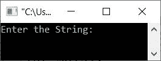
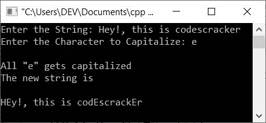

# C++程序大写字符串中的给定字符

> 原文：<https://codescracker.com/cpp/program/cpp-capitalize-specific-character-in-string.htm>

这篇文章提供了一个 C++程序，它只将字符串中的特定字符大写。这里的字符串和字符必须由用户在程序运行时输入。

例如，如果用户输入**嘿！，这是 codescracker** 为字符串， **e** 为字符，那么输出将是 **嘿！，这是 codEscrackEr** 。也就是说，在给定的字符串中，所有的 **e** (小写)都被转换成 **E** (大写)。

## 将字符串中的特定字符大写

问题是，**用 C++写一个程序，接收一个字符串和一个字符作为输入，并从给定的字符串中大写所有给定的字符 。**下面给出的程序是这个问题的答案:

```
#include<iostream>
#include<string.h>
#include<stdio.h>

using namespace std;
int main()
{
   char str[200], ch, ch_temp;
   int len, i, asc_val;
   cout<<"Enter the String: ";
   gets(str);
   cout<<"Enter the Character to Capitalize: ";
   cin>>ch;
   len = strlen(str);
   for(i=0; i<len; i++)
   {
      if(ch==str[i])
      {
         asc_val = str[i];
         if(asc_val>=97 && asc_val<=122)
         {
            asc_val = asc_val-32;
            ch_temp = asc_val;
            str[i] = ch_temp;
         }
      }
   }
   cout<<"\nAll \""<<ch<<"\" gets capitalized";
   cout<<"\nThe new string is\n\n";
   cout<<str;
   cout<<endl;
   return 0;
}
```

下面给出的快照显示了上述 C++程序产生的初始输出，该输出用于大写给定字符串中的所有给定字符:



现在提供输入，说**嘿！，这是 codescracker** 作为字符串和 **e** 作为字符来大写。下面是使用与这里给出的完全相同的用户输入运行的示例 :



这里，我使用了 ASCII 值来大写字符。即 **a-z** 的 ASCII 值为 **97-122** ，而 **A-Z** 的 ASCII 值为 **65-90** ，因此减去 32 意味着 [将小写转换为大写](/cpp/program/cpp-program-convert-lowercase-into-uppercase.htm)。

[C++在线测试](/exam/showtest.php?subid=3)

* * *

* * *