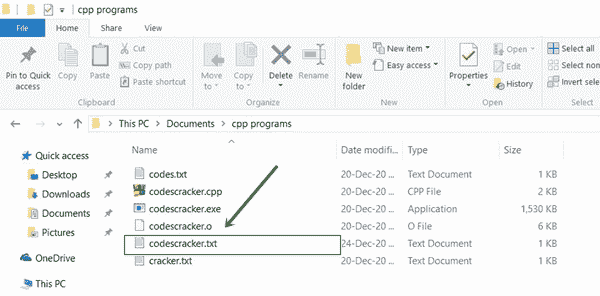
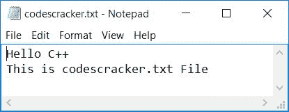
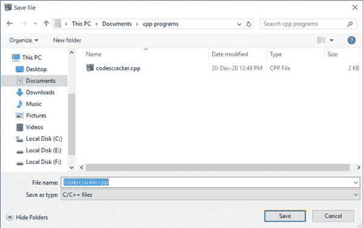
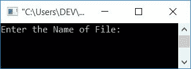
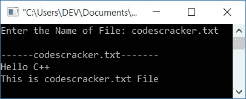

# 读取文件的 C++程序

> 原文：<https://codescracker.com/cpp/program/cpp-program-read-file.htm>

在本文中，您将学习并获得用 C++读取文件的代码。该程序是以这样的方式创建的，从用户那里接收文件名作为输入，并读取给定文件的所有内容。

### 编程前要做的事情

为了使用 C++程序读取文本文件，在执行读取文件内容的程序之前，必须在当前目录中创建一个文件。

即创建一个名为 **codescracker.txt** 的文件，内容如下:

```
Hello C++
This is codescracker.txt File
```

并将该文件保存在当前目录中。当前目录是指保存用来读取文件的 C++源代码的目录。因为我要把下面给出的程序保存在**的 **cpp 程序** **c 盘**的**文档的一个文件夹里。以下是该文件夹的快照:



下面是打开的 **codescracker.txt** 文件的快照:



现在让我们继续，创建一个 C++程序来读取这个文件的内容。

## 用 C++读取文本文件

这是一个用 C++读取文本文件内容的程序。新创建的文件， *codescracker.txt* 通过这个程序得到读取:

```
#include<iostream>
#include<fstream>
#include<stdio.h>
using namespace std;
int main()
{
    char fileName[30], ch;
    fstream fp;
    cout<<"Enter the Name of File: ";
    gets(fileName);
    fp.open(fileName, fstream::in);
    if(!fp)
    {
        cout<<"\nError Occurred!";
        return 0;
    }
    cout<<"\n------"<<fileName<<"-------\n";
    while(fp>>noskipws>>ch)
        cout<<ch;
    fp.close();
    cout<<endl;
    return 0;
}
```

这个程序是在 *Code::Blocks* IDE 下构建和运行的。将该源代码保存在同一个文件夹中， **cpp programs** ，其中创建了 **codescracker.txt** 文件。要将该源代码保存在该文件夹中，请导航至 **文件→文件另存为...**在*代码中；阻塞*并输入文件名，点击**保存**按钮 ，如下图所示:



保存源代码后，下面是它的运行示例。这是最初的输出:



现在提供输入，比如说 **codescracker.txt** 作为文件名，然后按`ENTER`键读取它 ，如下图所示:



**注-** 语句，**FP>T5】noskipws>T7】ch**以逐字符 的方式从文件中读取数据，不跳过空格。

**注-**中的 **fstream::为文件打开模式。它以只读模式打开文件。**

#### 其他语言的相同程序

*   [C 读取文件](/c/program/c-program-read-file.htm)
*   [Java 读取文件](/java/program/java-program-read-file.htm)
*   [Python 读取文件](/python/program/python-program-read-file.htm)

[C++在线测试](/exam/showtest.php?subid=3)

* * *

* * *