# C++ 程序：将数据写入文件

> 原文：<https://codescracker.com/cpp/program/cpp-program-write-file.htm>

在本文中，您将学习并获得使用 C++ 程序将用户输入的一些数据写入文件的代码。在本文中，我们创建了两个相同主题的程序。第一个程序是最简单的将数据写入文件的程序。而第二程序是第一程序的修改版本。

要使用 C++ 编程的 [在](/cpp/index.htm)[文件](/operating-system/files.htm)中写一些内容，你需要让用户输入文件名及其扩展名 ，比如说 **codescracker.txt** 或**codescracker.html**等。

现在我们必须以写模式打开文件。因此，如果文件不存在，那么文件会自动在当前目录下创建。

当前目录，指的是[目录](/operating-system/directories.htm)，你在那里保存 你的 C++ 源代码。因为我将我的 C++ 源代码保存在 **cpp 程序**文件夹中。在执行下面给出的程序之前，这里是 文件夹的快照:

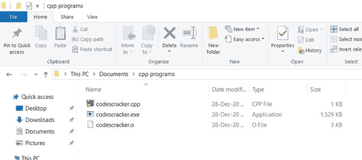

## 在文件中写入内容

现在让我们来看看下面给出的程序，它展示了一个文件是如何被创建的，以及用户在运行时输入的数据是如何被写入文件的。该程序是以这样一种方式创建的，用户可以向文件中写入他们想要的任意多的数据:

```
#include<iostream>
#include<stdio.h>
#include<fstream>
#include<string.h>
using namespace std;
int main()
{
    char fname[20], str[200];
    fstream fp;
    cout<<"Enter the Name of File: ";
    gets(fname);
    fp.open(fname, fstream::out);
    if(!fp)
    {
        cout<<"\nError Occurred!";
        return 0;
    }
    cout<<"Enter the Data: ";
    gets(str);
    while(strlen(str)>0)
    {
        fp<<str;
        fp<<"\n";
        gets(str);
    }
    fp.close();
    cout<<endl;
    return 0;
}
```

这个程序是在 *Code::Blocks* IDE 下构建和运行的。下面是这个 C++ 程序产生的初始输出:

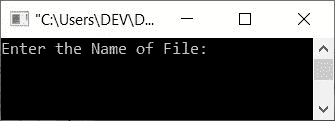

现在输入文件名，比如说 **codescracker.txt** ，按`ENTER`键，如下图 所示:

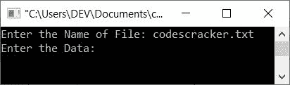

以下是文件夹 **cpp 程序**的快照:

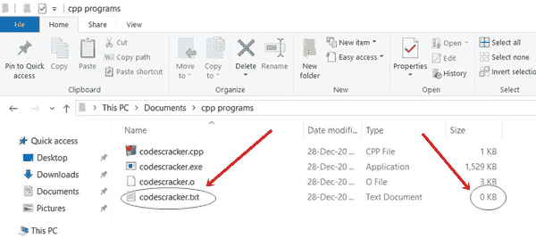

如您所见，文件 *codescracker.txt* 被创建。它是新创建的文件，内容为空。因此 其大小显示为 **0KB** 。让我们通过下面给出的程序在里面放一些内容。现在提供以下 数据:

```
Hello C++
I'm a File
My name is codescracker.txt
```

如下图所示:

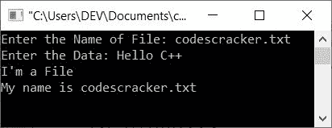

写完这三行数据后，按两下`ENTER`键将这些数据放入 *codescracker.txt* 文件中。以下是按下 *ENTER* 键后的输出:

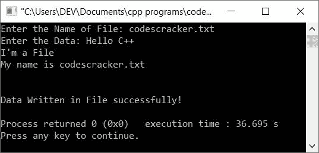

以下是当前目录的快照:

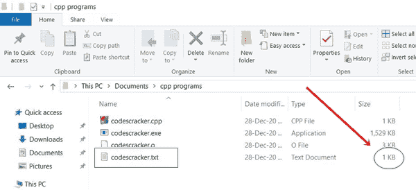

如您所见，文件的大小增加了。这里是打开文件的快照 *codescracker.txt* 文件:

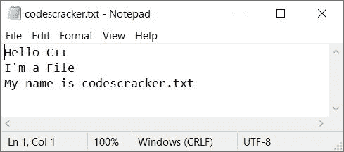

**注-****打开()** [功能](/cpp/cpp-functions.htm)用于 [打开文件](/cpp/cpp-opening-closing-files.htm)。它有两个参数，文件名和它的 打开模式。第一个参数(文件名)是必需的。我们已经使用 **fstream::out** 以写模式打开了文件。

**注意-** 不要忘了使用 **关闭()**功能关闭[文件](/cpp/cpp-opening-closing-files.htm)。

条件 **while 循环** ) **strlen(str) > 0** 检查用户输入的字符串长度 是否大于 0。如果它大于 0，意味着用户已经输入了一些数据。因此，条件评估为 真，并且使用 **fp < < str** 语句将内容或数据写入文件内部。

文件中还会写入一个新行。然后，我们再次收到字符串，并检查其长度是否大于 0。通过这种方式，数据被用户接收并不断写入文件，直到用户按下`ENTER`键而没有输入任何内容。

### 先前程序的修改版本

这是前一个程序的修改版本。该程序为程序中的每一步打印消息:

```
#include<iostream>
#include<stdio.h>
#include<fstream>
#include<string.h>
using namespace std;
int main()
{
    char fname[20], str[200];
    fstream fp;
    cout<<"Enter the Name of File: ";
    gets(fname);
    fp.open(fname, fstream::in);
    if(!fp)
    {
        cout<<"\nFile Doesn't Exist!\n";
        cout<<"\nCreating the File...\n";
        fp.open(fname, fstream::out);
        if(!fp)
        {
            cout<<"\nError Occurred while Creating the File!";
            cout<<"\nExiting...";
            return 0;
        }
        else
            cout<<"\nFile Created Successfully!";
    }
    fp.close();
    fp.open(fname, fstream::out);
    if(!fp)
    {
        cout<<"\nError Occurred while Opening the File!";
        cout<<"\nExiting...";
        return 0;
    }
    cout<<"\nEnter the Data: ";
    gets(str);
    while(strlen(str)>0)
    {
        fp<<str;
        fp<<"\n";
        gets(str);
    }
    cout<<"\nData Written in File successfully!";
    fp.close();
    cout<<endl;
    return 0;
}
```

下面是这个 C++ 程序产生的初始输出:

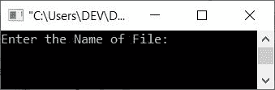

现在输入文件名说*codescracker.html*并按*回车*键。下面是执行此操作后的示例输出 :

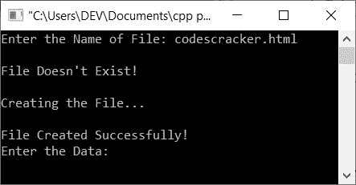

现在输入以下数据:

```
<h1>About</h1>
<p>This article is created to write data into a File.</p>
<p>This is an <u>HTML</u> document.</p>
<p>The name of this file is <b>codescracker.html</b>.</p>
```

逐一提供这些输入后，按两下 *ENTER* 键，您将看到以下输出:

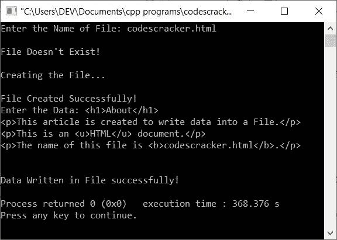

如果您看到文件夹 **cpp programs** ，那么文件*codescracker.html*将在那里作为 可用，如下图所示:

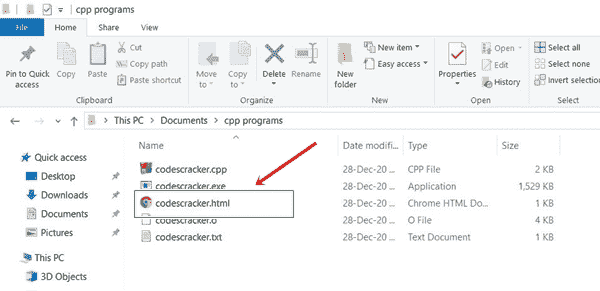

如果你在浏览器中打开这个文件，比如说在**谷歌 Chrome** 中，它看起来像是:

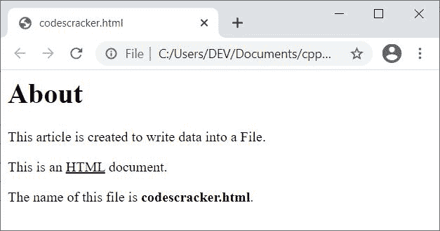

但是如果你在文本编辑器中打开同一个文件，比如**记事本**，那么它看起来像:

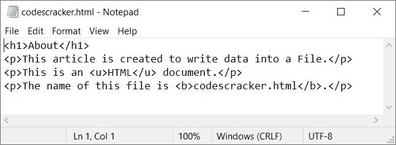

**注-** 要了解 *HTML* ，了解它是如何工作的，请参考 [HTML 教程](/html/index.htm)文章中的单独教程。

#### 其他语言的相同程序

*   [C 写入文件](/c/program/c-program-write-file.htm)
*   [Java 写入文件](/java/program/java-program-write-to-file.htm)
*   [Python 写文件](/python/program/python-program-write-to-file.htm)

[C++ 在线测试](/exam/showtest.php?subid=3)

* * *

* * *