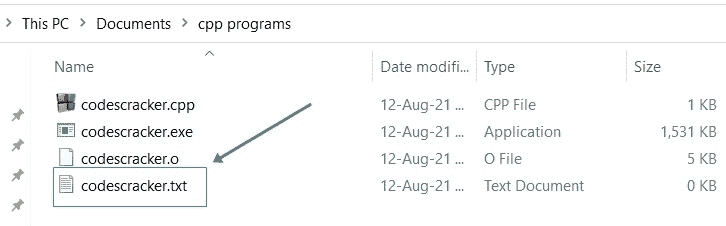
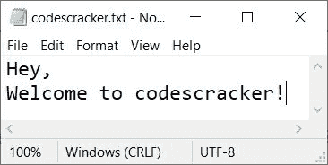
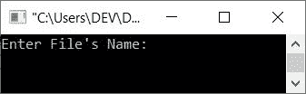
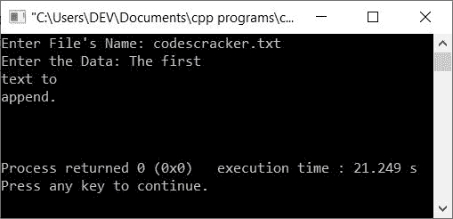
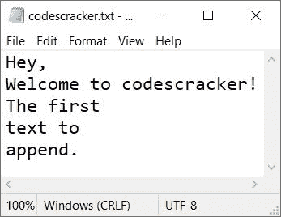
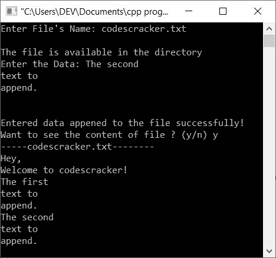
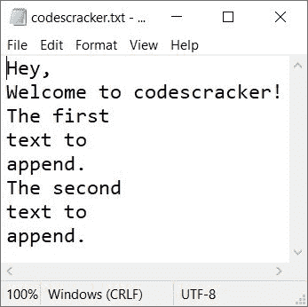

# C++ 程序：在文件中追加数据

> 原文：<https://codescracker.com/cpp/program/cpp-append-data-to-file.htm>

本文旨在为您提供在文件中追加一些数据的 C++ 程序。在这里，数据和文件都必须由用户在运行时输入。在文件中添加数据意味着在文件中添加新数据而不删除以前的数据。

#### 编程前要做什么？

需要一个文件在文件中追加一些数据。因此，我在当前目录下创建了一个文件(保存我的 C++ 源代码或将要保存的文件夹)。以下是创建文件的当前目录的快照:



从上面的快照可以看到，名为 **codescracker.txt** 的文件是可用的。这是我现在创造的。让我们 把一些内容放在里面。以下是在文件中手动写入一些数据后，打开的文件的快照:



因为我有一个文件，里面已经有了一些数据。因此，现在让我们继续，用 C++ 创建一个程序，使用 C++ 程序将用户在运行时输入的一些新数据追加到这个文件中。

## 在文件中追加数据

问题是，**用 C++ 写一个接收文件名和数据的程序，把给定的数据添加到给定的 文件**中。这个问题的答案是下面给出的程序:

```
#include<iostream>
#include<fstream>
#include<string.h>

using namespace std;
int main()
{
   char filename[20], str[500];
   fstream fp;
   cout<<"Enter File's Name: ";
   gets(filename);
   fp.open(filename, fstream::app);
   if(!fp)
   {
      cout<<"\nFile doesn't exist or Access denied!";
      return 0;
   }
   cout<<"Enter the Data: ";
   gets(str);
   while(strlen(str)>0)
   {
      fp<<"\n";
      fp<<str;
      gets(str);
   }
   fp.close();
   cout<<endl;
   return 0;
}
```

下面给出的快照显示了上述 C++ 程序在文件中追加数据时产生的初始输出:



现在提供之前创建的文件名，即 **codescracker.txt** ，然后输入一些数据，比如:

```
The first
text gets
append
```

即先键入**第一个**，然后按`ENTER`键，再键入**文本到**再按`ENTER`T11】键，最后键入**追加。**并按两次`ENTER`键停止输入更多数据，并将输入的完整 数据附加到文件 **codescracker.txt** 中，如下图所示。以下是使用完全相同的输入运行的示例:



现在，如果你看到同一个文件， **codescracker.txt** ，那么你会发现上面输入的文本/数据被追加。下面是打开文件的 新快照:



**注意-****fstream**头文件被包含进来，以使用它的类 **fstream** ，来处理文件流。

**注意-****fstream**是一个用于读写目的的流类。

**注意-****fstream::app**用于以追加方式打开文件。

但是上述程序并没有提供良好的用户体验。我的意思是，用户看不到上述程序正在进行的过程。甚至他们也看不到他/她输入的数据是否被附加。因此，我创建了另一个程序来提供良好的用户体验:

```
#include<iostream>
#include<fstream>
#include<string.h>

using namespace std;
int main()
{
   char filename[20], str[500], ch;
   fstream fp;
   cout<<"Enter File's Name: ";
   gets(filename);
   fp.open(filename, fstream::app);
   if(!fp)
   {
      cout<<"\nFile doesn't exist or Access denied!";
      return 0;
   }
   else
      cout<<"\nThe file is available in the directory";
   cout<<"\nEnter the Data: ";
   gets(str);
   while(strlen(str)>0)
   {
      fp<<"\n";
      fp<<str;
      gets(str);
   }
   cout<<"\nEntered data appended to the file successfully!";
   fp.close();
   cout<<"\nWant to see the content of file ? (y/n) ";
   cin>>ch;
   if(ch=='y')
   {
      fstream fp;
      fp.open(filename, fstream::in);
      cout<<"-----"<<filename<<"--------\n";
      while(fp>>noskipws>>ch)
         cout<<ch;
      fp.close();
   }
   cout<<endl;
   return 0;
}
```

下面是用户输入的运行示例， **codescracker.txt** 作为文件名，并且:

```
The second
text to
append.
```

作为要追加的数据， **y** 作为选择:



这是打开文件的新快照， **codescracker.txt** :



从上面的程序及其运行示例中可以看出，在文件中添加新数据后，用户可以看到正在进行的过程以及文件的内容(如果他/她愿意的话)。也就是说，基本上用户不需要进入目录并手动打开文件来查看附加后的新内容，因为这是使用程序本身完成的。

[C++ 在线测试](/exam/showtest.php?subid=3)

* * *

* * *