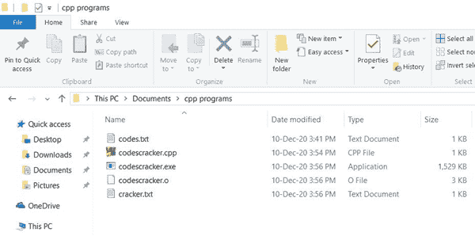

# C++ 程序：复制文件

> 原文：<https://codescracker.com/cpp/program/cpp-program-copy-file.htm>

在这篇文章中，你将学习并获得用 C++ 将一个文件的内容复制到另一个文件的代码。也就是说，源文件 say **codes.txt** 的内容被复制到目标文件 say **cracker.txt** 中。

但是在浏览程序之前，我们必须在当前目录下创建这两个文件。

### 计划前要做的事情

在保存 C++ 源代码的同一个目录下创建两个文件，比如 **codes.txt** 和 **cracker.txt** 。也就是说，要么:

1.  在你保存程序或者将要保存 C++ 程序的目录下创建两个文件，复制一个文件(如下所示)
2.  或者将你的 C++ 程序(将一个文件的内容复制到另一个文件)保存在创建了两个文件 **codes.txt** 和 **cracker.txt** 的文件夹中

如果你采取第二种选择。然后，首先在 **C 盘**中的**文档**文件夹下的 **cpp 程序** 目录下创建两个文件。这里是文件夹 **cpp programs** 的快照，其中包含新创建的两个名为 **codes.txt** 和 **cracker.txt** 的文件:


注意- 你也可以用自己的名字命名，如文件夹、文件、程序等的名字。

这里，我们假设文件 **codes.txt** 是一个源文件。因此，将以下内容放入该文件中:

```
Hello Programmer,
This is codescracker.com
Name of Article is:-
  Copy the content of one file to Another
```

下面是打开文件 **codes.txt** 的快照:


将第二个文件(目标文件)， **cracker.txt** 留空(里面没有任何内容)。因为下面给出的程序 将 **codes.txt** 文件的内容复制到 **cracker.txt** 文件中。

**注意-** 程序工作于一个当前目录。也就是说，如果您输入源和目标 文件的名称，程序将只搜索当前目录中的文件。当前目录是指保存程序的文件夹 。

## 在 C++ 中将一个文件的内容复制到另一个文件

在 C++ 编程中，要将一个[文件](/operating-system/files.htm)的内容复制到另一个文件中，你必须 要求用户输入源文件(带扩展名)和目标文件(带扩展名)的名称。现在按照下面给出的程序进行 复制文件操作。让我们先来看看这个程序，稍后会给出它的解释 。

```
#include<iostream>
using namespace std;
int main()
{
    char ch, sourceFile[20], targetFile[20];
    FILE *fs, *ft;
    cout<<"Enter the Name of Source File: ";
    cin>>sourceFile;
    fs = fopen(sourceFile, "r");
    if(fs == NULL)
    {
        cout<<"\nError Occurred!";
        return 0;
    }
    cout<<"\nEnter the Name of Target File: ";
    cin>>targetFile;
    ft = fopen(targetFile, "w");
    if(ft == NULL)
    {
        cout<<"\nError Occurred!";
        return 0;
    }
    ch = fgetc(fs);
    while(ch != EOF)
    {
        fputc(ch, ft);
        ch = fgetc(fs);
    }
    cout<<"\nFile copied successfully.";
    fclose(fs);
    fclose(ft);
    cout<<endl;
    return 0;
}
```

这个程序是在 *Code::Blocks* IDE 下构建和运行的。在运行示例之前，首先将这个 程序或源代码保存到之前创建这两个文件的文件夹中。也就是在 文件夹中 **cpp 程序**的**文档**文件夹中。

**注意-** 要保存这个源代码，导航到**文件→另存为...**并输入 源代码的名称说出 **codescracker.cpp** 。现在按下`ENTER`键。程序保存在创建这两个文件的同一个 文件夹中。以下是保存上述程序后的文件夹快照:


现在让我们继续它的样本运行。这是其初始输出的第一个快照:


现在输入源文件名为 **codes.txt** ，然后输入目标文件名为**cracker . txt**T5，按`ENTER`键将源文件内容复制到目标文件。以下是完成所有这些操作后您将看到的输出 :


现在 **codes.txt** 文件的内容被复制到 **cracker.txt** 文件中。下面是执行上述程序后 **文件夹 cpp 程序**的快照:



现在如果你打开文件 **cracker.txt** ，它包含与 **codes.txt** 文件相同的内容。 这里是打开 **cracker.txt** 文件的快照:


函数 fopen()打开一个文件。它接收两个参数。第一个参数是文件名，第二个参数是文件的打开方式。

**r** 仅用于以读取模式打开文件，而 **w** 用于以写入 模式打开文件。

函数 fopen()在成功打开时返回指向**文件**的指针，否则返回**空值**。

函数 **fgetc()** 用于以逐字符 的方式使用指针读取文件内容。

的**表示**文件结束**。而函数， **fclose()** 用来关闭指向 文件**的指针

运行上述 C++ 程序后，您的目标文件现在将包含源文件的内容

如果要读取目标文件的内容并在输出上显示，可以参考[读取和显示文件](/cpp/program/cpp-program-read-and-display-file.htm)程序。

#### 其他语言的相同程序

*   [C 复制文件](/c/program/c-program-copy-file.htm)
*   [Java 复制文件](/java/program/java-program-copy-file.htm)
*   [Python 复制文件](/python/program/python-program-copy-files.htm)

[C++ 在线测试](/exam/showtest.php?subid=3)

* * *

* * *