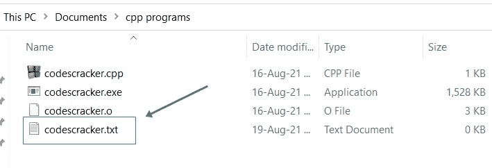
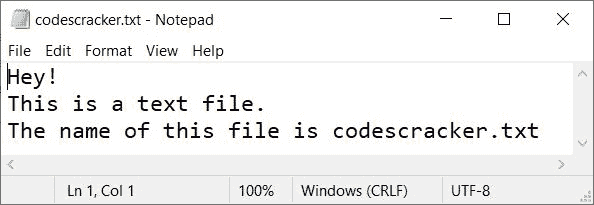
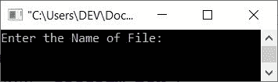
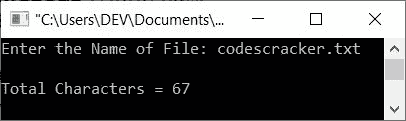
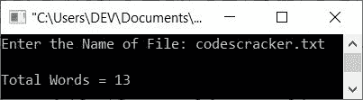
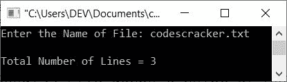
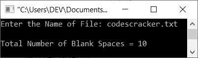
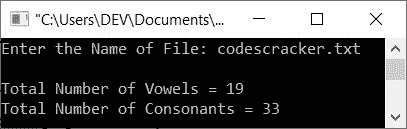

# C++ 程序：统计算文件中字符、单词、行

> 原文：<https://codescracker.com/cpp/program/cpp-count-characters-in-text-file.htm>

本文提供了一些用 C++ 编写的程序，可以计算和打印字符、单词、行、元音等的总数。在一个文件里。文件名必须由用户在运行时输入。本文将讨论这些程序:

*   统计文件中的字符总数
*   统计文件中的总字数
*   计算文件中的总行数
*   计算文件中空格的总数
*   计算文件中元音和辅音的总数

#### 编程前要做什么？

因为下面给出的程序对文件进行操作。因此，必须在当前目录(保存 C++ 程序源代码的文件夹)中提供/创建一个文件。因为我没有创建文件，所以让我创建一个文件，比如说 **codescracker.txt** 。 这是现在创建和保存该文件的文件夹的快照:



现在在这个文件中放一些内容，这样下面给出的程序就可以计算所有的东西，比如字符、单词、行、元音、辅音、空格等等。可在文件中找到。这里是写/放了一些 内容后打开文件的快照， **codescracker.txt** :



现在让我们继续，用 C++ 创建一个计算字符、单词和行数等的程序。从这个文件中使用程序。

## 计算文件中的字符数

问题是，*用 C++ 写一个程序，在运行时从用户那里接收文件名，计算并打印文件中可用字符的总数 。*这个问题的答案是下面给出的程序:

```
#include<iostream>
#include<fstream>

using namespace std;
int main()
{
   char filename[30], ch;
   int tot=0;
   ifstream fp;
   cout<<"Enter the Name of File: ";
   cin>>filename;
   fp.open(filename, ifstream::in);
   if(!fp)
   {
      cout<<endl<<"File doesn't exist or Access denied!";
      return 0;
   }
   while(fp>>noskipws>>ch)
      tot++;
   fp.close();
   cout<<endl<<"Total Characters = "<<tot;
   cout<<endl;
   return 0;
}
```

下面给出的快照显示了上述 C++ 程序在计算文本文件中可用字符总数时产生的初始输出:



现在输入文件名，比如说 **codescracker.txt** (之前创建的文件)，按`ENTER`键计算并打印 字符总数，如下图所示:



**注-****noskipws**在扫描/获取 字符时，用于文件指针 **fp** 和字符变量 **ch** 之间，以便提取和初始化所有东西(即文件的全部内容)，包括制表符、空格、 换行符等。

## 计算文件中的字数

这个程序计算并打印用户输入的文件中可用的总字数。大部分代码将与以前的程序相同，除了计数部分。让我们看看下面给出的程序:

```
#include<iostream>
#include<fstream>

using namespace std;
int main()
{
   char filename[30], ch, str[1000];
   int tot=0, i=0, tot_word=0;
   ifstream fp;
   cout<<"Enter the Name of File: ";
   cin>>filename;
   fp.open(filename, ifstream::in);
   if(!fp)
   {
      cout<<endl<<"File doesn't exist or Access denied!";
      return 0;
   }
   while(fp>>noskipws>>ch)
   {
      str[tot] = ch;
      tot++;
   }
   fp.close();
   str[tot]='\0';
   while(str[i]!='\0')
   {
      if(str[i]=='\n')
      {
         if(str[i+1]!='\0' && str[i+1]!=' ')
            tot_word++;
         i++;
      }
      else if(str[i]!=' ')
         i++;
      else
      {
         if(str[i+1]!='\0' && str[i+1]!=' ')
            tot_word++;
         i++;
      }
   }
   cout<<endl<<"Total Words = "<<tot_word;
   cout<<endl;
   return 0;
}
```

以下是使用相同用户输入运行的示例，即使用 **codescracker.txt** 作为文件名:



在上面的程序中，语句:

```
str[tot]='\0';
```

用于使用空终止字符(' \0 ')终止字符到字符串 **str** 的初始化。以及下面的 代码块:

```
   while(str[i]!='\0')
   {
      if(str[i]=='\n')
      {
         if(str[i+1]!='\0' && str[i+1]!=' ')
            tot_word++;
         i++;
      }
      else if(str[i]!=' ')
         i++;
      else
      {
         if(str[i+1]!='\0' && str[i+1]!=' ')
            tot_word++;
         i++;
      }
   }
```

负责统计字符串 **str** 中可用单词的总数。这个字符串包含了 文件的所有内容。因此，代码间接用于计算文件中的总字数。在这段代码中，代码:

```
while(str[i]!='\0')
```

声明循环继续执行，直到到达空终止字符(' \0 ')。代码是:

```
if(str[i+1]!='\0' && str[i+1]!=' ')
```

声明仅当第 **i+1** <sup>th</sup> 索引处的字符不等于空终止 字符且不等于空格时，条件评估为真。

## 计算文件中的行数

这是我认为所有程序中最简单的一个。在这个程序中，我们唯一要做的额外事情就是将当前索引处的字符与 **\n** 进行比较，并递增负责计算文件中新行或可用行数的变量 ，如下面给出的程序所示:

```
#include<iostream>
#include<fstream>

using namespace std;
int main()
{
   char filename[30], ch, str[1000];
   int tot=0, i=0, tot_lines=0;
   ifstream fp;
   cout<<"Enter the Name of File: ";
   cin>>filename;
   fp.open(filename, ifstream::in);
   if(!fp)
   {
      cout<<endl<<"File doesn't exist or Access denied!";
      return 0;
   }
   while(fp>>noskipws>>ch)
   {
      str[tot] = ch;
      tot++;
   }
   fp.close();
   str[tot]='\0';
   while(str[i]!='\0')
   {
      if(str[i]=='\n')
         tot_lines++;
      i++;
   }
   tot_lines++;
   cout<<endl<<"Total Number of Lines = "<<tot_lines;
   cout<<endl;
   return 0;
}
```

下面是用户输入 **codescracker.txt** 的示例运行，计算并打印该文件中可用的总行数，如下面给出的快照中的 所示:



## 文件中空格的总数

这个程序和以前的程序一样简单。这里我们也只需要和**“”**一个空格和每个 字符一一比较，就像这里给出的程序所示:

```
#include<iostream>
#include<fstream>

using namespace std;
int main()
{
   char filename[30], ch, str[1000];
   int tot=0, i=0, tot_blanks=0;
   ifstream fp;
   cout<<"Enter the Name of File: ";
   cin>>filename;
   fp.open(filename, ifstream::in);
   if(!fp)
   {
      cout<<endl<<"File doesn't exist or Access denied!";
      return 0;
   }
   while(fp>>noskipws>>ch)
   {
      str[tot] = ch;
      tot++;
   }
   fp.close();
   str[tot]='\0';
   while(str[i]!='\0')
   {
      if(str[i]==' ')
         tot_blanks++;
      i++;
   }
   cout<<endl<<"Total Number of Blank Spaces = "<<tot_blanks;
   cout<<endl;
   return 0;
}
```

这是示例运行的快照，用户输入与之前的程序相同，即 **codescracker.txt** :



## 清点文件中的元音和辅音

这是本文的最后一个程序，它计算并打印文本文件中可用的元音和辅音的总数:

```
#include<iostream>
#include<fstream>

using namespace std;
int main()
{
   char filename[30], ch, str[1000];
   int tot=0, i=0, vowels=0, consonants=0, ascii;
   ifstream fp;
   cout<<"Enter the Name of File: ";
   cin>>filename;
   fp.open(filename, ifstream::in);
   if(!fp)
   {
      cout<<endl<<"File doesn't exist or Access denied!";
      return 0;
   }
   while(fp>>noskipws>>ch)
   {
      str[tot] = ch;
      tot++;
   }
   fp.close();
   str[tot]='\0';
   while(str[i]!='\0')
   {
      if(str[i]=='a'||str[i]=='e'||str[i]=='i'||str[i]=='o'||str[i]=='u')
         vowels++;
      else if(str[i]=='A'||str[i]=='E'||str[i]=='I'||str[i]=='O'||str[i]=='U')
         vowels++;
      else
      {
         ascii = str[i];
         if(ascii>=65 && ascii<=90)
            consonants++;
         else if(ascii>=97 && ascii<=122)
            consonants++;
      }
      i++;
   }
   cout<<endl<<"Total Number of Vowels = "<<vowels;
   cout<<endl<<"Total Number of Consonants = "<<consonants;
   cout<<endl;
   return 0;
}
```

下面给出的快照显示了上述程序在运行时对用户输入的文本文件中的元音和辅音总数进行计数的示例运行:



上面的程序是以这样的方式创建的，首先我检查了字符是否是元音。如果没有，那么使用 **else** 块，字符被初始化为 **int** 类型的变量，该变量分配字符的 ASCII 等价物。并且使用 ASCII 值，我已经完成了。

**注-****A-Z**的 ASCII 值为 **65-90** ，而 **a-z** 的 ASCII 值为 **97-122** 。

您也可以替换上述程序中的以下代码块:

```
      else
      {
         ascii = str[i];
         if(ascii>=65 && ascii<=90)
            consonants++;
         else if(ascii>=97 && ascii<=122)
            consonants++;
      }
```

下面给出了代码块:

```
      else
      {
         if(str[i]>='A' && str[i]<='Z')
            consonants++;
         else if(str[i]>='a' && str[i]<='z')
            consonants++;
      }
```

输出将是相同的。我提供了这两种变体，让你对这个主题有一个完整的理解。

[C++ 在线测试](/exam/showtest.php?subid=3)

* * *

* * *