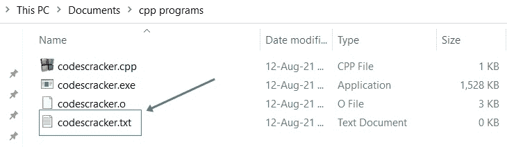
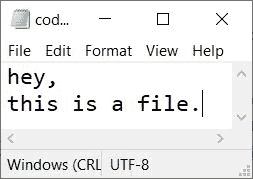
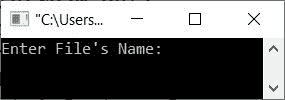
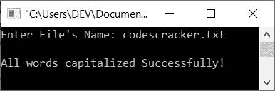
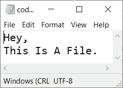

# C++程序将文件中每个单词的首字母大写

> 原文：<https://codescracker.com/cpp/program/cpp-capitalize-every-word-in-file.htm>

这篇文章提供了一个用 C++编写的程序，可以帮助将文件中的所有单词(或每个单词)大写。文件名必须由用户在运行时输入。将每个单词大写意味着将每个单词的第一个字母转换成大写。

#### 编程前要做什么？

程序是基于文件的。也就是说，下面给出的程序将文件中的每个单词都大写。因此，我们需要一个文件(包含一些内容)，它必须在当前目录中可用。因此，我打算先创建一个名为 **codescracker.txt** 的文件。

我已经创建了文件，这里是当前目录(保存 C++源代码的文件夹)的快照，该目录包含我新创建的名为 **codescracker.txt** 的文件:



现在在这个文件中放一些内容。因为下面给出的程序将文件中的每个单词都大写，所以我建议你用小写字母写所有的单词，这样我们的程序就可以很好地被测试。这是在文件中写入一些文字后打开的文件的快照:



现在让我们继续，用 C++创建一个程序，将这个文件中所有可用的单词大写。

## 文件中的所有单词都要大写

问题是，**用 C++写一个程序，在运行时从用户那里接收文件名，并大写该文件中可用的每个单词 。**下面是它的回答:

```
#include<iostream>
#include<fstream>
#include<sstream>

using namespace std;
int main()
{
   ifstream inf;
   ofstream ouf;
   stringstream str_stream;
   string str;
   char filename[30];
   int i=0, temp=0;

   cout<<"Enter File's Name: ";
   cin>>filename;

   inf.open(filename);
   str_stream<<inf.rdbuf();
   inf.close();
   str = str_stream.str();
   while(str[i])
   {
      if(temp==0)
      {
         str[i] = toupper(str[i]);
         temp = 1;
      }
      else if(isspace(str[i]))
         temp = 0;
      i++;
   }
   ouf.open(filename);
   ouf<<str;
   cout<<"\nAll words capitalized Successfully!";
   cout<<endl;
   return 0;
}
```

下面是上面的 C++程序在用户给定的文件中大写每个单词时产生的初始输出:



现在输入之前在本文顶部创建的那个文件的名称，即 **codescracker.txt** ，并按 `ENTER`键将该文件的所有单词大写，如下图所示:



以下是执行上述程序后同一文件的新快照:



从上面文件 **codescracker.txt** 的快照可以看出，在执行 C++程序后，它的所有单词都变成了大写。

**注意-****string stream**类(在 **sstream** 头文件中定义)允许字符串对象被当作一个流。

**注意-****rd buf()**用于返回一个指针，指向当前与流相关联的流缓冲区对象。

要手动实现大写代码(或者不使用 **toupper()** 将每个单词都大写)，可以从 [获取代码，将字符串](/cpp/program/cpp-capitalize-each-word-in-string.htm)中的每个单词都大写，并可以在上述程序中使用。 自己动手，为自己练习。

如果遇到麻烦，在执行每个单词都大写的手动版本的代码时，只需替换以下代码块(来自上述程序):

```

   while(str[i])
   {
      if(temp==0)
      {
         str[i] = toupper(str[i]);
         temp = 1;
      }
      else if(isspace(str[i]))
         temp = 0;
      i++;
   }
```

下面给出了代码块:

```

   while(str[i])
   {
      if(temp==0)
      {
         asc_val = str[i];
         if(asc_val>=97 && asc_val<=122)
         {
            asc_val = asc_val-32;
            str[i] = asc_val;
         }
         temp = 1;
      }
      if(isspace(str[i]))
         temp = 0;
      i++;
   }
```

您将获得与上一个程序相同的输出。

[C++在线测试](/exam/showtest.php?subid=3)

* * *

* * *