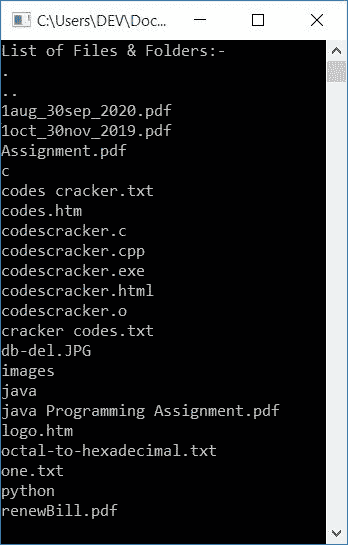
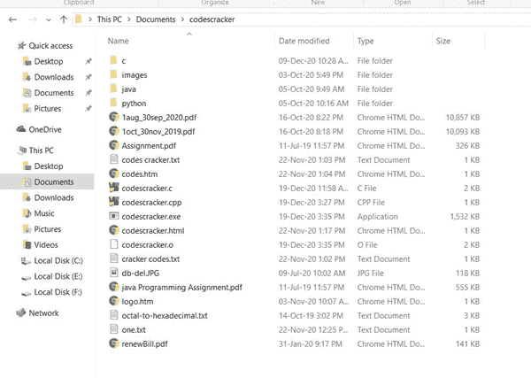

# C++ 程序：列出并显示当前目录中的文件

> 原文：<https://codescracker.com/cpp/program/cpp-program-list-files-in-directory.htm>

在本文中，您将学习并获得使用 C++语言列出并打印当前目录中所有可用文件和文件夹的代码。这里的当前目录是指保存 C++源代码的目录。

## 列出当前目录中的文件和文件夹

下面给出的程序列出并显示/打印了 [C++](/cpp/index.htm) 编程中当前[目录](/operating-system/directories.htm)下的所有[文件](/operating-system/files.htm)和 文件夹(子目录)。

问题是，**用 C++写一个程序，列出并打印当前目录下的所有文件和文件夹。**下面是 它的回答:

```
#include<iostream>
#include<dirent.h>
using namespace std;
int main()
{
    struct dirent *d;
    DIR *dr;
    dr = opendir(".");
    if(dr!=NULL)
    {
        cout<<"List of Files & Folders:-\n";
        for(d=readdir(dr); d!=NULL; d=readdir(dr))
        {
            cout<<d->d_name<<endl;
        }
        closedir(dr);
    }
    else
        cout<<"\nError Occurred!";
    cout<<endl;
    return 0;
}
```

这个程序是在 *Code::Blocks* IDE 下构建和运行的。下面是它的运行示例:



**注-** 带扩展名的名称是文件，不带扩展名的名称是文件夹。

如您所见，所有文件和文件夹都打印在上面给出的输出中。以下是实际文件夹(当前目录)的快照:



## 使用 while 循环打印当前目录的文件/文件夹

该程序执行与前一程序相同的工作，但使用 *while 循环*，而不是*循环*

```
#include<iostream>
#include<dirent.h>
using namespace std;
int main()
{
    struct dirent *d;
    DIR *dr;
    dr = opendir(".");
    if(dr!=NULL)
    {
        cout<<"List of Files and Folders:-\n";
        while((d=readdir(dr))!=NULL)
            cout<<d->d_name<<endl;
        closedir(dr);
    }
    else
        cout<<"\nError Occurred!";
    cout<<endl;
    return 0;
}
```

这个程序还显示当前目录中可用的文件和文件夹的名称。

#### 其他语言的相同程序

*   [C 列出目录](/c/program/c-program-list-files-in-directory.htm)中的文件
*   [目录中的 Java 列表文件](/java/program/java-program-list-files-in-directory.htm)
*   [Python 目录下的列表文件](/python/program/python-program-list-files-in-directory.htm)

[C++在线测试](/exam/showtest.php?subid=3)

* * *

* * *