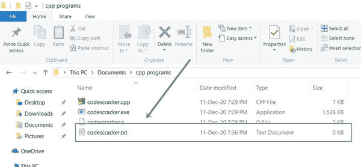
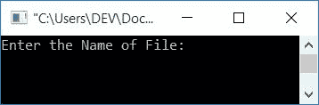
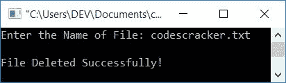
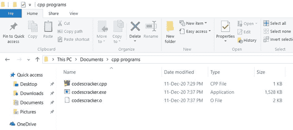

# C++ 程序：删除文件

> 原文：<https://codescracker.com/cpp/program/cpp-program-delete-file.htm>

在本文中，您将学习并获得用 C++ 从当前目录中删除文件的代码。这里当前目录的意思是，你保存 C++ 源代码的目录，或者将要保存删除文件的 C++ 源代码的目录，如下所示。

### 计划前要做的事情

在程序开始删除一个文件之前，使用 C++ 代码从当前目录中删除一个文件。文件说 **codescracker.txt** 必须被创建。因此，该文件被创建并保存在文件夹 **cpp 程序** 中，我将在此保存删除该文件的源代码(如下所示):



现在让我们继续创建一个 C++ 程序来删除这个名为 **codescracker.txt** 的文件。

**注意-** 您可以创建该文件并将其保存到下面给出的保存程序的文件夹中。

## 从当前目录中删除文件

要使用 [C++](/cpp/index.htm) 编程语言从当前目录中删除任何[文件](/cpp/cpp-data-file-handling.htm)，必须要求用户先输入文件名。 然后执行将其从目录中删除的操作。

[函数](/cpp/cpp-functions.htm) **remove()** 用于删除一个文件。它将 文件的名称作为其参数，如果文件被成功删除，则返回 0。如果不返回 0，那么就会发生 奇怪的事情，比如*文件不存在*或者*用户没有权限访问目录*等。

问题是，**用 C++ 写一个程序，从当前目录删除一个文件。**以下是其 的回答:

```
#include<iostream>
#include<stdio.h>
using namespace std;
int main()
{
    intstatus;
    char fileName[20];
    cout<<"Enter the Name of File: ";
    cin>>fileName;
    status = remove(fileName);
    if(status==0)
        cout<<"\nFile Deleted Successfully!";
    else
        cout<<"\nError Occurred!";
    cout<<endl;
    return 0;
}
```

这个程序是在 *Code::Blocks* IDE 下构建和运行的。这是它的样本运行。上述程序保存在 **cpp programs** 文件夹中，其中有之前创建的 *codescracker.txt* 文件:



现在输入文件名，比如说 **codescracker.txt** (之前创建的)来删除它，如下面给出的输出 所示:



现在如果你打开文件夹 **cpp programs** (你保存文件 *codescracker.txt* 和上面的源代码的文件夹)，那么它看起来像，如下面给出的快照所示。也就是说，文件从 文件夹中移除:



#### 其他语言的相同程序

*   [删除一个文件](/c/program/c-program-delete-file.htm)
*   [Java 删除一个文件](/java/program/java-program-delete-file.htm)
*   [Python 删除一个文件](/python/program/python-program-delete-files.htm)

[C++ 在线测试](/exam/showtest.php?subid=3)

* * *

* * *