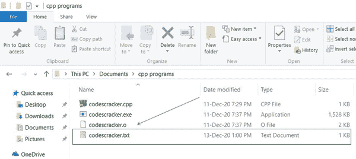
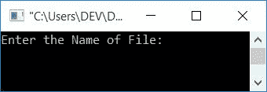
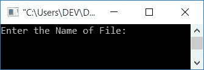

# C++ 程序：加密和解密文件

> 原文：<https://codescracker.com/cpp/program/cpp-program-encrypt-file.htm>

在本文中，您将学习并获得关于文件加密和解密的代码。即加密文本文件数据(内容)的代码。和解密文本文件的相同数据的另一个代码。

### 加密和解密意味着什么？

数据加密意味着将数据从原始形式转换成编码形式。未经授权的人不能读取原始数据的编码形式。

数据解密是指将数据从编码形式转换为原始形式。

加密数据只能由授权人员访问。

**注-** 授权人知道解密密钥。解密密钥是一个密码或公式，用于 将密文转换为明文

**注-** 加密数据称为密文，而解密数据(原始数据)称为明文。

因此，用简单的语言来说，将数据从明文转换成密文就是数据加密。而将数据从密文转换成明文被称为数据解密。

### 计划前要做的事情

因为下面给出的程序加密文本文件的数据，然后用另一个程序进一步解密相同的数据。我们必须在当前目录中创建一个文本文件，比如说， *codescracker.txt* 。

当前目录是指保存 C++ 源代码的目录。因此因为我要把加密和解密文件的程序保存在 **cpp programs** 文件夹中。然后在同一个文件夹中，为 创建一个名为 **codescracker.txt** 的文件，其内容如下:

```
username = codescrackerUser
password = codescrackerPassword
```

这是文件夹的快照， **cpp programs** 包含文件， *codescracker.txt* :



这是打开文件的快照， **codescracker.txt** :


现在让我们继续下面给出的程序，加密这个新创建的文件的数据，然后进一步解密相同的数据。

## 用 C++ 加密文件

在 [C++](/cpp/index.htm) 编程中要加密文件的内容，你必须要求用户输入 文件的[名(带扩展名)。然后对存在于](/operating-system/file-naming.htm)[文件](/operating-system/files.htm)中的内容 进行加密，如下面给出的程序所示。

```
#include<iostream>
#include<fstream>
#include<stdio.h>
using namespace std;
int main()
{
    char fileName[30], ch;
    fstream fps, fpt;
    cout<<"Enter the Name of File: ";
    gets(fileName);
    fps.open(fileName, fstream::in);
    if(!fps)
    {
        cout<<"\nError Occurred, Opening the Source File (to Read)!";
        return 0;
    }
    fpt.open("tmp.txt", fstream::out);
    if(!fpt)
    {
        cout<<"\nError Occurred, Opening/Creating the tmp File!";
        return 0;
    }
    while(fps>>noskipws>>ch)
    {
        ch = ch+100;
        fpt<<ch;
    }
    fps.close();
    fpt.close();
    fps.open(fileName, fstream::out);
    if(!fps)
    {
        cout<<"\nError Occurred, Opening the Source File (to write)!";
        return 0;
    }
    fpt.open("tmp.txt", fstream::in);
    if(!fpt)
    {
        cout<<"\nError Occurred, Opening the tmp File!";
        return 0;
    }
    while(fpt>>noskipws>>ch)
        fps<<ch;
    fps.close();
    fpt.close();
    cout<<"\nFile '"<<fileName<<"' Encrypted Successfully!";
    cout<<endl;
    return 0;
}
```

这个程序是在 *Code::Blocks* IDE 下构建和运行的。下面是它的运行示例:



现在输入文件名，比如说 **codescracker.txt** 并按`ENTER`键加密其数据。 这是样品运行的最终快照:


现在，如果你打开文件 **codescracker** ，它的数据(内容)会被加密。下面是 打开文件的截图， *codescracker.txt* :


从上面的快照可以看出，任何一个 未知的人，也就是不知道解密密钥的人，都无法读取文件 *codescracker.txt* 的数据。

解密密钥是加密文件时使用的公式，即*给每个 字符*加 100。所以要解密，我们必须从每个字符中减去 100。文件， **tmp.txt** 保存有 密文。

fstream 库允许处理文件。它在 **fstream** 头文件中定义。

**打开 ()** 函数接收一个或两个参数。第一个参数是必需的，即文件的名称。 第二个参数是*文件打开方式*。所以下面给出的声明:

```
fps.open(fileName, fstream::in);
```

以只读模式打开文件。文件名由用户输入，并存储在**文件名**变量中。 文件打开模式， **fstream::in** 以读取模式打开文件。

以及文件打开模式， **fstream::out** 以写模式打开文件。万一，如果文件不存在， 那么一个新的文件被创建。

声明，

```
fps>>noskipws>>ch
```

以逐字符方式从文件中读取数据，不跳过空格。

上述程序中的主要逻辑是:

*   要求用户输入文件名，如 **codescracker.txt**
*   打开用户输入的文件(在阅读模式下)
*   创建一个名为 **tmp.txt** 的文件
*   逐字符读取文件 **codescracker.txt** 的内容
*   读取字符时，添加 **100** 并写入 **tmp.txt** 文件
*   也就是说，在 **tmp.txt** 文件中，我们有与 **codescracker.txt** 相同的内容。相反，每个 字符都是 ASCII 值，比原来的值多 100
*   关闭两个文件流
*   以写入模式打开文件 **codescracker.txt**
*   在阅读模式下打开文件 **tmp.txt**
*   将**tmp . txt**(*codescracker . txt*文件的加密内容)复制到 *codescracker . txt*文件中

## 用 C++ 解密文件

现在让我们使用 **tmp.txt** 文件中的密码文本，用解密公式(每个字符减 100)， 来解密一个文件的数据， *codescracker.txt* 借助下面的程序:

```
#include<iostream>
#include<fstream>
#include<stdio.h>
using namespace std;
int main()
{
    char fileName[30], ch;
    fstream fps, fpt;
    cout<<"Enter the Name of File: ";
    gets(fileName);
    fps.open(fileName, fstream::out);
    if(!fps)
    {
        cout<<"\nError Occurred while Opening the Source File!";
        return 0;
    }
    fpt.open("tmp.txt", fstream::in);
    if(!fpt)
    {
        cout<<"\nError Occurred while Opening/Creating tmp File!";
        return 0;
    }
    while(fpt>>noskipws>>ch)
    {
        ch = ch-100;
        fps<<ch;
    }
    fps.close();
    fpt.close();
    cout<<"\nFile '"<<fileName<<"' Decrypted Successfully!";
    cout<<endl;
    return 0;
}
```

以下是示例运行的初始快照:



现在输入文件名，比如说 *codescracker.txt* 来解密其内容，如下图所示:


执行上述程序后，当你打开同一个文件时，就是名为 *codescracker.txt* 的文件。 然后你的数据将会是原始形式，或者你的数据被解密。下面是打开的 文件的快照:


**注意-** 您可以创建并使用自己的加密和解密算法。由你来决定。 上面给出的程序为你提供了一个关于这个话题的想法。

#### 关于加密/解密文件的短信

要加密用户输入的文件，首先[使用](/cpp/cpp-opening-closing-files.htm) [功能](/cpp/cpp-functions.htm)**T5】打开 ()** 打开文件。并以 的方式逐字符读取文件内容。在读取的时候，创建一些算法来加密文件的内容。加密时，将 内容(以逐个字符的方式)放在一个临时文件中，比如说 **tmp.txt** 。

将所有加密内容放入一个 **tmp.txt** 文件后，将其内容复制到原始文件中。稍后， 使用文件 **tmp.txt** 解密 *codescracker.txt* 文件的内容。

#### 其他语言的相同程序

*   [C 加密和解密文件](/c/program/c-program-encrypt-file.htm)

[C++ 在线测试](/exam/showtest.php?subid=3)

* * *

* * *