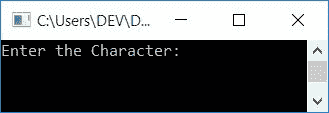
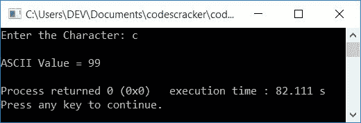
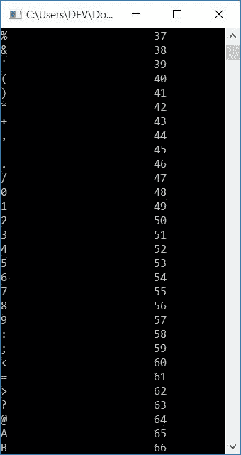
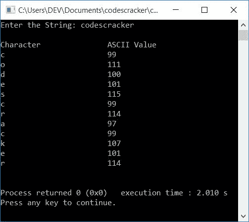
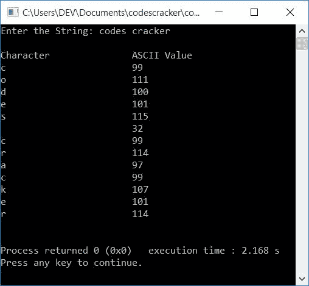

# C++ 程序：打印字符的 ASCII 值

> 原文：<https://codescracker.com/cpp/program/cpp-program-print-ascii-values.htm>

在本文中，您将学习并获得在 C++中打印字符的 ASCII 值的代码。以下是本文中提供的关于打印 ASCII 值的程序列表:

*   打印用户输入的字符的 ASCII 值
*   打印所有字符的 ASCII 值
*   打印用户输入的字符串中所有字符的 ASCII 值

### 什么是 ASCII？

ASCII 代表美国信息交换标准代码。这是一种用于电子通信的字符编码标准。

## 打印字符的 ASCII 值

这个程序在运行时接收用户输入的字符，并打印其 ASCII 值。

```
#include<iostream>
using namespace std;
int main()
{
    char ch;
    int i;
    cout<<"Enter the Character: ";
    cin>>ch;
    i = ch;
    cout<<"\nASCII Value = "<<i;
    cout<<endl;
    return 0;
}
```

这个程序是在 *Code::Blocks* IDE 下构建和运行的。下面是它的运行示例:



现在提供输入比如说 **c** 作为字符来查找并打印它的 ASCII 值，如下面给出的 的快照所示:



以下声明:

```
i = ch;
```

将 **ch** 的 ASCII 值(整数值)初始化为 **i** 。由于用户输入了 **c** 作为 字符输入，因此 **c** (小写字母)被存储在 **ch** 中，使用上述语句， **ch** (99)的 ASCII 值被存储(或初始化)到 **i** 。因为 **i** 属于 **int** (integer) 类型变量。现在只需在输出上将 **i** 的值打印为 **c** 的 ASCII 值。

## 打印所有字符的 ASCII 值

要打印 [C++](/cpp/index.htm) 编程中所有字符的 ASCII 值，使用 *for 循环* 执行*代码块* 255 次。即循环变量 **i** 从 0 开始，到 255 结束。

每次 **i** 的值被初始化为 **ch** ，该值为 **char** (字符)类型变量。 因此对应于 **i** 的值的字符被初始化为 **ch** 。这里**I**T21 的值被认为是 ASCII 值。因此，如果 **i** 的值为 65，那么 ASCII 值为 65 的字符会将 初始化为 **ch** 。因为 65 是 **A** 的 ASCII 值。所以当时， **ch=A**

每次进入循环的 体时，打印 **ch** 作为字符，打印 **i** 的值作为其 ASCII 值，如下面给出的程序所示:

```
#include<iostream>
using namespace std;
int main()
{
    char ch;
    int i;
    cout<<"Character\t\tASCII Value\n";
    for(i=0; i<255; i++)
    {
        ch = i;
        cout<<ch<<"\t\t\t"<<i<<endl;
    }
    cout<<endl;
    return 0;
}
```

这是它的示例输出。下面给出的快照显示了该程序产生的一小部分示例输出:



## 打印字符串中所有字符的 ASCII 值

这是最后一个关于打印 ASCII 值的程序。这个程序接收用户输入的字符串，并打印给定字符串中每个字符的 ASCII 值。

```
#include<iostream>
#include<stdio.h>
using namespace std;
int main()
{
    char ch, str[200];
    int i=0, val;
    cout<<"Enter the String: ";
    gets(str);
    cout<<"\nCharacter\t\tASCII Value\n";
    while(str[i])
    {
        ch = str[i];
        val = ch;
        cout<<ch<<"\t\t\t"<<val<<endl;
        i++;
    }
    cout<<endl;
    return 0;
}
```

下面是用户输入的示例运行， **codescracker** :



下面是另一个使用用户输入运行的示例， **codes cracker** :



#### 其他语言的相同程序

*   [C 打印 ASCII 值](/c/program/c-program-print-ascii-values.htm)
*   [Java 打印 ASCII 值](/java/program/java-program-print-ascii-values.htm)
*   [Python 打印 ASCII 值](/python/program/python-program-print-ascii-values.htm)

[C++在线测试](/exam/showtest.php?subid=3)

* * *

* * *