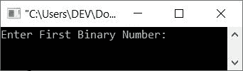
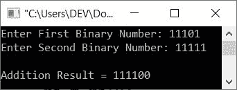
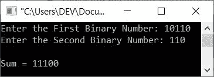
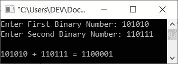
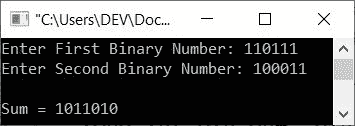

# C++程序将两个二进制数相加

> 原文：<https://codescracker.com/cpp/program/cpp-add-two-binary-numbers.htm>

在本文中，您将学习并获得用户在运行时输入的两个二进制数相加的代码。在这里，我用以下方法创建了二进制数加法程序:

*   使用**字符串**数据类型添加二进制数
*   使用 **int** (和 long int)数据类型将二进制数相加
*   使用用户定义的函数添加二进制数

**注-** 如果不知道二进制数加法的基本[规则](/computer-fundamental/binary-number-addition.htm)、 可以参考其单独教程。

## 使用字符串数据类型添加二进制数

问题是，**用 C++写一个程序，接收两个二进制数作为输入，找到并打印它的加法。**下面给出的程序 使用**字符串**数据类型来完成任务。函数的作用是:返回字符串的长度。

```
#include<iostream>
using namespace std;

int main()
{
   string bin1, bin2, addRes;
   int len, carry, re, i;
   cout<<"Enter First Binary Number: ";
   cin>>bin1;
   cout<<"Enter Second Binary Number: ";
   cin>>bin2;
   len = bin1.size();
   addRes = "";
   carry = 0;
   for(i=(len-1); i>-1; i--)
   {
      re = carry;
      if(bin1[i] == '1')
         re = re+1;
      else
         re = re+0;
      if(bin2[i] == '1')
         re = re+1;
      else
         re = re+0;
      if(re%2==1)
         addRes = '1' + addRes;
      else
         addRes = '0' + addRes;
      if(re<2)
         carry = 0;
      else
         carry = 1;
   }
   if(carry!=0)
      addRes = '1' + addRes;
   cout<<"\nAddition Result = "<<addRes;
   return 0;
}
```

下面是上面的 C++程序产生的初始输出:



现在提供输入，比如说第一个是 **11101** ，第二个是 **11111** 。以下是用户输入的运行示例:



使用相同的用户输入，即作为两个二进制数的 **11101** 和 **11111** ，上述程序的试运行如下:

*   当用户输入这两个二进制输入时，它们分别存储在 **bin1** 和 **bin2** 变量中。那是 **弦**型的。这里是 **bin1 = "11101"** 和 **bin2 = "11111"** : 的逐字符存储
    *   bin1[0] = '1 '
    *   bin1[1] = '1 '
    *   bin1[2] = '1 '
    *   bin1[3] = '0 '
    *   bin1[4] = '1 '
    *   以类似的方式，所有字符存储在各自的索引中，用于第二次输入到 **bin2**
*   现在使用语句
    `len = bin1.size();`
    将第一个二进制数的长度初始化为 **len** 。 因此 **len=5** ，因为 **bin1** 中有 5 个字符可用
*   空字符串，即**“**和空整数，即 **0** 被初始化为两个变量， **addRes** 和 T6 分别携带
*   现在开始执行循环的**，从来自 **len-1** 或 **5-1** 或 **4** 的 **i** 的值开始**
*   由于条件 **i > -1** 或 **4 > -1** 评估为真，因此程序流进入循环内部并评估其体内所有可用的语句
*   也就是说，第一个语句
    `re = carry;`
    被执行。因此 **re=0**
*   现在条件(第一个 **if** )，**bin 1[I]= ' 1 '**或**bin[4]= ' 1 '**或**' 1 ' = ' 1 ' = ' 1 '**评估为 真，因此 **re+1** 或 **0+1** 或 **1** 被初始化为 **re**
*   再次，(如果，**bin 2[I]= ' 1 '**或**bin 2[4]= ' 1 '**或**' 1 ' = ' 1 '**的条件评估为真，因此 **re+1** 或 **1+1** 或 **2** 被初始化为 **re**
*   再次，条件(第三个 **if** )， **re%2==1** 或 **2%2==1** 评估为假，因此程序流程转到其计数器部分，即 **else** 和**“0”+addRes**或**“0”+”** 或**“0”**被初始化为 **addRes**
*   再次，条件(第四个和最后一个**如果**)、 **re < 2** 或 **2 < 2** 评估为假，因此程序流程转到 **else** 的主体，并且 **1** 被初始化为**进位**。 所以**进位= 1**
*   由于所有的语句都被执行，因此程序流进入循环的增量部分，并且 **i** 的值被递减。现在 **i=3**
*   然后条件 **i > -1** 或 **3 > -1** 再次评估为真，因此程序流程再次进入循环。这个过程继续，直到条件评估为假
*   在退出循环后，或者当条件(i>-1)评估为假时，只有当**进位**不等于 0 时，才会在**地址**变量前添加**‘1’**
*   这样，两个二进制数的相加就被计算出来了

**注意-** 以上程序有限制。局限性是，如果两个输入的二进制输入的长度不相同或不相等， 程序不能以正确的方式工作。因此，这里创建了另一个程序，它在所有条件下都工作，不管二进制数输入的长度 是否相等。

```
#include<iostream>
using namespace std;

int main()
{
   string str1, str2, sum="";
   int len1, len2, i, j, ds=0;
   cout<<"Enter the First Binary Number: ";
   cin>>str1;
   cout<<"Enter the Second Binary Number: ";
   cin>>str2;
   len1 = str1.size();
   len2 = str2.size();
   i = len1 - 1;
   j = len2 - 1;
   while(i>=0 || j>=0 || ds==1)
   {
      ds = ds + ((i >= 0) ? str1[i] - '0' : 0);
      ds = ds + ((j >= 0) ? str2[j] - '0' : 0);
      sum = char(ds % 2 + '0') + sum;
      ds = ds/2;
      i--;
      j--;
   }
   cout<<"\nSum = "<<sum;
   return 0;
}
```

下面是用户输入 **10110** 和 **110** 作为两个二进制数的示例运行:



## 使用 int 数据类型的二进制数加法

这是你需要的程序，我想。因为这个程序不使用任何**字符串**类型来完成任务。这个程序是 创建的，它的所有变量都是 **int** 类型。但是两个程序的输出是相同的。

```
#include<iostream>
using namespace std;

int main()
{
   long int bin_one, bin_two, t1, t2;
   int i=0, rem=0, sum[16];
   cout<<"Enter First Binary Number: ";
   cin>>bin_one;
   cout<<"Enter Second Binary Number: ";
   cin>>bin_two;

   t1 = bin_one;
   t2 = bin_two;

   while(bin_one !=0 || bin_two !=0)
   {
      sum[i++] = (bin_one % 10 + bin_two % 10 + rem) % 2;
      rem = (bin_one % 10 + bin_two % 10 + rem) / 2;
      bin_one = bin_one/10;
      bin_two = bin_two/10;
   }

   if(rem!=0)
      sum[i++] = rem;

   i--;
   cout<<endl<<t1<<" + "<<t2<<" = ";

   while(i>=0)
      cout<<sum[i--];

   return 0;
}
```

以下是用户输入的示例运行，第一个是 **101010** ，第二个是 **110111** :



## 使用用户自定义函数添加二进制数

这是另一个程序，它执行与前两个程序相同的任务，但是使用了一个名为 **addBinNums()** ， 的用户定义函数，该函数有两个参数。一个用于第一个二进制数，另一个用于用户在运行时输入的第二个二进制数。

```
#include<iostream>
using namespace std;

int i=0, sum[16];
void addBinNums(int, int);
int main()
{
   long int bin_one, bin_two;
   cout<<"Enter First Binary Number: ";
   cin>>bin_one;
   cout<<"Enter Second Binary Number: ";
   cin>>bin_two;

   addBinNums(bin_one, bin_two);

   cout<<endl<<"Sum = ";
   while(i>=0)
      cout<<sum[i--];

   return 0;
}
void addBinNums(int b1, int b2)
{
   int r=0;
   while(b1 !=0 || b2 !=0)
   {
      sum[i++] = (b1 % 10 + b2 % 10 + r) % 2;
      r = (b1 % 10 + b2 % 10 + r) / 2;
      b1 = b1/10;
      b2 = b2/10;
   }
   if(r!=0)
      sum[i++] = r;
   i--;
}
```

以下是用户输入的示例运行，第一个和第二个二进制数分别为 **110111** 和 **100011** :



在上面的程序中，语句 **int i=0，sum[16]；**是全局声明的，即在两个( **main()** 和 **addBinNums()** )函数之外。因此，我们可以在整个程序中使用这两个变量以及它的更新值。

[C++在线测试](/exam/showtest.php?subid=3)

* * *

* * *