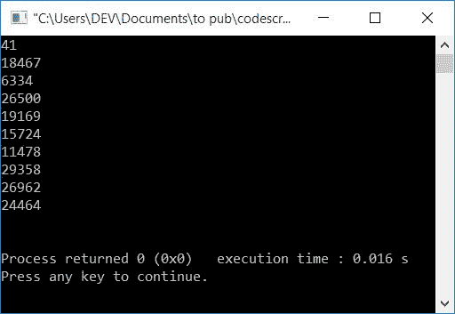
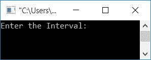
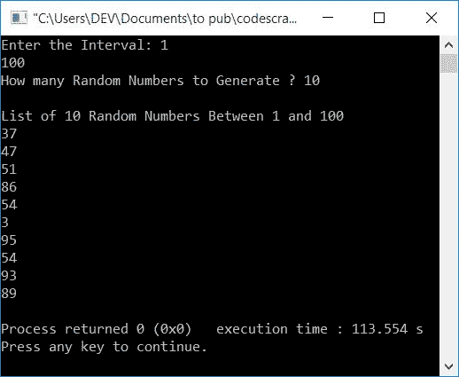

# 生成随机数的 C++程序

> 原文：<https://codescracker.com/cpp/program/cpp-program-generate-random-numbers.htm>

在本文中，您将学习并获得用 C++语言生成和打印随机数的代码。以下是关于随机数的程序列表:

*   生成 10 个随机数
*   生成无重复的随机数
*   在给定范围内生成随机数

### 如何生成随机数？

要生成随机数，使用 **rand()** 函数。该函数在 **stdlib.h** 头文件中定义。

## 生成 10 个随机数

该程序使用*循环*和 **rand()** 函数生成并打印 10 个随机数。

```
#include<iostream>
#include<stdlib.h>
using namespace std;
int main()
{
    int i;
    for(i=0; i<10; i++)
        cout<<rand()<<endl;
    cout<<endl;
    return 0;
}
```

这个程序是在 *Code::Blocks* IDE 下构建和运行的。下面是它的示例输出:



**注意-** 如果您重新运行上述程序，那么它将产生与先前相同的 10 个随机数。 所以为了解决这个问题，并且不重复地产生随机数，我们为你准备了另一个程序。

## 生成无重复的随机数

这是一个不重复产生随机数的程序。这里我们使用了 **srand()** (种子随机) 函数来设置初始点，以便使用 **time()** 函数生成随机数。

**注-****【时间()**功能用于设置 **srand()** 功能的初始点。这里我们使用了 **time()** 函数，因为它的值是不断变化的。

函数 **time()** 在 **time.h** 头文件中定义。所以在执行下面给出的程序之前，不要忘记包含这个头文件， 。其余的事情和前面的程序一样。

```
#include<iostream>
#include<stdlib.h>
#include<time.h>
using namespace std;
int main()
{
    int i;
    srand(time(0));
    for(i=0; i<10; i++)
        cout<<rand()<<endl;
    cout<<endl;
    return 0;
}
```

这个程序产生与前一个程序相同的输出。唯一的区别是，每次执行这个程序时，我们会得到随机数而不会重复。否则我们会得到不同的随机数。

## 在给定范围内生成随机数

这是最后一个程序，在给定的范围内产生随机数。该范围必须由用户在运行时提供

也就是说，这个程序要求用户首先输入时间间隔。例如，如果用户输入间隔为 **5** 和 **20** ，那么程序进一步要求输入数量，例如 **10** ，以生成 5 和 20 之间的 10 个随机数 。让我们看一下节目单

```
#include<iostream>
#include<stdlib.h>
#include<time.h>
using namespace std;
int main()
{
    int i, rnum, amount, first, last;
    cout<<"Enter the Interval: ";
    cin>>first>>last;
    cout<<"How many Random Numbers to Generate ? ";
    cin>>amount;
    cout<<"\nList of "<<amount<<" Random Numbers Between "<<first<<" and "<<last;
    srand(time(0));
    for(i=0; i<amount; i++)
    {
        rnum = rand()%(last+1-first)+first;
        cout<<endl<<rnum;
    }
    cout<<endl;
    return 0;
}
```

这是它的样本运行。这是该程序产生的初始输出:



现在输入区间说 **1** 和 **100** ，然后输入金额说 **10** 生成 10 个 1 到 100 之间的随机 数字。也就是说，在提供这些输入后，程序将打印 10 个随机数，其中所有的 随机数必须大于或等于 1 且小于或等于 100:



#### 其他语言的相同程序

*   [C 生成随机数](/c/program/c-program-generate-random-numbers.htm)
*   [Java 生成随机数](/java/program/java-program-generate-random-numbers.htm)
*   [Python 生成随机数](/python/program/python-program-generate-random-numbers.htm)

[C++在线测试](/exam/showtest.php?subid=3)

* * *

* * *