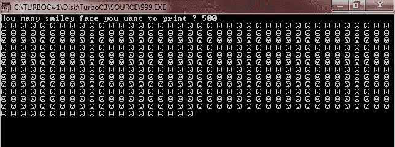

# 在屏幕上打印笑脸的 C++程序

> 原文：<https://codescracker.com/cpp/program/cpp-program-print-smiling-face-on-screen.htm>

在 [C++](/cpp/index.htm) 编程中要在屏幕上打印笑脸，首先你要让用户 输入他/她想要打印的笑脸数量，才能在屏幕上打印出所需数量的笑脸 。

使用笑脸的 ASCII 值，为 1，先声明一个[变量](/cpp/cpp-variables.htm) say**int**类型的 **sml** 并对其初始化 **1** 。现在声明一个变量，比如类型为 **char** 的 **ch** ，并将 **sml** 初始化为 **ch** 。现在 **ch** 持有笑脸符。应该以这种 方式创建程序。

```
#include<iostream.h>
#include<conio.h>
void main()
{
   clrscr();
   int sml=1, i, limit;
   char ch=sml;
   cout<<"How many smiley face you want to print ? ";
   cin>>limit;
   for(i=0; i<limit; i++)
   {
      cout<<ch<<" ";
   }
   getch();
}
```

当编译并执行上述 C++程序时，它将产生以下结果:



[C++在线测试](/exam/showtest.php?subid=3)

* * *

* * *