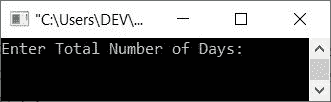
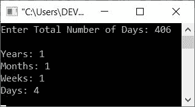
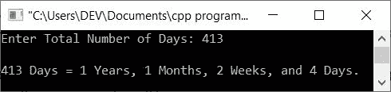
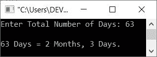

# C++ 程序：将天转换成年、月、周和天

> 原文：<https://codescracker.com/cpp/program/cpp-convert-days-in-years-weeks-days.htm>

本文提供了一些 C++ 程序，用于将用户在运行时输入的总天数转换为年、月、周和日。

例如，如果用户输入 **406** (总天数)，那么输出将是 **1** 年、 **1** 月、 T6】1 周、 **4** 天。下面的转换显示了如何将 406 天转换为年、月、周和日:

```
406 days = 1 (1*365) + 1 (1*30) + 1 (1*7) + 4
         = 1 (year) + 1 (month) + 1 (week) + 4 (days)
         = 1 (1*365) + 1 (1*30) + 1 (1*7) + 4
         = 365 + 30 + 7 + 4
         = 395 + 11
         = 406
```

问题是，*编写一个 C++ 程序，接收总天数作为输入，将给定的天数转换并打印成相应的 年、月、周和日。*下面给出的程序是这个问题的答案:

```
#include<iostream>

using namespace std;
int main()
{
   int tot, days, weeks, months, years;
   cout<<"Enter Total Number of Days: ";
   cin>>tot;
   years = tot/365;
   months = (tot%365)/30;
   weeks = ((tot%365)%30)/7;
   days = ((tot%365)%30)%7;

   cout<<"\nYears: "<<years<<endl;
   cout<<"Months: "<<months<<endl;
   cout<<"Weeks: "<<weeks<<endl;
   cout<<"Days: "<<days<<endl;
   cout<<endl;
   return 0;
}
```

下面给出的快照显示了上述 C++ 程序在将总天数转换为年、月、周和天时产生的初始输出:



现在提供输入，比如说 **406** 作为总天数，并按`ENTER`键查看输出，如下面给出的 快照所示:



在上面的程序中，当用户输入 **406** 天时，它被初始化为 **tot** 变量。现在声明:

```
years = tot/365;
```

给出 **1** 是因为**年**变量是 **int** 类型。因此 1 被初始化为**年**。和声明:

```
months = (tot%365)/30;
```

评价像 **(tot%365)/30** 给 **(406%365)/30** 给 **(41)/30** 给 **1** 。因此 1 被初始化为 **月**。和声明:

```
((tot%365)%30)/7;
```

评价像 **((tot%365)%30)/7** 给 **((406%365)%30)/7** 给 **((41)%30)/7** 给 **(11)/7** 给 **1** 。 因此 1 被初始化到**周**。还有最后一句话，那就是:

```
((tot%365)%30)%7
```

评价像 **((tot%365)%30)%7** 给 **((406%365)%30)%7** 给 **((41)%30)%7** 给 **11%7** 给 **4** 。 因此 4 被初始化为**天**。这样，计算或所有四个转换语句 的评估就像这样进行。

我们用下面给出的程序修改一下上面的程序。这个程序提供的用户体验很差，因为输出打印在一行中，而不是像前面的程序那样打印在多行中:

```
#include<iostream>

using namespace std;
int main()
{
   int tot, days, weeks, months, years;
   cout<<"Enter Total Number of Days: ";
   cin>>tot;
   years = tot/365;
   months = (tot%365)/30;
   weeks = ((tot%365)%30)/7;
   days = ((tot%365)%30)%7;

   cout<<endl<<tot<<" Days = ";
   cout<<years<<" Years, ";
   cout<<months<<" Months, ";
   cout<<weeks<<" Weeks, and ";
   cout<<days<<" Days.";
   cout<<endl;
   return 0;
}
```

以下是其示例运行，用户输入 **413** 作为天数:



这个程序看起来仍然很奇怪，因为那个 **1 年**必须转换成 **1 年**(没有 s)。让我们彻底修改上面的 程序:

```
#include<iostream>

using namespace std;
int main()
{
   int tot, days, weeks, months, years;
   cout<<"Enter Total Number of Days: ";
   cin>>tot;
   years = tot/365;
   months = (tot%365)/30;
   weeks = ((tot%365)%30)/7;
   days = ((tot%365)%30)%7;

   cout<<endl<<tot<<" Days = ";
   if(years>1)
      cout<<years<<" Years, ";
   else
   {
      if(years==1)
         cout<<years<<" Year, ";
   }
   if(months>1)
      cout<<months<<" Months, ";
   else
   {
      if(months==1)
         cout<<months<<" Month, ";
   }
   if(weeks>1)
      cout<<weeks<<" Weeks, and ";
   else
   {
      if(weeks==1)
         cout<<weeks<<" Week, and ";
   }
   if(days>1)
      cout<<days<<" Days.";
   else
   {
      if(days==1)
         cout<<days<<" Day.";
   }
   cout<<endl;
   return 0;
}
```

下面是用户输入 63 天的运行示例:



正如您从上面的程序示例运行中看到的，如果任何一个术语(如年、月、周或日)等于 0，那么就不会显示该术语的输出。

[C++ 在线测试](/exam/showtest.php?subid=3)

* * *

* * *