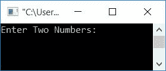
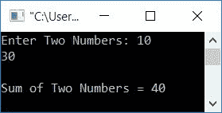
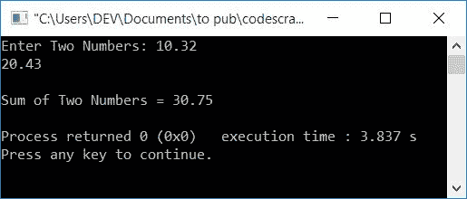

# C++ 程序：使用指针将两个数相加

> 原文：<https://codescracker.com/cpp/program/cpp-program-add-two-numbers-using-pointers.htm>

## 在 C++中使用指针将两个数相加

在 C++ 编程中使用[指针将两个数字相加，你需要 让用户输入这两个数字。然后让两个指针类型相同的](/cpp/cpp-pointers.htm)[变量](/cpp/cpp-variables.htm) [类型](/cpp/cpp-data-types.htm)比如 ***ptr1** 和 ***ptr2** 来初始化两个 变量(保存数字)的地址，并使用另一个变量比如 **sum** ，存储两个数字的相加，即 **sum = *ptr1 + *ptr2** 并显示 **sum** 的值

这里 ***** 称为 [操作符](/cpp/cpp-operators.htm)的<u>值， **&** 称为</u>操作符的<u>地址。</u>

下面的 C++ 程序要求用户输入两个数并用指针相加。 并在屏幕上显示加法结果:

```
#include<iostream>
using namespace std;
int main()
{
    int num1, num2, *ptr1, *ptr2, sum=0;
    cout<<"Enter Two Numbers: ";
    cin>>num1>>num2;
    ptr1 = &num1;
    ptr2 = &num2;
    sum = *ptr1 + *ptr2;
    cout<<"\nSum of Two Numbers = "<<sum;
    cout<<endl;
    return 0;
}
```

这个程序是在 *Code::Blocks* IDE 下构建和运行的。下面是它的运行示例:



现在提供任意两个数字，比如说 **10** 和 **30** 作为输入。按下`ENTER`键，使用指针查看两个给定数字的加法 ，如下面给出的样品运行的最终快照所示:



这里，第一个数字的地址(存储在 **num1** 中)被初始化为 **ptr1** ，而 第二个数字的地址使用 **&** (地址)运算符被初始化为 **ptr2** 。

使用 ***** (地址值)运算符，我们将两个数相加，并将其初始化为**和**。最后 只是把它的值打印出来作为输出。

要详细了解指针，那么你可以跟随关于它的单独教程。

### 如果数字包含小数呢？

要处理实数，只需将数据类型从 **int** 替换为 **float** 。即下面的语句:

```
int num1, num2, *ptr1, *ptr2, sum=0;
```

替换为:

```
float num1, num2, *ptr1, *ptr2, sum=0;
```

其余的事情将是一样的。下面是在实数输入上运行的示例:



#### 其他语言的相同程序

*   使用指针将两个数相加
*   [Java 使用指针将两个数相加](/java/program/java-program-add-two-numbers-using-pointers.htm)

[C++在线测试](/exam/showtest.php?subid=3)

* * *

* * *