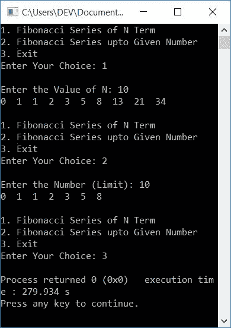

# C++ 程序：打印斐波那契数列

> 原文：<https://codescracker.com/cpp/program/cpp-program-print-fabonacci-series.htm>

在本文中，您将学习并获得使用 C++ 程序以下列方式打印斐波那契数列的代码:

*   打印 N 项斐波纳契数列
*   打印斐波纳契数列直到给定的数字
*   使用函数打印斐波那契数列。这个程序包括打印斐波那契数列的两种方法

在第一个程序中，如果用户输入一个数字，比如说 **10** 作为输入，那么程序打印出带有 10 项的斐波纳契数列，比如:

```
0  1  1  2  3  5  8  13  21  34
```

而在第二个程序中，如果用户输入 **10** 作为输入，那么程序打印斐波纳契数列，其中 的最后一个数字不能大于 **10** 。这是斐波纳契数列到 10:

```
0  1  1  2  3  5  8
```

在第三个程序中，我们已经使用 **switch** case 和用户定义的函数实现了这两个特性。

但是在浏览这些程序之前，让我们先了解一下斐波那契数列。

### 什么是斐波那契数列？

斐波那契数列是一个数字序列，其中前两个数字以 0 和 1 开始。所有即将到来的数字都是按照前面两个数字的总和来计算的，计算方法如下:

*   0 作为第一个数字
*   1 作为第二个数字
*   1 作为第三个数字。第三个数字是第二个数字(1)和第一个数字(0)的总和。也就是 **1+0**
*   2 作为第四个数字。第四个数字是第三(1)和第二(1)个数字的总和。也就是 **1+1**
*   3 作为第五个数字。也就是 **2+1**
*   5 作为第六个数字。也就是 **3+2**
*   等等

## 打印 N 项斐波纳契数列

要在 [C++](/cpp/index.htm) 编程中打印出 **N** 项的斐波那契数列，你必须要求 用户输入斐波那契数列或数列的大小。然后生成并打印给定 大小的斐波那契数列，如下面给出的程序所示:

```
#include<iostream>
using namespace std;
int main()
{
    int a=0, b=1, c, tot, temp, i;
    cout<<"Enter the Size of Fibonacci Sequence: ";
    cin>>tot;
    cout<<"\nFibonacci Series of "<<tot<<" Terms:\n";
    for(i=1; i<=tot; i++)
    {
        if(i==1)
            c = 0;
        else if(i==2 || i==3)
            c = 1;
        else
        {
            temp = a;
            a = b;
            b = c;
            c = a+b;
        }
        if(i==tot)
            cout<<c;
        else
            cout<<c<<", ";
    }
    cout<<endl;
    return 0;
}
```

这个程序是在 *Code::Blocks* IDE 下构建和运行的。下面是它的运行示例:


现在提供数字形式的输入来打印斐波那契数列。这里的数字表示斐波纳契数列包含的位数或项数(无论你说什么)。例如，如果用户输入 10，那么程序将打印包含 10 个数字的斐波纳契数列。下面是用户输入的示例输出， **10** :


## 打印斐波纳契数列直到给定的数字

这个程序生成斐波那契数列的方式是最后一个数字不能大于用户输入的数字，如下面给出的程序所示。

问题是，**用 C++ 写一个程序打印斐波纳契数列到给定的数字**。以下是它的答案:

```
#include<iostream>
using namespace std;
int main()
{
    int a=0, b=1, c, limit, temp, i;
    cout<<"Enter the Limit: ";
    cin>>limit;
    cout<<"\nFibonacci Series upto "<<limit<<":\n";
    for(i=1; ; i++)
    {
        if(i==1)
            c = 0;
        else if(i==2 || i==3)
            c = 1;
        else
        {
            temp = a;
            a = b;
            b = c;
            c = a+b;
        }
        if(c>limit)
            break;
        cout<<c<<"  ";
    }
    cout<<endl;
    return 0;
}
```

下面是用户输入的示例运行， **200** :


## 使用函数的斐波那契数列

该程序生成并打印斐波纳契数列*的 **N** 项*和*直到给定的数字*和 ，无论用户想要使用菜单驱动功能执行什么。该程序使用用户定义的函数，即 **FiboOfNTerm()** 和 **FiboUptoGivenNumber()** ，以两种方式打印斐波那契数列。

```
#include<iostream>
using namespace std;
void FiboOfNTerm(int);
void FiboUptoGivenNumber(int);
int main()
{
    int ch, N, limit;
    do
    {
        cout<<"1\. Fibonacci Series of N Term\n";
        cout<<"2\. Fibonacci Series upto Given Number\n";
        cout<<"3\. Exit\n";
        cout<<"Enter Your Choice: ";
        cin>>ch;
        switch(ch)
        {
            case 1:
                cout<<"\nEnter the Value of N: ";
                cin>>N;
                FiboOfNTerm(N);
                break;
            case 2:
                cout<<"\nEnter the Number (Limit): ";
                cin>>limit;
                FiboUptoGivenNumber(limit);
                break;
            case 3:
                return 0;
            default:
                cout<<"\nWrong Input!";
                break;
        }
        cout<<"\n\n";
    }while(ch==1 || ch==2);
    cout<<endl;
    return 0;
}
void FiboOfNTerm(int tot)
{
    int i, a=0, b=1, c, temp;
    for(i=1; i<=tot; i++)
    {
        if(i==1)
            c = 0;
        else if(i==2 || i==3)
            c = 1;
        else
        {
            temp = a;
            a = b;
            b = c;
            c = a+b;
        }
        cout<<c<<"  ";
    }
}
void FiboUptoGivenNumber(int limit)
{
    int i, a=0, b=1, c, temp;
    for(i=1; ; i++)
    {
        if(i==1)
            c = 0;
        else if(i==2 || i==3)
            c = 1;
        else
        {
            temp = a;
            a = b;
            b = c;
            c = a+b;
        }
        if(c>limit)
            break;
        cout<<c<<"  ";
    }
}
```

这是它的样本运行。这是最初的输出:


现在输入你的选择，也就是你想以什么方式打印斐波那契数列。以下是输入 **1** 作为选择并按`ENTER`键后产生的样本输出:


输入 **N** 的值，生成并打印由 **N** 个数字组成的斐波那契数列。以下是提供或输入 **10** 作为 **N** 的值后的样本输出 :


如您所见，10 项斐波纳契数列被打印出来，并再次显示继续运算的选项。让我们先看看第二个选项，然后看看第三个选项，如下图所示:



#### 其他语言的相同程序

*   [C 打印斐波那契数列](/c/program/c-program-print-fabonacci-series.htm)
*   [Java 打印斐波那契数列](/java/program/java-program-print-fibonacci-series.htm)
*   [Python 打印斐波那契数列](/python/program/python-program-print-fibonacci-series.htm)

[C++ 在线测试](/exam/showtest.php?subid=3)

* * *

* * *