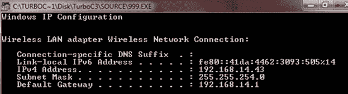
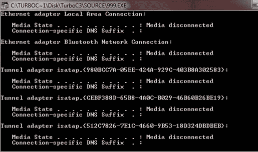
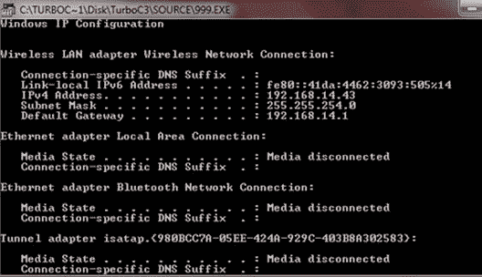
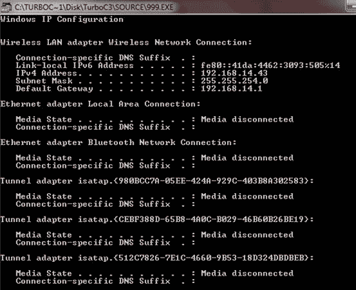

# C++ 程序：获取并显示 IP 地址

> 原文：<https://codescracker.com/cpp/program/cpp-program-get-ip-address.htm>

要使用 [C++](/cpp/index.htm) 查找并打印您的计算机系统的 IP 地址，请使用名为**的 [函数](/cpp/cpp-functions.htm)，并将命令 **ipconfig** 放在 之后，提供 **System32** 的完整路径，即
**C:\ \ Windows \ \ System32 \ \ ipconfig**
，其中 调用 Windows 命令提示符 ( 【T14**

 **## 获取 IP 地址的 C++ 编程代码

下面的 C++ 程序获取 IP 地址并显示在屏幕上:

```
#include<conio.h>
#include<stdlib.h>
void main()
{
   clrscr();

   system("C:\\Windows\\System32\\ipconfig");

   getch();
}
```

当编译并执行上述 C++ 程序时，它将产生以下结果:



您也可以从源文件夹而不是 BIN 文件夹中检查它(在源文件夹中，您可以找到您的程序名，单击它可以查看关于您的 ip 地址的输出，输出示例如下)。这是为“Turbo C”用户准备的。以上 C++ 编程示例输出(输出的下半部分):



以上 C++ 编程示例输出(输出的上半部分):



以上 C++ 编程示例输出(输出的完整部分):



### 其他语言的相同程序

您可能喜欢用其他编程语言编写相同的程序:

*   [C 获取 IP 地址](/c/program/c-program-get-ip-address.htm)
*   [Java 获取 IP 地址](/java/program/java-program-get-ip-address.htm)
*   [Python 获取 IP 地址](/python/program/python-program-get-ip-address.htm)

[C++ 在线测试](/exam/showtest.php?subid=3)

* * *

* * ***