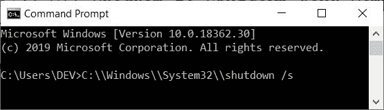
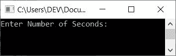
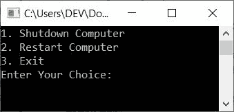
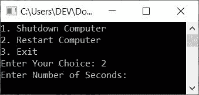

# 关闭和重启计算机的 C++程序

> 原文：<https://codescracker.com/cpp/program/cpp-program-shutdown-computer.htm>

在本文中，您将学习并获得使用 C++程序关闭或重启计算机系统的代码。以下是关闭或重新启动计算机系统时的程序列表:

*   在默认时间关闭计算机系统
*   立即关闭计算机
*   运行时用户在给定时间内关闭计算机
*   在默认时间重新启动计算机
*   立即重启计算机
*   在给定时间内重新启动计算机
*   关闭/重启计算机的菜单驱动程序
*   关闭基于 Linux 的系统
*   关闭基于 Windows XP 的系统

**注-** 此处给出的所有关机或重启计算机系统的程序都经过良好的测试和执行。 因此<u>在执行这些程序之前一定要保存好所有打开的文件</u>。

使用 [C++](/cpp/index.htm) 程序关闭或重启计算机系统。使用**系统()** [功能](/cpp/cpp-functions.htm)。它在 **stdlib.h** 头文件中定义。 **system()** 函数调用命令处理器执行命令。

基于 windows 的系统的命令处理器是 **cmd** (命令提示符)。而基于 linux 系统的命令处理器是**终端**。

因此，要关闭或重启您的计算机，请将与关闭或重启相对应的命令放在 *system()* 中，如下面给出的程序所示。

## 用 C++关闭计算机

这是关闭基于 windows 的计算机系统的最简单的程序。在这个程序中，我们没有提供计时器。因此系统在默认时间关机，即在执行下面给出的程序 后的 **30** 秒。

```
#include<stdlib.h>
int main()
{
    system("C:\\Windows\\System32\\shutdown /s");
    return 0;
}
```

执行上述程序后，默认情况下，计算机系统会在 30 秒后关闭。您也可以定义计时器，以秒为单位，如下面给出的程序(第二个程序)所示。

**注意-** 在执行程序之前，请务必保存所有文件。

您也可以将命令直接写入**命令提示符**，如下所示:



现在按`ENTER`键 30 秒后关机，直接用 **cmd** 。 <u>但是通过一个 C++程序，我们使用了 **system()** 函数来调用命令处理器(cmd)来执行 命令</u>。因此，要执行以下命令:

```
C:\\Windows\\System32\\shutdown /s
```

我们已经使用了 **system()** 函数。

### 立即关闭计算机

如果您想立即关闭基于 windows 的系统，请将计时器设置为 0(秒)，如下面的程序所示。问题是，**用 C++写个程序让电脑立即关机**。 下面是它的回答:

```
#include<stdlib.h>
int main()
{
    system("C:\\Windows\\System32\\shutdown /s /t 0");
    return 0;
}
```

**注意-** 这里我们将计时器设置为 0，以便在 0 秒内(或立即)关闭电脑。

### 在给定时间内关闭计算机

这个程序允许用户以秒为单位输入计时器。例如，如果用户输入 20，则系统会在 20 秒后关闭:

```
#include<iostream>
#include<stdlib.h>
#include<string.h>
#include<sstream>
using namespace std;
int main()
{
    int sec, i;
    string strOne, strTwo;
    char str_One[50], str_Two[10];
    ostringstream intToStr;
    cout<<"Enter Number of Seconds: ";
    cin>>sec;
    intToStr<<sec;
    strOne = "C:\\Windows\\System32\\shutdown /s /t ";
    strTwo = intToStr.str();
    i=0;
    while(strOne[i])
    {
        str_One[i] = strOne[i];
        i++;
    }
    str_One[i] = '\0';
    i=0;
    while(strTwo[i])
    {
        str_Two[i] = strTwo[i];
        i++;
    }
    str_Two[i] = '\0';
    strcat(str_One, str_Two);
    system(str_One);
    return 0;
}
```

下面是它的运行示例:



现在提供输入比如说 **20** 作为计时器(秒数)，然后按`ENTER`键在 20 秒后关闭 你的计算机系统。

**注意-****intToStr**是一个用户定义的变量，属于 **ostringstream** 类

**ostringstream** 将流类输出给字符串上的操作符。这个类的对象使用一个包含字符序列的字符串缓冲区 。基本上， **ostringstream** 类用于将输入的秒 (一个 **int** 类型值)转换为**字符串**

也就是说，当用户输入秒时，该值存储在**秒**中。并使用以下语句:

```
intToStr<<sec;
strTwo = intToStr.str();
```

**strTwo** 现在保存与 **sec** 相同的值，即用户输入的秒数，但采用 字符串形式。

例如，如果用户输入 20 作为秒数，那么 20 被存储在**秒**中，并且在执行两行 C++代码上面的 、 **strTwo=20** 之后。在执行以下语句后:

```
strOne = "C:\\Windows\\System32\\shutdown /s /t ";
```

变量 **strOne** 现在保存关闭计算机系统的命令。因此 **strOne = C:\ \ Windows \ \ System32 \ \ shut down/s/t**和 **strTwo=20** 。现在，我们必须连接这两个 值，并放入 **system()** 函数来执行完整的命令，以便在 20 (用户给定的时间)秒内关闭系统。

因为这两个值属于字符串的范畴，因此使用 **strcat()** 我们必须连接 这两个值。但在此之前，我们必须将其转换为字符数组(字符串)。所以我们把这个字符串逐个复制到 字符数组、 **str_One** 和 **str_Two** 中。也就是说，字符串 **strOne** 被复制到 **str_One** ，而 **strTwo** 被逐字符复制到 **str_Two** 。

**注意-** 要获得关于复制字符串的详细信息，请参考 [复制字符串](/cpp/program/cpp-program-copy-string.htm)以获得关于该主题的所有必要信息。 比如如何复制字符串，为什么在最后一个索引处初始化一个空字符等等。喜欢的东西。

现在我们可以自由地应用连接操作了。因此，我们使用以下语句将两个字符串连接起来:

```
strcat(str_One, str_Two);
```

执行该语句后， **str_Two** 的值被连接或附加到 **str_One** 上。 所以现在**str _ One = C:\ \ Windows \ \ System32 \ \ shut down/s/t 20**。因此，只需将 **str_One** 作为 **system()** 函数的参数，即可应用关机操作。

**注-** 要了解关于字符串连接的更多信息，请参考 [连接字符串](/cpp/program/cpp-program-concatenate-string.htm)一文以获得所需的一切。

## 用 C++重启计算机

现在让我们使用下面的 C++代码重新启动基于 windows 的系统。这个程序在执行后会在默认时间(30 秒)内重启你的计算机系统。

```
#include<stdlib.h>
int main()
{
    system("C:\\Windows\\System32\\shutdown /r");
    return 0;
}
```

### 立即重启计算机

与在*立即关闭计算机*中所做的方式类似，这里我们也将计时器写为 0 秒，以便 立即重启系统:

```
#include<stdlib.h>
int main()
{
    system("C:\\Windows\\System32\\shutdown /r /t 0");
    return 0;
}
```

### 在给定时间内重新启动计算机

**注-** 在给定的时间内，按照**给定的程序关闭电脑，只有一个变化。 即替换下面的语句:**

```
strOne = "C:\\Windows\\System32\\shutdown /s /t ";
```

下面给出了声明:

```
strOne = "C:\\Windows\\System32\\shutdown /r /t ";
```

**注-** 就因为 **s** 和 **r** 的问题，整个节目都变了。

## 关闭并重新启动计算机

在关机和重启程序的基础上，我们创建了一个菜单驱动的程序来完成关机和重启的工作。也就是说，允许用户输入他/她的选择，即他/她想要做什么。关闭或重启。让我们来看看这个程序:

```
#include<iostream>
#include<stdlib.h>
#include<string.h>
#include<sstream>
using namespace std;
int getInput();
int main()
{
    int ch, sec, i;
    string strOne, strTwo;
    char str_One[50], str_Two[10];
    ostringstream intToStr;
    cout<<"1\. Shutdown Computer\n";
    cout<<"2\. Restart Computer\n";
    cout<<"3\. Exit\n";
    cout<<"Enter Your Choice: ";
    cin>>ch;
    if(ch==1 || ch==2)
    {
        cout<<"Enter Number of Seconds: ";
        cin>>sec;
        intToStr<<sec;
        strTwo = intToStr.str();
    }
    switch(ch)
    {
        case 1:
            strOne = "C:\\Windows\\System32\\shutdown /s /t ";
            i=0;
            while(strOne[i])
            {
                str_One[i] = strOne[i];
                i++;
            }
            str_One[i] = '\0';
            i=0;
            while(strTwo[i])
            {
                str_Two[i] = strTwo[i];
                i++;
            }
            str_Two[i] = '\0';
            strcat(str_One, str_Two);
            system(str_One);
            break;
        case 2:
            strOne = "C:\\Windows\\System32\\shutdown /r /t ";
            i=0;
            while(strOne[i])
            {
                str_One[i] = strOne[i];
                i++;
            }
            str_One[i] = '\0';
            i=0;
            while(strTwo[i])
            {
                str_Two[i] = strTwo[i];
                i++;
            }
            str_Two[i] = '\0';
            strcat(str_One, str_Two);
            system(str_One);
            break;
        case 3:
            return 0;
        default:
            cout<<"\nWrong Choice!";
            return 0;
    }
    return 0;
}
```

以下是该程序产生的初始输出:



现在输入你的选择，说 **2** 重启你的电脑系统。以下是键入 2 并按下`ENTER`键后产生的示例输出:



现在输入秒数，比如说 50 秒后重启你的电脑系统。

这个 C++程序是为关机或重启计算机而创建的。首先，程序会询问用户，他/她是想关机还是想重启电脑。第一个选项是关机，而第二个选项是重启计算机系统。

## 关闭基于 Linux 的系统

这个程序是为 Linux 用户创建的。同样在 linux 中，使用的是 **system()** 函数。也就是说，功能是 一样的，但是命令变了。因为函数与 C++相关，而命令与本地系统相关 软件:

```
#include<stdio.h>
int main()
{
    system("shutdown -P now");
    return 0;
}
```

**注意-** 对于 linux 用户，要关闭计算机，您需要以 root 用户身份登录。

#### 为 Linux 用户设置关机前的计时器

在 linux 中，也可以这样设置计时器:

```
system("shutdown -P number of minutes");
```

举个例子，

```
system("shutdown -P 5");
```

将在执行程序五分钟后关闭您的系统。

**注-** 在基于 Windows 的系统中，定时器指的是秒数。而在基于 linux 的系统中，计时器 指的是分钟数。

## 关闭基于 Windows XP 的系统

这是本文的最后一个程序。它是为 *Windows XP* 用户创建的:

```
#include<stdlib.h>
int main()
{
    system("C:\\Windows\\System32\\shutdown -s");
    return 0;
}
```

即不使用 **/s** ，而是使用 **-s** 来关闭基于 Windows XP 的计算机系统。

#### 其他语言的相同程序

*   [C 关机电脑](/c/program/c-program-shutdown-computer.htm)
*   [Java 关机电脑](/java/program/java-program-shutdown-computer.htm)
*   [Python 关闭电脑](/python/program/python-program-shutdown-restart-computer.htm)

[C++在线测试](/exam/showtest.php?subid=3)

* * *

* * *