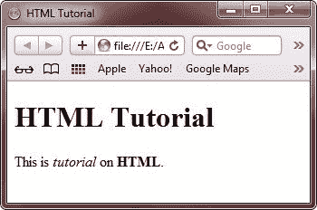
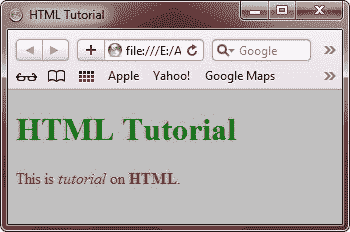

# HTML 教程

> 原文：<https://codescracker.com/html/index.htm>

本教程将教你所有关于 HTML 的知识，从初级到高级。

## 什么是 HTML？

HTML(长超文本标记语言)是一种用于创建网页的标记语言。有了 HTML，你可以制作自己的网站。

## HTML 的简史

HTML 是由万维网(W3C)联盟开发和维护的。

## HTML 中的 hyper 是什么？

在 **Hyper** 文本标记语言(HTML)中，术语 Hyper 表示以非线性方式从一个位置到另一个位置的导航。 也就是说，点击网页上的超文本将你带到互联网或网站上的相关页面，这不一定是网站上的下一页 。

## HTML 定义了什么？

HTML 借助 [标签](/html/html-elements.htm)和[属性](/html/html-attributes.htm)定义内容，即网页的[结构](/html/html-structure.htm)和布局。一个元素包括开始和结束标签，其中包含一些内容，属性提供了关于元素的附加信息(比如元素在 Web 页面上的对齐)。

下面是一个简单的 HTML 例子。

```
<!DOCTYPE HTML>
<html>
<head>
   <title>HTML Tutorial</title>
</head>
<body>

<h1>HTML Tutorial</h1>
<p>This is <i>tutorial</i> on <b>HTML</b>.</p>

</body>
</html>
```

打开文本编辑器，复制上面的 HTML 代码，然后粘贴到文本编辑器中。用扩展名**保存文件。像 myfile.html 的**一样的**T4 的 html，并在你的浏览器中打开它，那么下面是上面的 HTML 文档/代码在浏览器中产生的输出:**

**

这是另一个例子:

```
<!DOCTYPE HTML>
<html>
<head>
   <title>HTML Tutorial</title>
   <style>
      body{background-color:silver;}
      h1{color:green;}
      h2{color:blue;}
      p{color:red;}
   </style>
</head>
<body>

<h1>HTML Tutorial</h1>
<p>This is <i>tutorial</i> on <b>HTML</b>.</p>

</body>
</html>
```

如果您尝试在浏览器中打开它，您将看到以下输出:



在这个系列教程中，你将学到所有关于 HTML 的知识。

## 观众

本教程的设计和开发是为了帮助那些 HTML 爱好者，那些有兴趣作为初学者学习 HTML 或者想深入学习 HTML 的人。因为我们在 HTML 中包含了很多代码，所以你可以很容易地在更短的时间内了解更多。

## 先决条件

在进入这个 HTML 教程之前，如果你对互联网和网站有一些基本的概念，那么它会变得非常容易抓住任何相关的东西，并能更好地理解 HTML。另外，如果你没有任何先验知识，你也可以遵循这个 HTML 教程。

[HTML 在线测试](/exam/showtest.php?subid=4)

* * *

* * ***