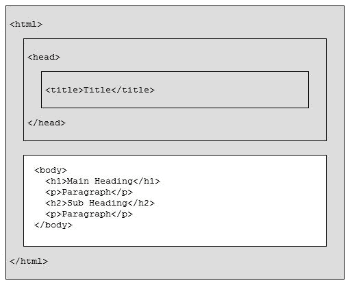
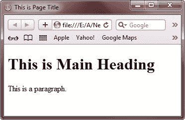
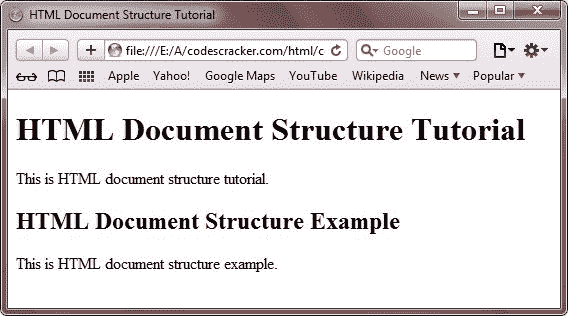
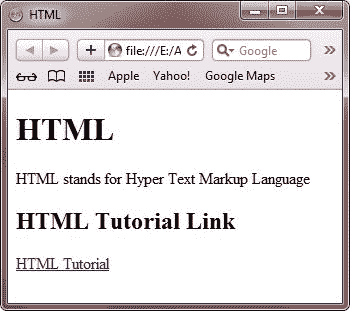

# HTML 文档结构

> 原文：<https://codescracker.com/html/html-structure.htm>

在这里你将学习 HTML 文档的文档结构。下图显示了 HTML 文档的一般结构。



正文标签(和)之间的文本将在浏览器中显示。

## HTML 文档的基本结构

这是一个展示 HTML 文档基本结构的例子。

```
<!DOCTYPE html>
<html>
<head>
   <title>This is Page Title</title>
</head>
<body>

<h1>This is Main Heading</h1>
<p>This is a paragraph.</p>

</body>
</html>
```

要开始 HTML 编码，请打开文本编辑器，如 windows 用户记事本。输入上面的 HTML 代码或者直接复制粘贴。

打字/复印后，在你的电脑里存成 filename.htm 或 filename.html。现在，在网页浏览器中打开保存的 HTML 文件，观看输出网页。

你将在你的浏览器上看到下面给出的 HTML 输出网页。



下面是上面 HTML 文档结构示例的解释:

*   **DOCTYPE** 声明将文档类型定义为 HTML
*   **< html >** 和 **< /html >** 之间的文本描述一个 html 文档
*   **<头>** 和**</头>** 之间的文本提供了关于 HTML 文档的信息
*   **<标题>** 和**</标题>** 之间的文本为 HTML 文档提供了一个标题
*   **<正文>** 和**</正文>** 之间的文字描述了可见的页面内容，即在浏览器中可见的内容。
*   **< h1 >** 和 **< /h1 >** 之间的文字描述主标题
*   **< p >** 和 **< /p >** 之间的文字描述了一个段落

## 更多关于 HTML 文档结构的例子

这里有更多的 HTML 示例，展示了任何 HTML 文档的一般结构。

```
<!DOCTYPE HTML>
<html>
<head>
   <title>HTML Document Structure Tutorial</title>
</head>
<body>

<h1>HTML Document Structure Tutorial</h1>
<p>This is HTML document structure tutorial.</p>
<h2>HTML Document Structure Example</h2>
<p>This is HTML document structure example.</p>

</body>
</html>
```

以下是上述 HTML 代码产生的输出:



下面是另一个 HTML 示例，展示了 HTML 文档的基本结构:

```
<!DOCTYPE HTML>
<html>
<head>
   <title>HTML</title>
</head>
<body>

<h1>HTML</h1>
<p>HTML stands for Hyper Text Markup Language</p>
<h2>HTML Tutorial Link</h2>
<p><a href="/html/index.htm">HTML Tutorial</a></p>

</body>
</html>
```

以下是上述 HTML 示例产生的输出:



[HTML 在线测试](/exam/showtest.php?subid=4)

* * *

* * *