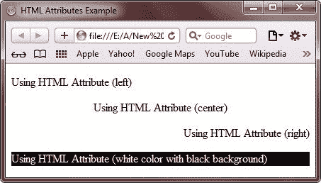
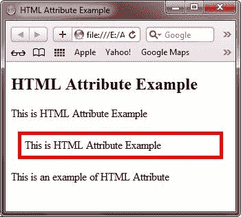
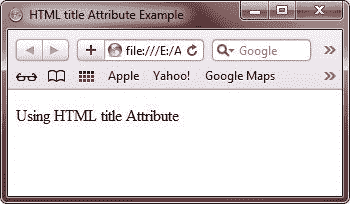
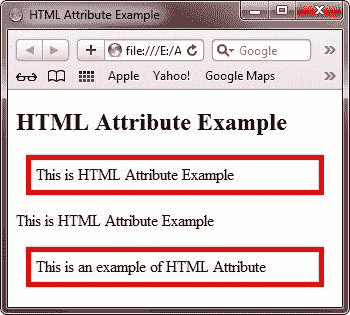
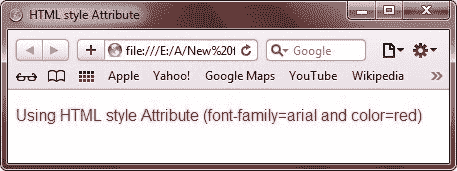
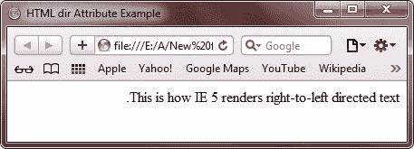
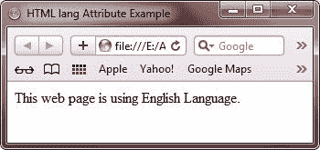
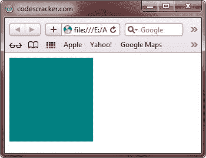
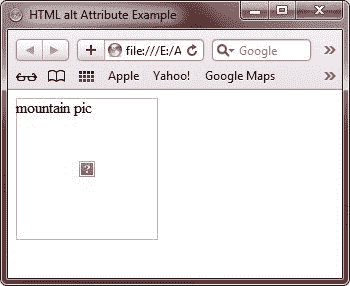

# HTML 属性

> 原文：<https://codescracker.com/html/html-attributes.htm>

HTML 属性用来提供更多关于 HTML 元素的信息。属性是像 name="value "这样的名称和值对。

## HTML 属性示例

以下是 HTML 属性的一个示例:

```
<!DOCTYPE html>
<html>
<head>
   <title>HTML Attributes Example</title>
</head>
<body>

<p align="left">Using HTML Attribute (left)</p>
<p align="center">Using HTML Attribute (center)</p>
<p align="right">Using HTML Attribute (right)</p>
<p style="background-color:black;color:white;">Using HTML Attribute (white color with black background)</p>

</body>
</html>
```

以下是由上述 HTML 属性示例代码生成的示例输出:



## HTML id 属性

HTML id 属性主要用于唯一地标识 HTML 页面中的任何元素。下面是一个在 HTML 中使用 id 属性的示例:

```
<p id="left_float">This will identified by id left_float</p>
<p id="right_float">This will identified by id right_float</p>
```

下面是一个在 HTML 中使用 id 属性的例子。

```
<!DOCTYPE html>
<html>
<head>
   <title>HTML Attribute Example</title>
   <style>
      p#styling
      {
         border : 5px solid red;
         padding : 5px;
         margin : 10px;
      }
   </style>
</head>
<body>

<h2>HTML Attribute Example</h2>
<p>This is HTML Attribute Example</p>
<p id="styling">This is HTML Attribute Example</p>
<p>This is an example of HTML Attribute</p>

</body>
</html>
```

以下是上述 HTML id 属性示例代码显示的输出:



要了解更多关于使用样式标签对 HTML 元素进行样式化的信息，请参考 [HTML CSS](/html/html-css.htm) 教程。要了解所有关于样式或 CSS 的知识，请参考 [CSS 教程](/css/index.htm)。

## HTML 标题属性

HTML title 属性用于为 HTML 元素指定一个标题。下面是一个使用 HTML 标题属性的例子:

```
<!DOCTYPE html>
<html>
<head>
   <title>HTML title Attribute Example</title>
</head>
<body>

<p title="I am the HTML title attribute">Using HTML title Attribute</p>

</body>
</html>
```

以下是上述 HTML title 属性示例代码显示的示例输出:



下面是上面 HTML 格式的 title 属性示例代码的实时演示输出。

使用 HTML 标题属性

你可以从上面的输出中看到，如果你将鼠标光标放在使用 HTML 标题属性的行**上，你会看到 标题**我是 HTML 标题属性**作为光标的工具提示出现。**

## HTML 类属性

HTML class 属性用于给 HTML 元素一个类。您可以为多个元素指定相同的类名。下面是一个在 HTML 中使用 class 属性的示例:

```
<p class="par1">Using HTML class Attribute (1)</p>
<p class="par2">Using HTML class Attribute (1)</p>
<p class="par1">Using HTML class Attribute (1)</p>
```

下面的例子展示了如何在 HTML 中使用 class 属性来设计 HTML 元素的样式。

```
<!DOCTYPE html>
<html>
<head>
   <title>HTML Attribute Example</title>
   <style>
      p.styling
      {
         border : 5px solid red;
         padding : 5px;
         margin : 10px;
      }
   </style>
</head>
<body>

<h2>HTML Attribute Example</h2>
<p class="styling">This is HTML Attribute Example</p>
<p>This is HTML Attribute Example</p>
<p class="styling">This is an example of HTML Attribute</p>

</body>
</html>
```

以下是上述 HTML 类属性示例代码产生的输出:



## HTML 样式属性

[HTML 样式](/html/html-styles.htm)属性用于样式化 HTML 元素。下面的示例显示了如何使用 style 属性来设置 HTML 元素的样式:

```
<!DOCTYPE html>
<html>
<head>
   <title>HTML style Attribute</title>
</head>
<body>

<p style="font-family:arial; color:red;">Using HTML style Attribute (font-family=arial and color=red)</p>

</body>
</html>
```

它将在浏览器中显示以下内容:



要了解更多关于 HTML 元素的样式，请参考 CSS 教程。

## HTML 目录属性

HTML dir 属性用于向浏览器指示文本应该流向的方向。下面是一个在 HTML 中使用 dir 属性的示例:

```
<!DOCTYPE html>
<html dir="rtl">
<head>
   <title>HTML dir Attribute Example</title>
</head>
<body>

This is how IE 5 renders right-to-left directed text.

</body>
</html>
```

它将在浏览器中显示以下内容:



## HTML 语言属性

HTML lang 属性用于指示文档中使用的主要语言。下面是一个在 HTML 中使用 lang 属性的例子:

```
<!DOCTYPE html>
<html lang="en">
<head>
   <title>HTML lang Attribute Example</title>
</head>
<body>

This web page is using English Language.

</body>
</html>
```

下面是上面的 lang 属性示例在 HTML 中显示的输出。



## HTML 大小属性

HTML size 属性用于定义 HTML 文档中图像的大小。要定义大小，请使用宽度和高度属性，如下例所示:

```
<!DOCTYPE html>
<html>
<head>
   <title>HTML size Attribute Example</title>
</head>
<body>


</body>
</html>
```

它将在浏览器中显示以下内容:



## HTML alt 属性

HTML alt 属性用于指定当 HTML 元素无法显示时要显示的替代文本。下面是一个在 HTML 中使用 alt 属性的示例:

```
<!DOCTYPE html>
<html>
<head>
   <title>HTML alt Attribute Example</title>
</head>
<body>


</body>
</html>
```

由于**unknown.jpg**是不存在的文件，所以会显示替代文本，这里是**山图**:



[HTML 在线测试](/exam/showtest.php?subid=4)

* * *

* * *