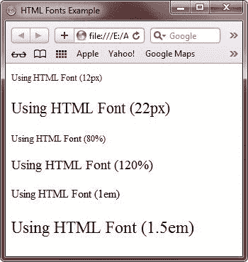
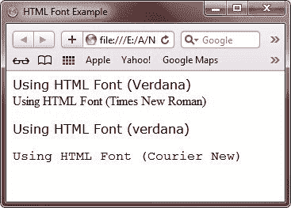
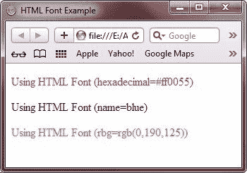

# HTML Fonts

> 原文：<https://codescracker.com/html/html-fonts.htm>

HTML 字体标签(<font>)用于指定 HTML 文档中文本的字体、大小和[颜色](/html/html-colors.htm)。但是 HTML5 不支持字体标签。可以用 [CSS](/css/index.htm) 代替。</font>

## HTML 设置字体大小

您可以使用 size [属性](/html/html-attributes.htm)设置内容字体大小。可接受值的范围是从 1(最小) 到 7(最大)。字体的默认大小是 3。

你也可以用像素和百分比来表示字体大小。让我们看看下面的例子，展示了如何在 HTML 中设置字体大小:

```
<!DOCTYPE html>
<html>
<head>
   <title>HTML Fonts Example</title>
</head>
<body>

<p style="font-size:12px">Using HTML Font (12px)</p>
<p style="font-size:22px">Using HTML Font (22px)</p>
<p style="font-size:80%">Using HTML Font (80%)</p>
<p style="font-size:120%">Using HTML Font (120%)</p>
<p style="font-size:1em">Using HTML Font (1em)</p>
<p style="font-size:1.5em">Using HTML Font (1.5em)</p>

</body>
</html>
```

下面是由上面的 HTML 字体示例代码生成的示例输出:



## HTML Set Text Font

您可以使用 face 属性设置字体，但是要注意，如果查看页面的用户没有安装字体，他们将看不到它。相反，用户将看到适用于用户计算机的默认字体。

您也可以使用字体系列来设置文本的字体。让我们看看下面的例子，它展示了如何在一个 HTML 文档中设置文本的字体:

```
<!DOCTYPE html>
<html>
<head>
   <title>HTML Font Example</title>
</head>
<body>

<font face="Verdana">Using HTML Font (Verdana)</font><br />
<font face="Times New Roman">Using HTML Font (Times New Roman)<br />
<p style="font-family:verdana">Using HTML Font (verdana)</p>
<p style="font-family:'Courier New'">Using HTML Font (Courier New)</p>

</body>
</html>
```

下面是上面的 HTML 字体示例程序显示的示例输出:



## HTML 设置字体颜色

您可以使用颜色属性设置任何字体颜色。您可以通过颜色名称或十六进制代码或使用它们的 rgb 值来指定所需的颜色。让我们看看下面的例子，它展示了如何在一个 HTML 文档中设置字体颜色:

```
<!DOCTYPE html>
<html>
<head>
   <title>HTML Font Example</title>
</head>
<body>

<p style="color:#ff0055;">Using HTML Font (hexadecimal=#ff0055)</font><br />
<p style="color:blue;">Using HTML Font (name=blue)</p>
<p style="color:rgb(0, 190, 125);">Using HTML Font (rbg=rgb(0,190,125))</p>

</body>
</html>
```

它将在浏览器中显示以下内容:



要获取 HTML 中所有颜色的代码，请参考 [HTML 所有颜色代码](/html/html-colors.htm)。

[HTML 在线测试](/exam/showtest.php?subid=4)

* * *

* * *