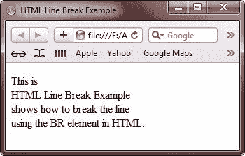
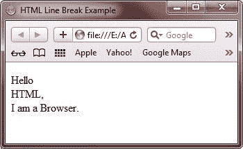

# HTML 换行

> 原文：<https://codescracker.com/html/html-line-break.htm>

有时在写文本时，可能需要在某些地方换行。BR 元素用于在 HTML 文档中定义一个换行符。

## HTML BR 元素属性

下表列出了 BR 元素的属性:

| 属性 | 目的 |
| 班级 | 定义元素的类名 |
| 身份证明（identification） | 定义 id 的值 |
| 风格 | 定义元素的内联样式 |
| 标题 | 提供有关元素的额外信息 |

## HTML 换行符示例

下面的例子展示了如何在 HTML 中使用 BR 元素换行。

```
<!DOCTYPE html>
<html>
<head>
   <title>HTML Line Break Example</title>
</head>
<body>

<p>This is <br />
HTML Line Break Example <br />
shows how to break the line <br />
using the BR element in HTML.</p>

</body>
</html>
```

以下是上述 HTML 换行符示例代码显示的输出:



这是另一个例子，演示了 HTML 中的换行符。

```
<!DOCTYPE html>
<html>
<head>
   <title>HTML Line Break Example</title>
</head>
<body>

<p>Hello<br />
HTML,<br />
I am a Browser.</p>

</body>
</html>
```

下面是上面的 HTML 换行符示例产生的示例输出:



[HTML 在线测试](/exam/showtest.php?subid=4)

* * *

* * *